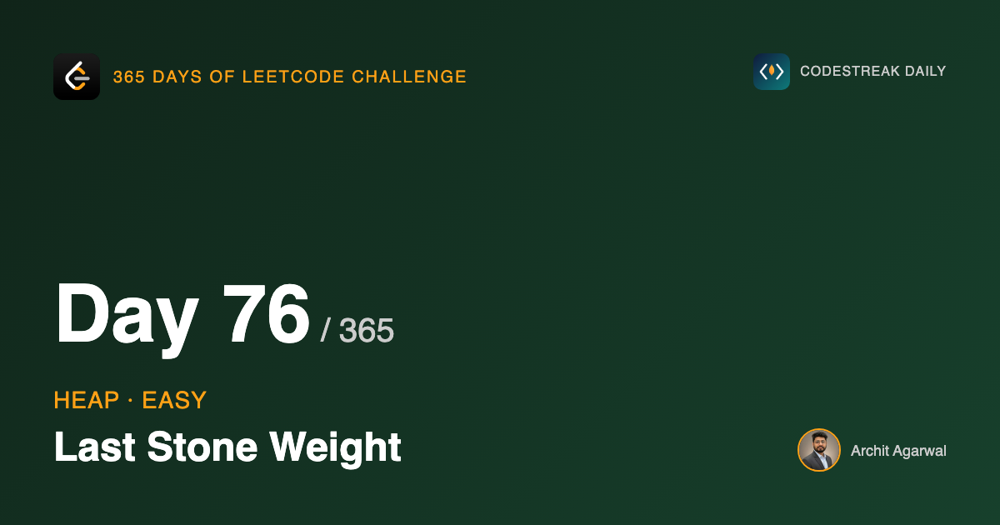
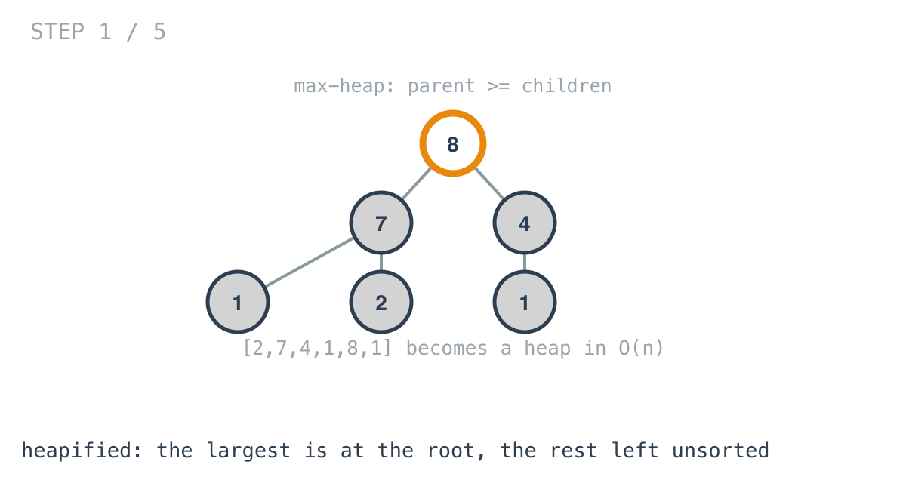
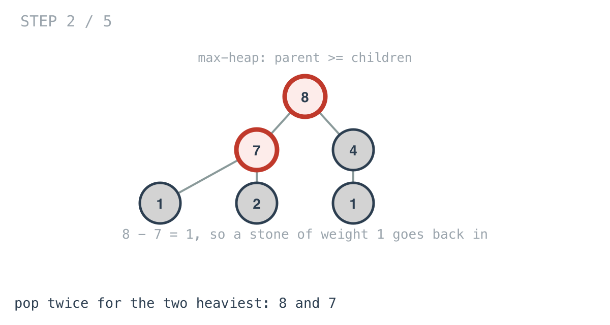
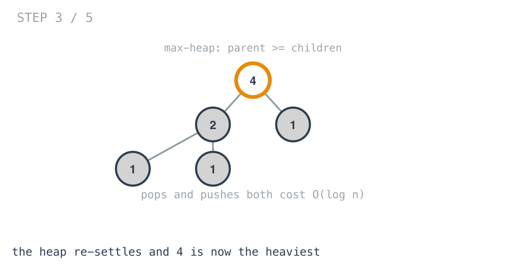
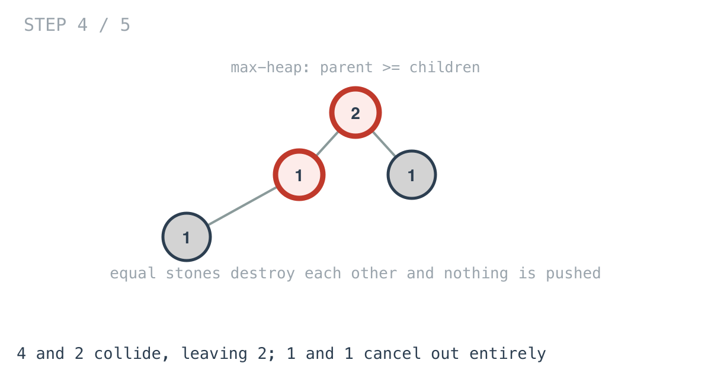
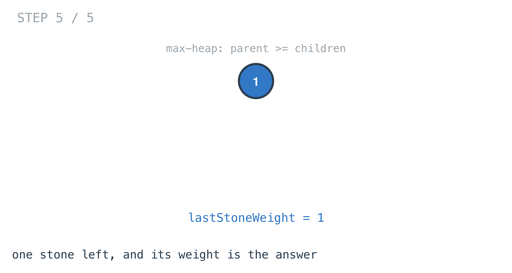

*365 Days of LeetCode Challenge — Day 76/365*

**[1046. Last Stone Weight](https://leetcode.com/problems/last-stone-weight/)** (Easy)

You have a collection of stones. Repeatedly take the two heaviest and smash them together: equal stones destroy each other, unequal ones leave a stone of the difference. Return the weight of the last stone, or 0 if none survives.

Heaps start today. Day 75 was Kth Largest Element in a Stream, which already used one — it is the bridge into this arc, and the difference is what the structure is being asked for. There it held a running answer; here it is a source of maxima.

## Start by asking why not just sort

Sorting is the honest first idea and it is worth taking seriously.

Sort the stones descending. Take the first two, smash them, and put the remainder back — but *in the right place*, because the next round needs the two heaviest again. That reinsertion is a search plus a shift, so O(n), and you pay it every round.

You can improve the constant, but not the shape. And the shape is the real problem.

Sorting produces a total ordering of every stone. This problem never asks for one. It never needs the third-heaviest stone. It never needs to know whether stone A is heavier than stone B unless one of them is currently the maximum.

**Sorting answers a strictly bigger question than the one being asked**, and you pay for the extra.

## What a heap promises, and what it refuses to

A heap keeps exactly one guarantee: **the largest element is at the root.**

That is the whole contract. It makes no claim about the second largest, or about the order of anything below the root. If you print a heap's backing array left to right, it looks close to unsorted, and that is not a flaw.



The diagram draws it as a tree so the invariant is visible: every parent is at least as large as its children. Notice what that does *not* say — there is no relationship at all between siblings, or between a node and its cousins.

This is the central idea of the structure, and it is worth stating as a principle: **maintaining less is what makes it cheaper.** A sorted array knows more and costs more to keep. A heap deliberately knows less, and gets O(log n) insertion and removal in exchange.

What it gives you:

- Find the maximum: O(1), it is at index 0.
- Remove the maximum: O(log n).
- Add an element: O(log n).

Compare that against the operations this problem performs: find the maximum, remove it, twice; then add one back. The match is exact. There is no operation in the problem that the heap does not do cheaply, and no operation in the heap that the problem does not need.

## The shape, briefly

A binary heap is a *complete* binary tree — filled level by level, left to right, with no gaps. Because it is complete, it needs no pointers at all: it lives in a flat array where the children of index `i` sit at `2i+1` and `2i+2`.

Pushing appends to the end and swaps upward while the new value beats its parent. Popping moves the last element to the root and swaps downward while a child beats it. Each walks one root-to-leaf path, and a complete tree of n nodes has height log n, which is where both bounds come from.

## One inverted comparison

```go
func (h *MaxHeap) Less(i, j int) bool { return (*h)[i] > (*h)[j] }
```

Go's `container/heap` **always builds a min-heap**. It has no notion of direction. It puts whatever your `Less` reports as smallest at the root.

So a max-heap is obtained by lying to it: define `Less` as greater-than, and the package dutifully arranges the largest element at the root while believing it is the smallest.

That one character is the entire difference between a min-heap and a max-heap in Go, and it is the most common place to go wrong with this package — the compiler cannot help, and the result is a correct heap sorted the wrong way.

## The loop

```go
for maxHeap.Len() > 1 {
	x := heap.Pop(maxHeap).(int)
	y := heap.Pop(maxHeap).(int)
	z := x - y
	if z != 0 {
		heap.Push(maxHeap, z)
	}
}
```



Two pops give the two heaviest stones. Note a small thing the heap buys: `x >= y` is guaranteed, because `x` came out first. So `x - y` is never negative and there is no `abs` anywhere.



Pushing the remainder re-settles the heap in O(log n), and the next round's maximum is available with no searching at all.



When two stones are equal, `z` is 0 and nothing is pushed. Both are destroyed, which is exactly what the problem describes, and it required no special case — it is just the `if`.



## The `Pop` that looks backwards

This is the part of `container/heap` that confuses everyone the first time.

```go
func (h *MaxHeap) Pop() any {
	old := *h
	n := old.Len()
	x := old[n-1]
	*h = old[:n-1]
	return x
}
```

It returns the **last** element of the array. For a method called `Pop` on a max-heap, that looks plainly wrong.

It is correct, because of how the package divides the work. When you call `heap.Pop(h)`, the package first swaps the root with the last element and sifts the new root down to restore the invariant. *Then* it calls your `Pop` to detach the element now sitting at the end — which is the old root.

Your method never sees the root, and never needs to. It is a deallocation hook, not the algorithm.

Writing `return old[0]` instead is a classic mistake. It compiles, it runs, and it returns wrong answers quietly, because at that moment index 0 holds the element that was just sifted into place.

## A detail worth improving

```go
maxHeap := &MaxHeap{}
heap.Init(maxHeap)
for _, v := range stones {
	heap.Push(maxHeap, v)
}
```

`heap.Init` is called on a heap that is still empty, so it does nothing at all. Then each stone is pushed individually at O(log n), giving O(n log n) to build the heap.

The alternative is to append every stone to the slice directly and call `Init` once afterwards. That runs Floyd's heapify, which sifts down from the middle of the array outward and is **O(n)** — genuinely linear, not linear-looking.

It makes no difference to the overall complexity here, because the main loop is O(n log n) regardless. I mention it because the two constructions look equally reasonable and one of them is asymptotically better, and knowing which is which is the kind of thing that matters when the build is the whole cost.

## The zero case

```go
if maxHeap.Len() == 0 {
	return 0
}
```

Stones can cancel exactly, leaving nothing behind. `[2,2]` destroys itself completely.

The problem specifies 0 for that case, so this is the stated answer rather than defensive padding.

## Complexity

- **Time: O(n log n).** Building the heap as written is O(n log n); each round does a constant number of O(log n) operations and there are at most n rounds.
- **Space: O(n)** for the heap. Heapifying the caller's slice in place would make it O(1) extra, at the cost of consuming their input.

## Builds on

- [Day 75: Kth Largest Element in a Stream](https://github.com/architagr/leetcode_solutions/blob/main/easy_problems/701_800/kth_largest_element_in_a_stream/) — the same structure, used there to hold a running answer and here to repeatedly take the largest

Full code and the step-by-step walkthrough:
[last_stone_weight](https://github.com/architagr/leetcode_solutions/blob/main/easy_problems/1001_1100/last_stone_weight/SOLUTION.md)

---

*Solution and code by Archit Agarwal. Write-up drafted with AI assistance from the code and problem statement.*
