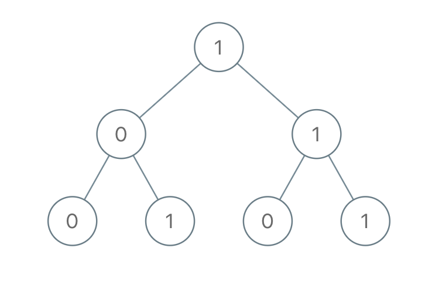
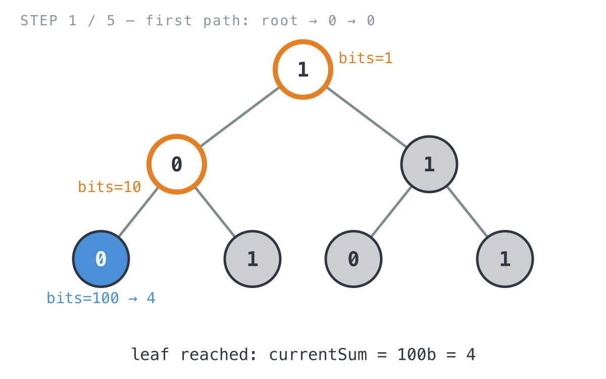
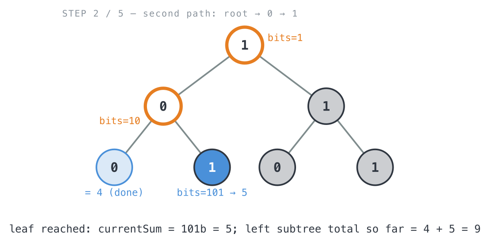
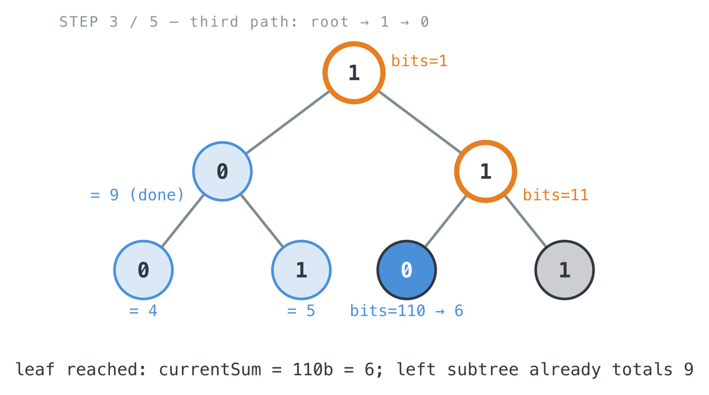
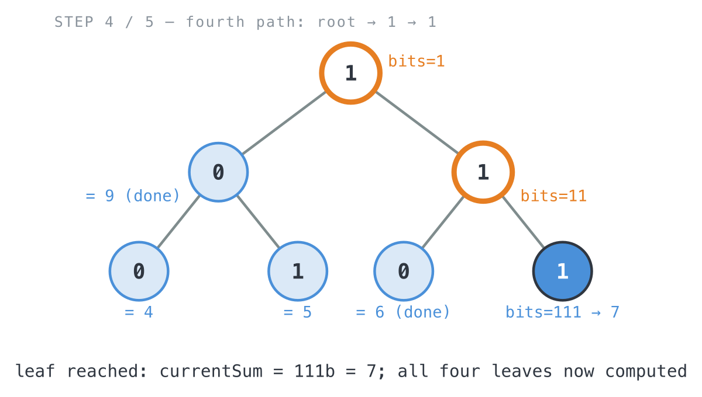
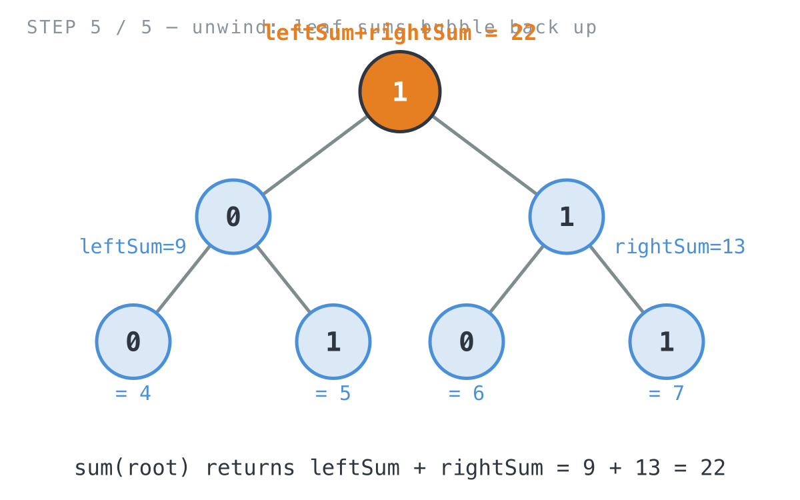

## 365 Days of LeetCode Challenge — Day 26/365

# Sum of Root To Leaf Binary Numbers

🔗 https://leetcode.com/problems/sum-of-root-to-leaf-binary-numbers/ · Difficulty: Easy

### The problem

You're given the root of a binary tree where every node holds a `0` or a `1`. Read a
root-to-leaf path top to bottom and its node values spell out a binary number, most
significant bit first: the path `0 -> 1 -> 1 -> 0 -> 1` reads as `01101` in binary,
which is `13`. Do that for every leaf in the tree and add up the results.

### The intuition

Each root-to-leaf path spells out a binary number one bit at a time, most significant
bit first, and that happens to be the exact order a top-down recursion visits nodes in.
That match is really the whole trick here. Instead of collecting bits into a list and
converting them to a number once you finally reach a leaf, you can carry the number
itself down the recursion: at each step, shift what's been built so far one bit to the
left (multiply by 2) and drop in the current node's bit in the units place. It's the
same thing you'd do by hand reading a binary number left to right: `1101` is
`((1*2+1)*2+0)*2+1`. Once you see it that way, "go one level deeper, append one bit"
and "shift and add" turn out to be the same sentence.

Carrying that value as a function parameter means each recursive call only needs one
number: the path so far. No list of bits, no whole-path tracking. Hit a leaf and that
running value already is the answer for the path, no conversion step needed
afterward. Internal nodes don't contribute a value of their own; they just hand the
extended value to both children and add up whatever comes back from the left and right
subtrees.

### The solution

Here's the code. Once the shift-and-add idea clicks, the whole thing is maybe five
lines that matter.



```go
func sumRootToLeaf(root *TreeNode) int {
	// rootLevelSum starts at 0: no bits accumulated yet above the root.
	return sum(root, 0)
}

// sum returns the total of all root-to-leaf binary numbers in this subtree.
// rootLevelSum is the binary number built from the true root down to (but
// not including) this node, i.e. the bits contributed by ancestors so far.
func sum(root *TreeNode, rootLevelSum int) int {
	if root == nil {
		return 0
	}
	// Shift the accumulated bits one place left to make room for this
	// node's bit, then drop root.Val (0 or 1) into the new units place —
	// the same way a binary number grows digit by digit left to right.
	rootLevelSum *= 2
	currentSum := rootLevelSum + root.Val
	if isLeafNode(root) {
		// currentSum already is the complete binary number for this
		// root-to-leaf path, so it's the whole contribution from here.
		return currentSum
	}

	// Not a leaf: pass the extended currentSum down as the new
	// rootLevelSum for each child, and sum whatever they each contribute.
	leftSum := sum(root.Left, currentSum)
	rightSum := sum(root.Right, currentSum)
	return leftSum + rightSum
}

func isLeafNode(node *TreeNode) bool {
	return node.Left == nil && node.Right == nil
}
```

Let's trace it on `root = [1,0,1,0,1,0,1]` (root=1, left=0, right=1, leftleft=0,
leftright=1, rightleft=0, rightright=1). Expected answer: `22`.

- `sum(root=1, 0)`: `currentSum = 1` ("bits=1"). Not a leaf, so recurse into both
  children.
  - `sum(left=0, 1)`: `currentSum = 10b = 2`. Still not a leaf, keep going.
    - `sum(leftleft=0, 2)`: `currentSum = 100b = 4`. That's a leaf, so it returns `4`.

    

    - `sum(leftright=1, 2)`: `currentSum = 101b = 5`. Leaf, returns `5`.
      `leftSum = 4 + 5 = 9`.

    

  - `sum(right=1, 1)`: `currentSum = 11b = 3`. Not a leaf, recurse further.
    - `sum(rightleft=0, 3)`: `currentSum = 110b = 6`. Leaf, returns `6`.

    

    - `sum(rightright=1, 3)`: `currentSum = 111b = 7`. Leaf, returns `7`.
      `rightSum = 6 + 7 = 13`.

    

  - Back at the top: `leftSum = 9`, `rightSum = 13`, so the total returned is
    `9 + 13 = 22`, which matches.

  

**Complexity:** O(n) time, since every node is visited exactly once. O(h) space for the
recursion stack, where h is the tree height (O(log n) if it's balanced, O(n) if it's a
straight line down one side).

Full code: `easy_problems/1001_1100/sum_of_root_to_leaf_binary_numbers/` in the repo.

#LeetCode #100DaysOfCode #DSA #CodingInterview #Programming #BinaryTree #DFS #Golang

---

*Solution and code by Archit Agarwal. Write-up drafted with AI assistance from the code and problem statement.*
