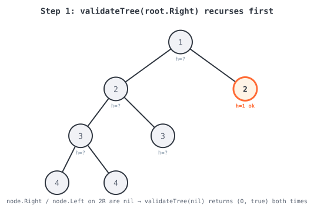
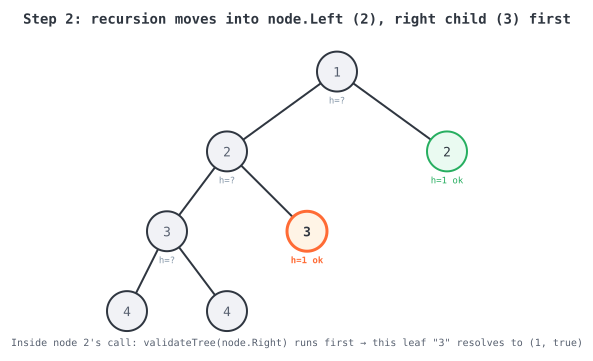
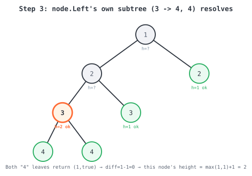
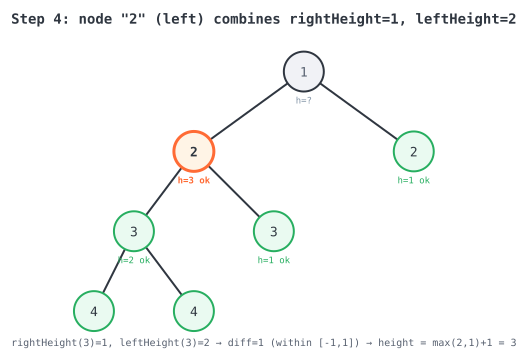
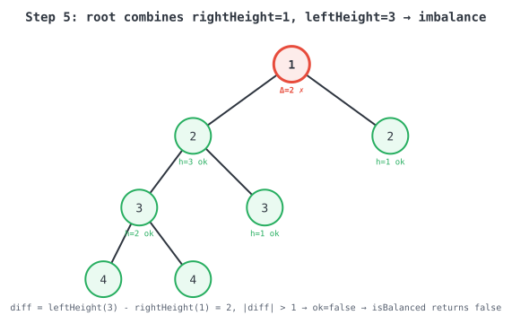

**365 Days of LeetCode Challenge — Day 5/365**

**Balanced Binary Tree (Easy)**
🔗 https://leetcode.com/problems/balanced-binary-tree/

Checking height separately at every node is the trap here — it recomputes the same
subtree heights over and over and costs O(n²) on a skewed tree. The fix: compute height
**and** balance in one bottom-up post-order pass, and short-circuit the moment any
subtree turns out unbalanced.

**The code:**
```go
func isBalanced(root *TreeNode) bool {
	// Only the balance flag matters here; the overall tree height is discarded.
	_, ok := validateTree(root)
	return ok
}

// validateTree does a single post-order pass that returns, for the subtree rooted at
// node, both its height and whether it (and everything beneath it) is height-balanced.
// Computing both in one pass avoids recomputing subtree heights repeatedly, which is
// what makes a naive "check height() at every node" approach O(n^2) in the worst case.
func validateTree(node *TreeNode) (height int, ok bool) {
	// Base case: an empty subtree has height 0 and is trivially balanced. This is what
	// lets leaf nodes resolve cleanly with no special-casing above.
	height = 0
	ok = true
	if node == nil {
		return
	}
	rightHeight := 0
	rightHeight, ok = validateTree(node.Right)
	if !ok {
		// Short-circuit: the right subtree is already unbalanced, so this subtree
		// (and everything above it) can never be balanced either. Skip checking the
		// left subtree entirely.
		return
	}
	leftHeight := 0
	leftHeight, ok = validateTree(node.Left)
	if !ok {
		// Same short-circuit, triggered by the left subtree instead.
		return
	}
	// Both children are individually balanced (ok == true so far); now check that
	// their heights don't differ by more than 1 at this node.
	diff := leftHeight - rightHeight
	if diff > 1 || diff < -1 {
		ok = false
		return
	}
	// This node passes its own check: its height is one more than its taller child.
	height = maxValue(leftHeight, rightHeight) + 1
	return
}

func maxValue(a, b int) int {
	if a > b {
		return a
	}
	return b
}
```

**Walkthrough:**

`isBalanced` is a thin wrapper — the real work is in `validateTree`, which returns both
a subtree's height and whether it's balanced. Go's named return values give the `nil`
base case `height=0, ok=true` for free.

The code recurses into `node.Right` before `node.Left`, checking `ok` right after each
call. The moment one side fails, it returns immediately — the other side never even gets
visited. That's the short-circuit in action.

Once both children come back balanced, `diff := leftHeight - rightHeight` decides this
node's own fate: `|diff| > 1` flips `ok` to `false`. Otherwise this node's height is
`max(leftHeight, rightHeight) + 1`, and the recursion unwinds one level up.

**Visual trace**, following `root = [1,2,2,3,3,null,null,4,4]` (Example 2, output
`false`) — this one shows both the happy path and the short-circuit:

```
              1
            /   \
           2     2      <- right "2" is a leaf
          / \
         3   3           <- right "3" is a leaf
        / \
       4   4
```

Step 1 — root's right subtree (leaf "2") resolves first: `(1, true)`.



Step 2 — inside the left "2", its right child (leaf "3") resolves next: `(1, true)`.



Step 3 — the two "4" leaves resolve, then their parent "3" combines them:
`diff=1-1=0`, `height=max(1,1)+1=2`.



Step 4 — the left "2" combines `rightHeight=1` and `leftHeight=2`: `diff=1` (fine),
`height=max(2,1)+1=3`.



Step 5 — the root combines `rightHeight=1` and `leftHeight=3`: `diff=2`, `|diff|>1` →
`ok=false`. `isBalanced` returns `false`.



**Complexity:** O(n) time (each node visited once), O(h) space for the recursion stack.
