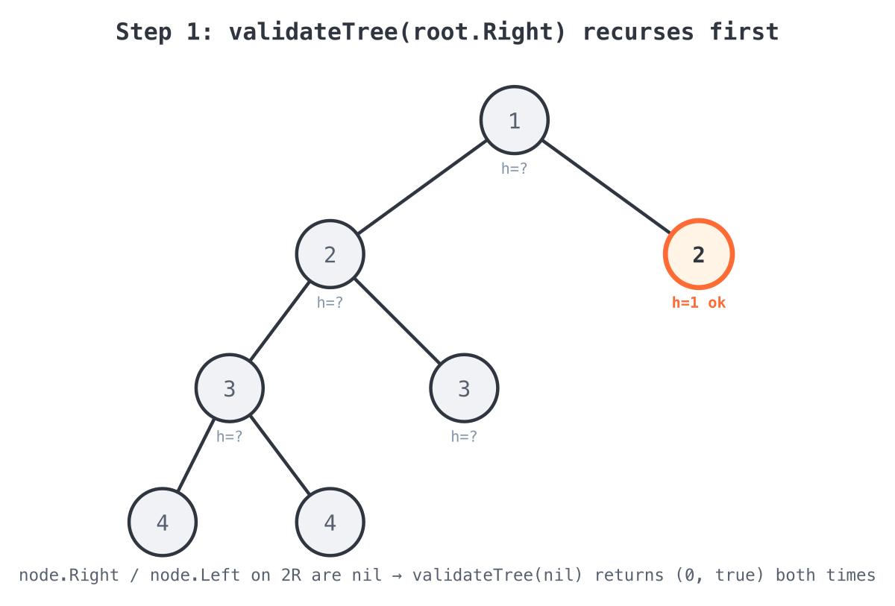
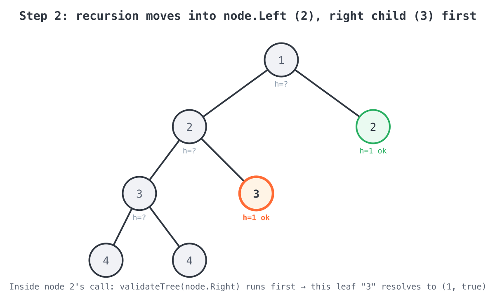
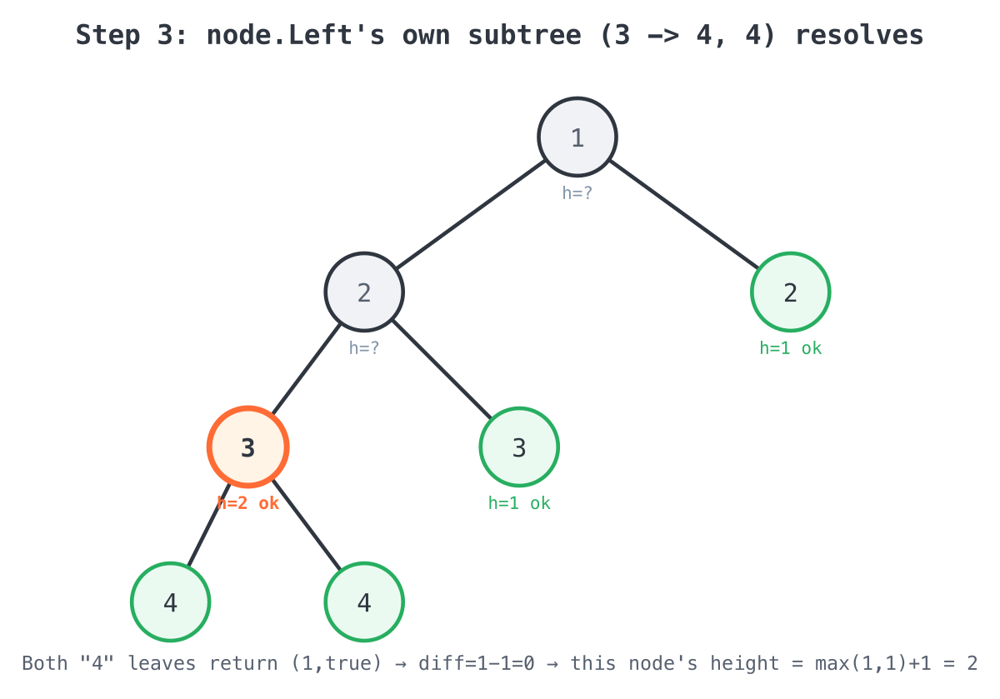
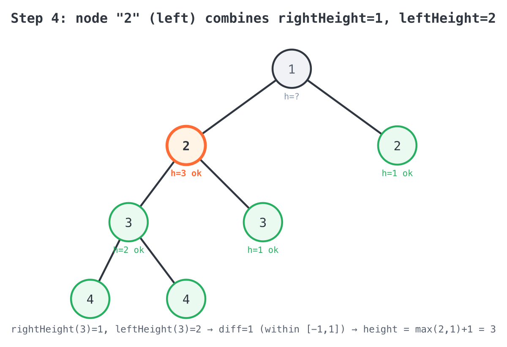
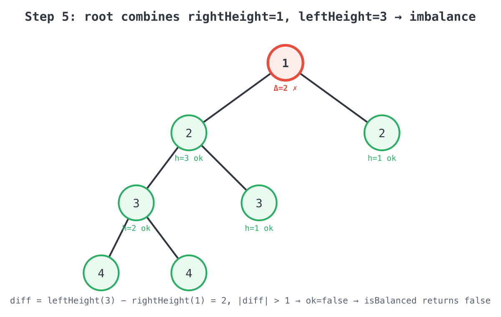

# Solution

## The code

```go
func isBalanced(root *TreeNode) bool {
	_, ok := validateTree(root)
	return ok
}

func validateTree(node *TreeNode) (height int, ok bool) {
	height = 0
	ok = true
	if node == nil {
		return
	}
	rightHeight := 0
	rightHeight, ok = validateTree(node.Right)
	if !ok {
		return
	}
	leftHeight := 0
	leftHeight, ok = validateTree(node.Left)
	if !ok {
		return
	}
	diff := leftHeight - rightHeight
	if diff > 1 || diff < -1 {
		ok = false
		return
	}
	height = maxValue(leftHeight, rightHeight) + 1
	return
}

func maxValue(a, b int) int {
	if a > b {
		return a
	}
	return b
}
```

## Walking through it

### `isBalanced` is a thin wrapper

```go
func isBalanced(root *TreeNode) bool {
	_, ok := validateTree(root)
	return ok
}
```

All the real work happens in `validateTree`, which returns two things for any subtree
rooted at `node`: its `height`, and whether it (and everything below it) `ok`-ays as
balanced. `isBalanced` only cares about the second value — the height of the whole tree
is thrown away with `_`.

### `validateTree`'s base case: an empty subtree

```go
height = 0
ok = true
if node == nil {
	return
}
```

Go's named return values (`height`, `ok`) are initialized up front, so an empty subtree
(`nil`) is defined as height `0` and trivially balanced. This is what makes every leaf
node's children resolve cleanly without any special-casing further up.

### Right before left — an implementation detail worth noticing

```go
rightHeight := 0
rightHeight, ok = validateTree(node.Right)
if !ok {
	return
}
leftHeight := 0
leftHeight, ok = validateTree(node.Left)
if !ok {
	return
}
```

Balance doesn't care about traversal order — the result is identical whichever child is
visited first — but this implementation happens to recurse into `node.Right` before
`node.Left`. Each call checks `ok` immediately after it comes back and returns early if
that subtree already failed, so `validateTree(node.Left)` is never even called once a
right subtree turns out unbalanced. This is the short-circuiting mentioned in
`INTUITION.md`: the moment one branch fails, the rest of the tree is skipped.

### The balance check for this node

```go
diff := leftHeight - rightHeight
if diff > 1 || diff < -1 {
	ok = false
	return
}
```

Once both children have reported back a real height (meaning both subtrees are
individually balanced), this node checks itself: do its two children's heights differ by
more than 1? If so, `ok` flips to `false` and `height` is left at its zero value — the
caller only ever looks at `height` when `ok` is `true`, so a leftover `0` here is
harmless.

### Combining into this node's own height

```go
height = maxValue(leftHeight, rightHeight) + 1
```

If the node passed its own balance check, its height is one more than the taller of its
two children — the standard definition of tree height, computed bottom-up as the
recursion unwinds.

## Visual walkthrough

LeetCode's own diagrams for the two examples:

**Example 1 — balanced:**


**Example 2 — not balanced:**


The step-by-step trace below follows **Example 2**, `root = [1,2,2,3,3,null,null,4,4]`,
because it shows both the "everything's fine so far" path and the short-circuiting
failure path in the same tree:

```
              1
            /   \
           2     2      <- right "2" is a leaf (both children null)
          / \
         3   3           <- right "3" is a leaf (both children null)
        / \
       4   4
```

Because the code calls `validateTree(node.Right)` before `validateTree(node.Left)` at
every level, the actual order of computation is:

**Step 1 — the root's right subtree resolves first.** The right child of the root (a
leaf "2") has two `nil` children, so both recursive calls immediately return `(0, true)`,
and this node computes `height = max(0,0)+1 = 1`, `ok = true`.



**Step 2 — descend into the root's left subtree, right child first.** Inside the call for
the left "2", `validateTree(node.Right)` runs before `validateTree(node.Left)` — so the
leaf "3" on the right resolves next, also to `(1, true)`.



**Step 3 — the left "3" and its two "4" leaves resolve.** Both "4" nodes are leaves and
return `(1, true)`. Back in their parent "3", `diff = leftHeight - rightHeight = 1-1 = 0`,
so it passes its own check and reports `height = max(1,1)+1 = 2`.



**Step 4 — the left "2" combines its two children.** `rightHeight` (from the leaf "3") is
`1`, `leftHeight` (from the "3" with two "4" children) is `2`. `diff = 2-1 = 1`, which is
within `[-1, 1]`, so this node is fine and reports `height = max(2,1)+1 = 3`.



**Step 5 — the root combines its children and fails.** `rightHeight` (from the leaf "2")
is `1`, `leftHeight` (from the "2" subtree just resolved) is `3`. `diff = 3-1 = 2`, and
`2 > 1`, so `ok` is set to `false` right here at the root. `isBalanced` returns `false`.



## Complexity

- **Time: O(n)** — `validateTree` visits each node exactly once; everything else in the
  function body is O(1).
- **Space: O(h)** — the recursion stack depth equals the tree's height `h`
  (`O(log n)` best case, `O(n)` for a skewed tree).
