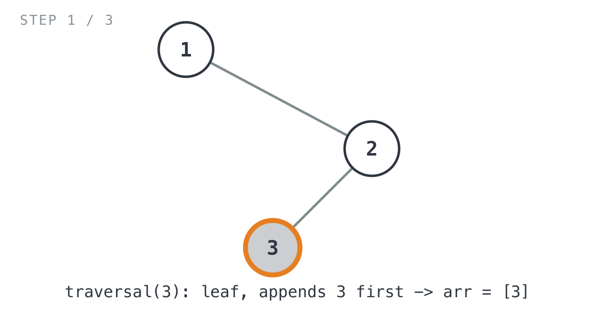
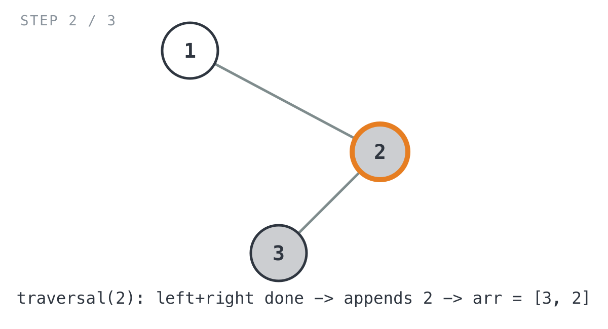
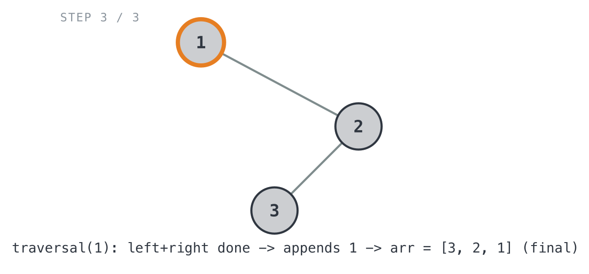

## 365 Days of LeetCode Challenge — Day 9/365

# Binary Tree Postorder Traversal

🔗 https://leetcode.com/problems/binary-tree-postorder-traversal/ · Difficulty: Easy

### The problem

Given the root of a binary tree, return the postorder traversal of its nodes'
values — left subtree, then right subtree, then the node itself.

### The intuition

"Postorder" is just naming the order a node gets recorded in, relative to its
children: left subtree, then right subtree, then the node itself. So a node's
value only lands in the result after everything under it does. It's always the
last thing written among itself and its descendants.

What I like about this one is how little bookkeeping it needs. The whole thing
falls out of a plain recursive shape: recurse left, recurse right, then append
the current node. No flag for "have I visited this node's children yet," no
manual stack management. The recursion itself guarantees both children are
fully processed, and their values are already sitting in the result slice,
before the current node's `append` ever runs.

The only base case is an empty subtree (`nil`). It contributes nothing and
hands back the result slice unchanged. That's what stops recursion at missing
children, and it's also why leaves resolve in one step: both of a leaf's
recursive calls hit that base case immediately, so the very next line appends
the leaf's own value.

### The solution


```go
func PostorderTraversal(root *TreeNode) []int {
	arr := make([]int, 0)
	return traversal(root, arr)
}

func traversal(A *TreeNode, arr []int) []int {
	if A == nil {
		return arr
	}

	arr = traversal(A.Left, arr)
	arr = traversal(A.Right, arr)
	arr = append(arr, A.Val)
	return arr
}
```

`PostorderTraversal` seeds an empty slice and hands it to `traversal`, which
does the actual work. It threads the growing result slice through every
recursive call: left, then right, then the current node last.

Walking `traversal(1, [])` on `root = [1,null,2,3]` (`1`'s left child is `nil`,
its right child is `2`, and `2`'s left child is `3`), expected output `[3,2,1]`:

- `traversal(1, [])` recurses left into `nil` → returns `[]` unchanged, then
  recurses right into `2`.
  - `traversal(2, [])` recurses left into `3`.
    - `traversal(3, [])` has both children `nil`, so it bottoms out immediately
      and appends its own value → `arr = [3]`.

    

  - Back in `traversal(2, [])`: left came back `[3]`, right (`nil`) adds
    nothing. Both sides done → appends `2` → `arr = [3, 2]`.

    

- Back in `traversal(1, [])`: left (`nil`) contributed nothing, right came back
  `[3, 2]`. Both sides done → appends `1` → `arr = [3, 2, 1]`.

  

`PostorderTraversal` returns `[3, 2, 1]`. ✓

Time complexity is O(n), since every node gets visited exactly once. Space is
O(h) for the recursion stack, where h is the tree's height (O(log n) balanced,
O(n) if it degenerates into a line), plus O(n) for the output slice.

One thing worth chewing on: LeetCode also asks for an iterative version. The
common trick is a single stack that pushes nodes and prepends their values
instead of appending — you're essentially building the reverse of a
root-right-left traversal and letting the prepend flip it into postorder.

Full code: `easy_problems/101_200/binary_tree_postorder_traversal/` in the repo.

#DSA #LeetCode #BinaryTree #Recursion #Golang #100DaysOfCode #CodingInterview

---

*Solution and code by Archit Agarwal. Write-up drafted with AI assistance from the code and problem statement.*
