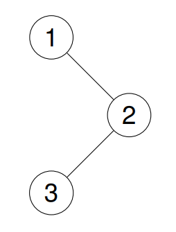
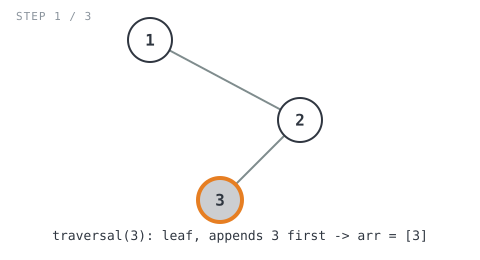
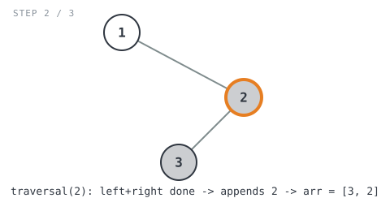
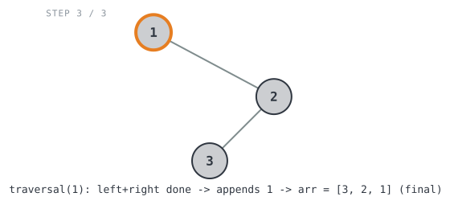

## Solution walkthrough

The implementation is `PostorderTraversal(root *TreeNode) []int` in
`binary_tree_postorder_traversal.go`, which delegates to a helper,
`traversal(A *TreeNode, arr []int) []int`.

```go
func PostorderTraversal(root *TreeNode) []int {
	arr := make([]int, 0)
	return traversal(root, arr)
}

func traversal(A *TreeNode, arr []int) []int {
	if A == nil {
		return arr
	}

	arr = traversal(A.Left, arr)
	arr = traversal(A.Right, arr)
	arr = append(arr, A.Val)
	return arr
}
```

`PostorderTraversal` just seeds an empty slice and hands it off to `traversal`,
which does the real work and threads the growing result slice through every
recursive call.

We'll trace it on Example 1, `root = [1,null,2,3]`:



1. **Base case.** `if A == nil { return arr }` — an empty subtree contributes
   nothing and just hands back whatever slice it was given, unchanged. This is
   what stops recursion on missing children (like `1`'s nil left child) and is
   also why a leaf resolves in one step: both of its recursive calls hit this
   line immediately.

2. **Recurse left first.** `arr = traversal(A.Left, arr)` — walk the entire left
   subtree and let it append everything it owns before this node does anything
   else.

3. **Recurse right second.** `arr = traversal(A.Right, arr)` — same idea for the
   right subtree, using the slice that came back from the left recursion so
   nothing already appended is lost.

4. **Append the current node last.** `arr = append(arr, A.Val)` — by now both
   subtrees are fully recorded, so the current node's value is written after all
   of its descendants, which is exactly what "postorder" means.

Walking `traversal(1, [])` on `root = [1,null,2,3]` (`1`'s left child is `nil`,
its right child is `2`, and `2`'s left child is `3`):

- `traversal(1, [])` first calls `traversal(1.Left, [])` = `traversal(nil, [])`
  → base case, returns `[]` unchanged.
- Then it calls `traversal(1.Right, [])` = `traversal(2, [])`:
  - `traversal(2, [])` first calls `traversal(2.Left, [])` = `traversal(3, [])`:
    - `traversal(3, [])` calls `traversal(3.Left, [])` = `traversal(nil, [])` →
      `[]`, then `traversal(3.Right, [])` = `traversal(nil, [])` → `[]`, then
      appends `3.Val` → `arr = [3]`.

    

  - Back in `traversal(2, [])`: left came back as `[3]`. Now it calls
    `traversal(2.Right, [3])` = `traversal(nil, [3])` → `[3]` unchanged. Both
    sides done, so it appends `2.Val` → `arr = [3, 2]`.

    

- Back in `traversal(1, [])`: left came back as `[]`, right came back as
  `[3, 2]`. Both sides done, so it appends `1.Val` → `arr = [3, 2, 1]`.

  

`PostorderTraversal` returns `[3, 2, 1]`, matching the expected output. ✓

**Complexity:** O(n) time — `traversal` visits every node exactly once. O(h) space
for the recursion stack (h = tree height), plus O(n) for the output slice.
