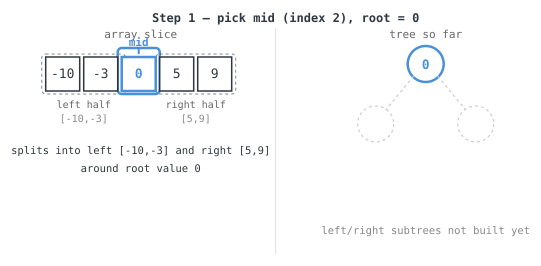

**365 Days of LeetCode Challenge — Day 2/365**
**Convert Sorted Array to Binary Search Tree** (Easy)
🔗 https://leetcode.com/problems/convert-sorted-array-to-binary-search-tree/

**Intuition:** since the array's sorted, the middle element always has smaller values
to its left and larger to its right. Pick it as root, recurse on both halves, and the
tree comes out balanced with no extra work. Kind of a nice freebie for an easy-rated
problem.

LeetCode's example for `[-10,-3,0,5,9]`:


Alternate accepted shape (the one this trace builds):


**Full solution:**
```go
func SortedArrayToBST(nums []int) *TreeNode {
	if len(nums) == 0 {
		return nil
	}
	// The array is sorted, so the middle element naturally splits the
	// remaining elements evenly between the left and right subtrees,
	// keeping the resulting tree height-balanced with no extra rebalancing.
	mid := len(nums) / 2

	root := new(TreeNode)
	root.Val = nums[mid]
	root.Left = SortedArrayToBST(nums[:mid])
	root.Right = SortedArrayToBST(nums[mid+1:])
	return root
}
```

**Walkthrough** on `[-10,-3,0,5,9]`:
- `mid=2`, root `0`

  
- left: `SortedArrayToBST([-10,-3])` → root `-3`, left child `-10`

  ![Step 2: left half [-10,-3], mid=1, root=-3](images/walkthrough-2.svg)
- right: `SortedArrayToBST([5,9])` → root `9`, left child `5`

  ![Step 3: right half [5,9], mid=1, root=9](images/walkthrough-3.svg)
- **final tree:** `0` with left subtree `-3(-10)`, right subtree `9(5)`, matching
  `[0,-3,9,-10,null,5]`.

O(n) time, since every element becomes one node. Recursion runs about O(log n) deep.
