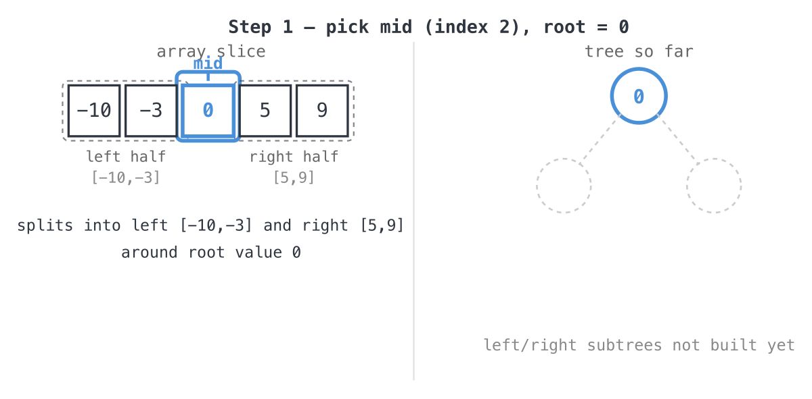

## 365 Days of LeetCode Challenge — Day 2/365

# Convert Sorted Array to Binary Search Tree

🔗 https://leetcode.com/problems/convert-sorted-array-to-binary-search-tree/ · Difficulty: Easy

### The problem

Given an integer array `nums` sorted in ascending order, convert it to a
**height-balanced** binary search tree.

### The intuition

A height-balanced BST needs the left and right side of every node to hold roughly the
same number of elements. The array being **sorted** does most of that work for you:
pick the **middle element** as a node's value, and everything smaller lands in the
left subtree, everything bigger lands in the right, no comparisons required. What I
like about this one is that you never touch a rotation or a balance factor anywhere in
the code. The input handed you the split before you wrote a single line.

So the approach is a straightforward divide-and-conquer:
- Pick the middle element of the current slice as the root of this subtree.
- Recurse on the left half to build the left subtree.
- Recurse on the right half to build the right subtree.
- An empty slice means there's no subtree here, so return `nil`.

Because the recursion halves the array at every step, the tree comes out balanced by
construction. There's nothing to fix up afterward.

### The solution

LeetCode's own example shows the target shape for `nums = [-10,-3,0,5,9]`:


The trace below builds a different but equally valid shape, `[0,-3,9,-10,null,5]`,
shown in LeetCode's alternative diagram:


```go
func SortedArrayToBST(nums []int) *TreeNode {
	if len(nums) == 0 {
		return nil
	}
	// The array is sorted, so the middle element naturally splits the
	// remaining elements evenly between the left and right subtrees,
	// keeping the resulting tree height-balanced with no extra rebalancing.
	mid := len(nums) / 2

	root := new(TreeNode)
	root.Val = nums[mid]
	root.Left = SortedArrayToBST(nums[:mid])
	root.Right = SortedArrayToBST(nums[mid+1:])
	return root
}
```

Walking it through `nums = [-10,-3,0,5,9]`:
- `mid = 2`, so the root is `0`.

  
- The left half, `[-10,-3]`, becomes root `-3` with left child `-10`.

  ![Step 2: left half [-10,-3], mid=1, root=-3](images/walkthrough-2.png)
- The right half, `[5,9]`, becomes root `9` with left child `5`.

  ![Step 3: right half [5,9], mid=1, root=9](images/walkthrough-3.png)
- Put it together and you get `0` with left subtree `-3(-10)` and right subtree
  `9(5)`. That's the same shape as the alternate accepted output `[0,-3,9,-10,null,5]`.

**Complexity:** O(n) time, since every element becomes exactly one node. Recursion
depth runs about O(log n), plus O(n) for the output tree itself.

Full code: `easy_problems/101_200/convert_sorted_array_to_binary_search_tree/` in the repo.

#DSA #LeetCode #100DaysOfCode #CodingInterview #BinarySearchTree #Recursion #Golang

---

*Solution and code by Archit Agarwal. Write-up drafted with AI assistance from the code and problem statement.*
