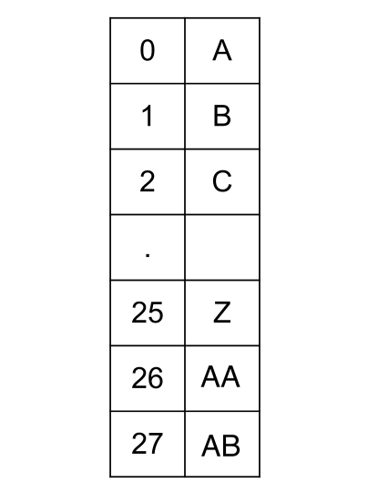

# Intuition

In Excel, the columns are letters that correspond to numbers. We start with `A = 1`. Similarly, `2` corresponds to `B` until `26` for `Z`. Once we run out of letters, we start appending them. `27` will correspond to `AA`, `28` for `AB`, and so on. In this problem, we are given the integer which is the column number and we need to return the corresponding letters for it.

At first glance, it might be tempting to say that these numbers are just base 26, but the catch is that in a base 26 system, the numbers would start from `0`. The mapping would be like below:

However, in the problem, we have the number starting from `1`, not `0`. But we can change them to process them like base 26 numbers. The important point to observe here is that every column title has the corresponding column number as a number in base 26 plus one. For example, let's convert the number `2002` to the letters `BXZ` by representing it as a number in base 26. Note that each part will have an extra `1` added to compensate for the fact that we are starting from `1` in our system. See the below example for a better understanding of the algorithm:

`N = 2002` corresponds to `BXZ`.

In terms of base 26:

$\ N=(B+1)⋅26^2 +(X+1)⋅26^1+(Z+1)∗26^0$

$\ N=(1+1)⋅676+(23+1)⋅26+(25+1)⋅1 = 2002$

## Steps to get the letters:

1. Subtract `1` from `N`. Now, `N = 2001`. Take N modulo 26 and convert the result to the corresponding position in the alphabet. `2001 % 26 = 25`, which corresponds to `Z`, since we start with `A = 0`.
1. Divide `N` by 26. We have $\ N= \frac{2001}{26} = 76$.
1. Repeat the process until `N = 0`. We subtract `1`, so now `N = 75`. Take it modulo 26: `75 % 26 = 23`. This corresponds to `X`.
1. Divide `N` by 26. We have $\ N= \frac{75}{26}= 2$.
1. Subtract `1`, so now `N = 1`. Take it modulo 26: `1 % 26 = 1`. This corresponds to `B`.

Finally, we are done, because  $\ \frac{N}{26} = 0$. The result is `BXZ`, the reverse order in which we found the letters.

## Algorithm

1. Initialize an empty string `ans` which would store the column title.
1. Do the following as long as `columnNumber` is greater than `0`:
   - Subtract `1` from the `columnNumber`
   - Find the character corresponding to `columnNumber % 26` and append it to the `ans` in the end.
   - Assign `columnNumber` to `columnNumber / 26`.
1. Reverse the string `columnNumber` and return it.