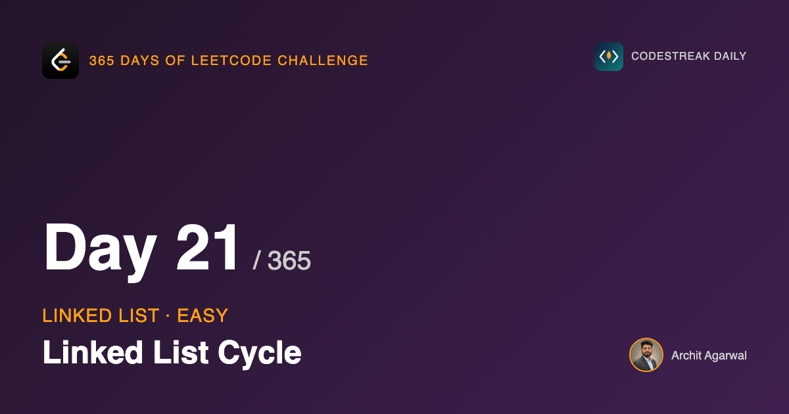

*365 Days of LeetCode Challenge — Day 21/365*

**[141. Linked List Cycle](https://leetcode.com/problems/linked-list-cycle/)** (Easy)

Yesterday introduced a walk. Today is the problem that walk is actually famous for, and it is worth noticing that the code barely changes. What changes is the question being asked of it.

The task: following `Next` from the head, do you ever return to a node you have already visited?

## Start with the set

Keep a set of the nodes seen so far. At each step, ask whether the current node is already in it. If yes, there is a cycle. If you reach `nil`, there is not.

This is a good answer. It is O(n) time, it is obviously correct, and the correctness argument fits in the sentence I just wrote. If you produced this in an interview you have solved the problem.

It is also O(n) space, and the follow-up question on the problem page asks whether you can do it in constant space. That is the only reason to keep reading.

## The same walk, a different question

Two pointers from the head. One moves a node per step, the other moves two.

```go
func HasCycle(head *ListNode) bool {
	slow, fast := head, head

	for fast != nil && fast.Next != nil {
		slow = slow.Next
		fast = fast.Next.Next
		if slow == fast {
			return true
		}
	}
	return false
}
```

Put that next to yesterday's `middleNode` and the differences are the return type and two lines in the middle. The loop header is identical, character for character.

But the loop header has been promoted. Yesterday those two conditions were housekeeping: they stopped the fast pointer dereferencing `nil` on even-length and odd-length lists respectively. Today, reaching either one *is the answer*. A list with an end cannot contain a cycle, so falling out of the loop means returning false.

And a cyclic list never falls out. Neither pointer can reach `nil`, because in a cyclic list there is no `nil` to reach. The only way out is the `return true` inside the body. The loop condition and the loop body have become the two possible answers.

## The walk

`[3,2,0,-4]`, tail pointing back at index 1.


One iteration: `slow` on 2, `fast` on 0, two apart.


Two iterations, and `fast` has gone round through the back edge to sit behind `slow`.

This is the picture I would stop on. It shows that "fast is ahead of slow" quietly stops being a meaningful statement once the structure wraps around. Position in the list is no longer an ordering. What remains meaningful is the distance from one pointer to the other measured *forward around the cycle*, and that is the quantity the proof is about.


Three iterations, both on the same node, and the function returns true.

## Why they must meet

Here is the whole argument.

Once both pointers are inside the cycle, define the gap as the number of steps forward from `fast` to `slow`, going around the loop. Each iteration, `fast` advances two and `slow` advances one, so the gap decreases by exactly one.

A non-negative integer that decreases by exactly one each step must reach zero. It cannot jump over zero, because it moves by one, not by two.

Gap zero means both pointers are on the same node, which is the check. So detection is guaranteed, not probable, and because the gap starts smaller than the cycle length it happens within a single lap.

I like that this argument needs nothing about where the loop starts, how long the tail before it is, or how big the cycle is. It is a statement about a counter going down by one.

It also explains a detail that otherwise looks arbitrary: why the step sizes are 1 and 2. Make them 1 and 3 and the gap shrinks by two per iteration, which means it can go from 1 to -1 without ever being 0. The pointers step straight past each other and the loop runs forever on some inputs. The choice of 2 is not stylistic.

## Comparing nodes, not values

```go
if slow == fast {
```

`slow` and `fast` are `*ListNode`, so this compares addresses. Are these the same node in memory? That is exactly the question the problem asks.

Writing `slow.Val == fast.Val` produces a different program that happens to pass some tests. Give it `[1,1]`, a perfectly straight two-node list, and after one iteration both pointers sit on nodes holding the value 1, and it reports a cycle that does not exist.

The check also has to sit after both moves, not before. At the top of the first iteration both pointers are on the head, and a comparison there returns true for every non-empty list.

## Complexity

- **Time: O(n).** With no cycle, the fast pointer reaches the end in about n/2 iterations. With a cycle, the pointers meet within one lap of the slow pointer entering it.
- **Space: O(1).** Two pointers. Next to the hash set that is the entire argument for this solution.

## Builds on

- [Day 20: Middle of the Linked List](https://github.com/architagr/leetcode_solutions/blob/main/easy_problems/801_900/middle_of_the_linked_list/) — the identical two-pointer walk, used here for a completely different purpose

Full code and the step-by-step walkthrough:
[linked_list_cycle](https://github.com/architagr/leetcode_solutions/blob/main/easy_problems/101_200/linked_list_cycle/SOLUTION.md)

---

*Solution and code by Archit Agarwal. Write-up drafted with AI assistance from the code and problem statement.*
