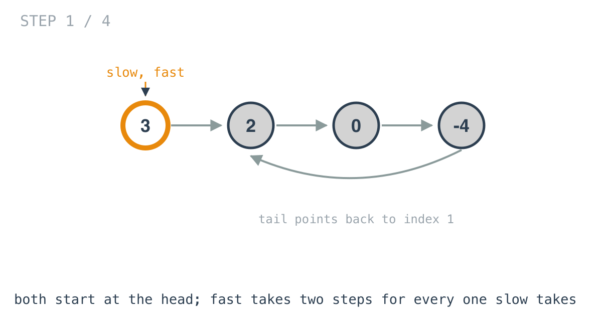
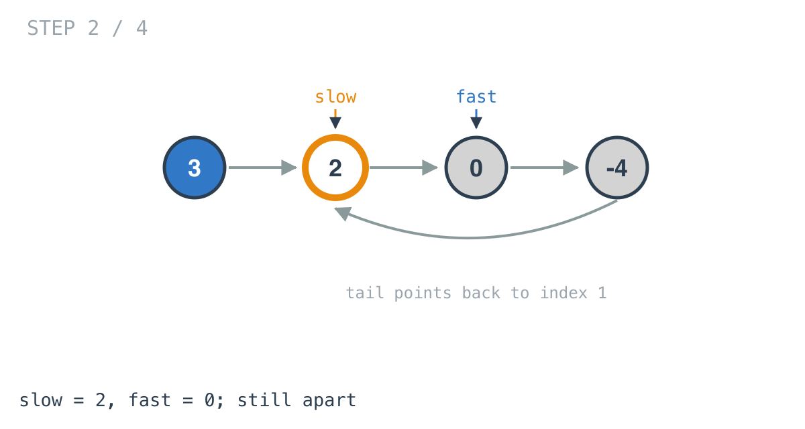
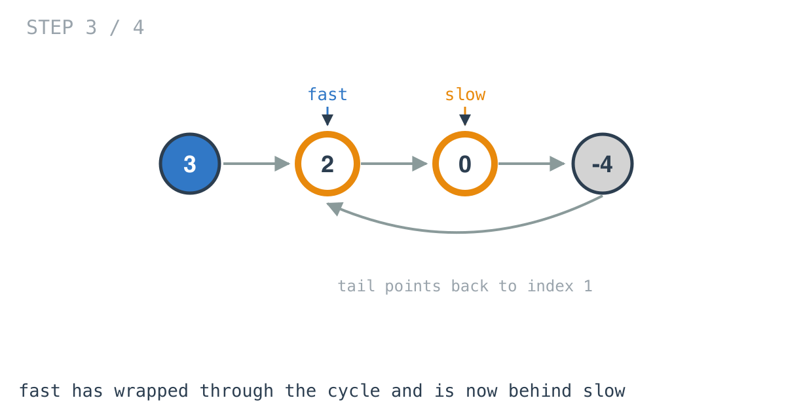
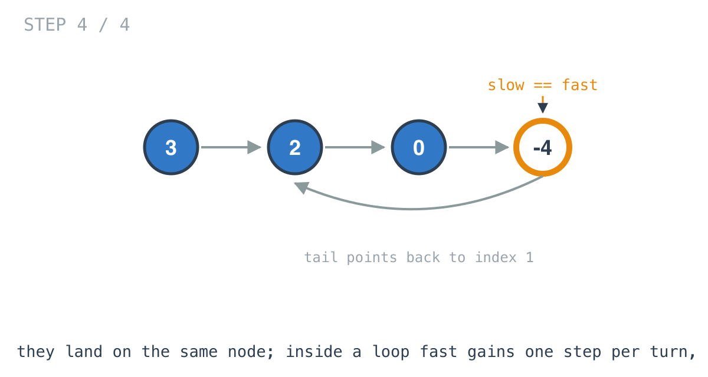

# Linked List Cycle — solution walkthrough

The whole function, from `linked_list_cycle.go`:

```go
func HasCycle(head *ListNode) bool {
	slow, fast := head, head

	for fast != nil && fast.Next != nil {
		slow = slow.Next
		fast = fast.Next.Next
		if slow == fast {
			return true
		}
	}
	return false
}
```

Compare it to day 20's `middleNode` and the only differences are the return type and the two lines in the middle. The walk is the same walk.

## The loop condition is the no-cycle answer

```go
for fast != nil && fast.Next != nil {
```

Exactly the two guards from day 20, catching the same two parities: `fast != nil` for an even-length list where the fast pointer steps onto `nil`, and `fast.Next != nil` for an odd-length one where it lands on the last node.

Here they do double duty. In day 20 they only kept the walk from dereferencing nothing. Here, reaching either of them *is* the result: a list that has an end cannot have a cycle, so falling out of the loop means `return false`.

A cyclic list never fails this condition. Neither pointer can reach `nil`, because there is no `nil` to reach. The loop only exits through the `return true` inside it.

## The walk, on a cyclic list

The example is `[3,2,0,-4]` with the tail pointing back at index 1.



Both pointers start on the head.



One iteration: `slow` on 2, `fast` on 0. They are two apart.



Two iterations. `fast` has gone round through the back edge and is now sitting behind `slow`. This is the picture worth stopping on, because it shows that "fast is ahead" stops being meaningful once the structure wraps. What stays meaningful is the forward distance around the cycle.



Three iterations, and both land on the same node. `slow == fast`, so the function returns `true`.

## Why meeting is guaranteed, not lucky

Once both pointers are inside the cycle, measure the gap as the number of steps forward from `fast` to `slow` going around the loop.

Each iteration `fast` moves two and `slow` moves one, so that gap decreases by exactly one. It is a non-negative integer that drops by one per iteration, so it reaches zero. It cannot skip zero, because it changes by one, not two.

Gap zero means both pointers are on the same node, and the check fires. Since the gap starts at less than the cycle length, the meeting happens within one lap.

This also explains why the step sizes are 1 and 2 rather than, say, 1 and 3. With a difference of 2 per iteration the gap decreases by two each turn and can step straight over zero, so the pointers can pass each other without ever landing together.

## Comparing nodes, not values

```go
if slow == fast {
```

`slow` and `fast` are `*ListNode`, so this compares addresses: are these the same node? That is the actual question.

Writing `slow.Val == fast.Val` would be a different and wrong program. It reports a cycle on `[1,1]`, a two-node list with no cycle at all, because after one iteration both pointers sit on nodes holding 1.

## Where the check sits

It comes *after* both pointers move, not before. At the top of the first iteration `slow` and `fast` are both on the head and comparing them would return `true` for every non-empty list.

Moving first also means the meeting is detected on the iteration it happens, rather than one iteration late.

## Complexity

- **Time: O(n).** No cycle: the fast pointer reaches the end in about n/2 iterations. Cycle: the pointers meet within one lap after the slow one enters it, which is bounded by n.
- **Space: O(1).** Two pointers, no allocation. This is the whole point compared to the hash-set solution, which is O(n) space.

## Test

`main_test.go` builds each example with a `buildCycle` helper that links the nodes and then points the tail back at index `pos`, because the bracket notation in the problem statement cannot express a cycle on its own. The cases are `[3,2,0,-4]` with `pos = 1`, `[1,2]` with `pos = 0`, and the single node `[1]` with `pos = -1` for the no-cycle path.
