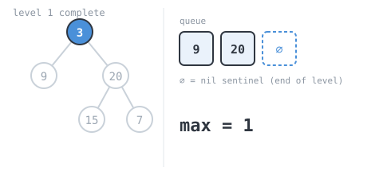
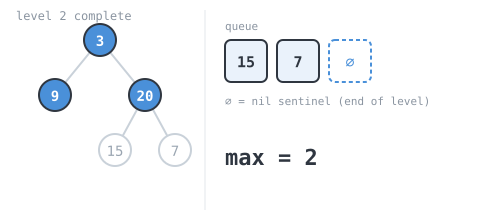
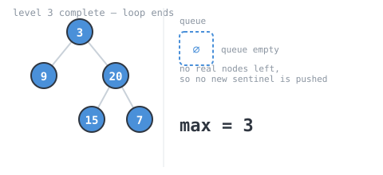

## 365 Days of LeetCode Challenge — Day 1/365

# Maximum Depth of Binary Tree

🔗 https://leetcode.com/problems/maximum-depth-of-binary-tree/ · Difficulty: Easy

### The problem

Given the root of a binary tree, return its maximum depth — the number of nodes along
the longest path from the root down to the farthest leaf.

### The intuition

The "depth" of a binary tree is just its number of levels. If you could see the whole
tree drawn out, the answer is the number of rows before the tree runs out of nodes.

The natural way to count rows is a **level-order (breadth-first) traversal**: visit all
nodes at depth 1, then all nodes at depth 2, then depth 3, and so on, counting how many
full rounds you complete before there's nothing left to visit.

A BFS naturally processes nodes queue-by-queue, but a plain queue doesn't tell you
*where one level ends and the next begins* — you'd just see a flat stream of nodes. The
trick used here is to push a `nil` "sentinel" value right after the root, marking the
end of the current level. Every time you pop a `nil` off the queue, you know you've
just finished a full level: increment the depth counter, and (if there are still real
nodes left in the queue) push a fresh `nil` sentinel to mark the end of the *next*
level.

This turns "how many levels are there" into "how many sentinels did I pop", which is
easy to track with a single counter and no extra bookkeeping about level sizes.

### The solution

Here's the tree from LeetCode's own example, which we'll trace below:


```go
func maxDepth(root *TreeNode) int {
	if root == nil {
		return 0
	}
	max := 0
	queue := make([]*TreeNode, 0)
	// nil is a sentinel marking "end of the current level" in the queue, so a
	// plain BFS can tell levels apart without tracking per-level sizes.
	queue = append(queue, root, nil)
	pop := func() *TreeNode {
		node := queue[0]
		queue = queue[1:]
		return node
	}
	push := func(node *TreeNode) {
		queue = append(queue, node)
	}
	for len(queue) > 0 {
		node := pop()
		if node == nil {
			// Popping the sentinel means we've drained a whole level.
			if len(queue) > 0 {
				// More real nodes remain: push the next level's end marker.
				push(nil)
			}
			max++
			continue
		}
		if node.Left != nil {
			push(node.Left)
		}
		if node.Right != nil {
			push(node.Right)
		}
	}

	return max
}
```

Walking it through `[3,9,20,null,null,15,7]` (expected depth `3`):
- Queue starts `[3, nil]`. Pop `3` (real): push its children `9, 20` → queue `[nil, 9, 20]`.
- Pop `nil` (level 1 done, `max=1`): queue not empty, push new sentinel → `[9, 20, nil]`.

  

- Pop `9` (real, no children) → `[20, nil]`.
- Pop `20` (real): push children `15, 7` → `[nil, 15, 7]`.
- Pop `nil` (level 2 done, `max=2`): push new sentinel → `[15, 7, nil]`.

  

- Pop `15`, then `7` (both leaves) → `[nil]`.
- Pop `nil` (level 3 done, `max=3`): queue empty, no new sentinel.
- Return `max = 3`. ✓

  

**Complexity:** O(n) time — every node is enqueued/dequeued once. O(n) space in the
worst case for the queue (a very wide, shallow tree).

Full code + tests: `easy_problems/101_200/maximum_depth_of_binary_tree/` in the repo.
