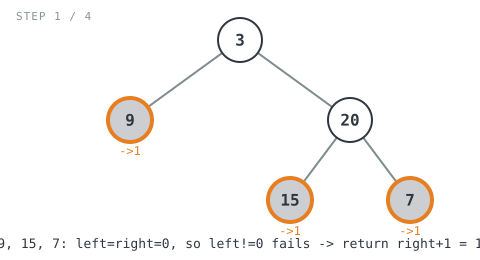
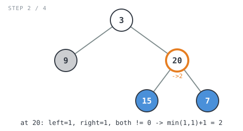
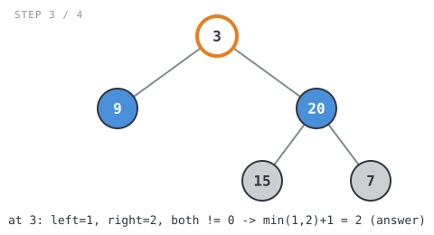
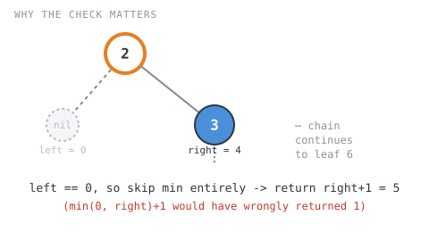

**365 Days of LeetCode Challenge — Day 6/365**
**Minimum Depth of Binary Tree** (Easy)
🔗 https://leetcode.com/problems/minimum-depth-of-binary-tree/

This looks like Maximum Depth with `min` swapped in, but a leaf needs no children,
not just a missing one. A node with only one child still isn't a leaf, so a nil
child's depth (`0`) must never be allowed to win a naive `min()` comparison, or the
code will report the tree bottoms out one step too early. Easy trap to fall into if
you're pattern-matching off memory.


Full solution:
```go
func minDepth(root *TreeNode) int {
	// An empty subtree has no depth. This 0 sentinel also lets a parent
	// tell "no subtree here" apart from "a real subtree of depth 1".
	if root == nil {
		return 0
	}
	left := minDepth(root.Left)
	right := minDepth(root.Right)

	// Both children exist (neither depth came back as the nil-sentinel 0):
	// this is a real branching node, so the shortest path takes the
	// shallower side.
	if left != 0 && right != 0 {
		return minVal(left, right) + 1
	} else if left != 0 {
		// Only the left child exists; a 0 on the right means "no subtree",
		// not "a zero-length path", so it must never win the comparison.
		return left + 1
	}
	// Falls through when only the right child exists, or when both are
	// nil (a true leaf), in which case right is 0 and this yields 1.
	return right + 1
}

// minVal returns the smaller of a and b.
func minVal(a, b int) int {
	if a < b {
		return a
	}
	return b
}
```

Walking it through `[3,9,20,null,null,15,7]` (expected `2`):
- `9`, `15`, `7` are leaves (both children nil), so each falls to `return right+1 = 1`



- `minDepth(20)`: left=1, right=1, both non-zero, so `min(1,1)+1 = 2`



- `minDepth(3)`: left=1, right=2, both non-zero, so `min(1,2)+1 = 2`, matching the
  expected answer



Why the guard matters: Example 2, `[2,null,3,null,4,null,5,null,6]`, is a
right-only chain (answer `5`). Without the `left != 0` check, a missing left child's
`0` would win `min(0, right)+1`, wrongly returning `1` at the first node. That's the
whole bug in one line.



O(n) time since every node gets visited once, O(h) space for the recursion stack
(the tree height).
