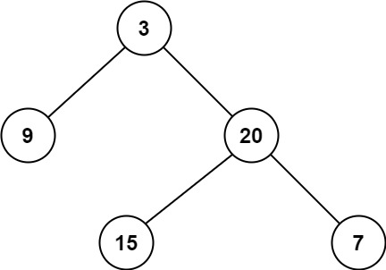
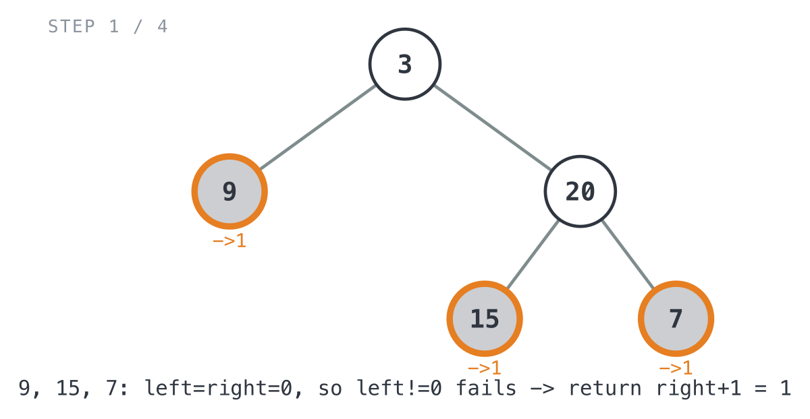
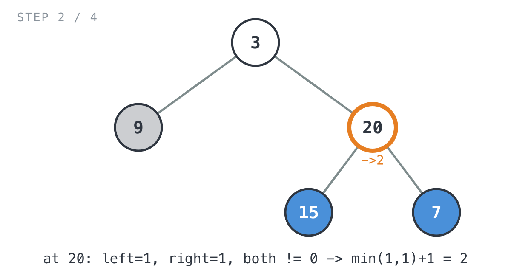
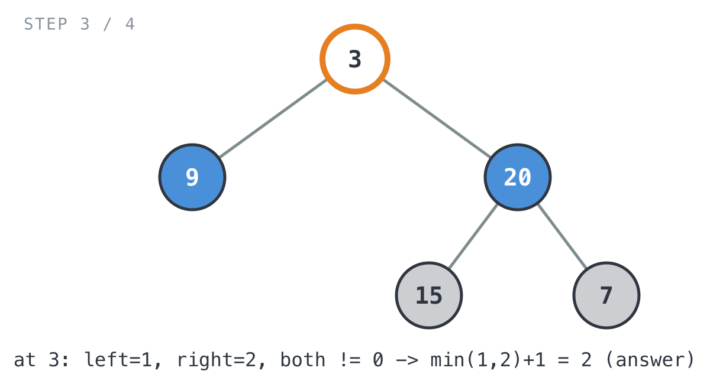
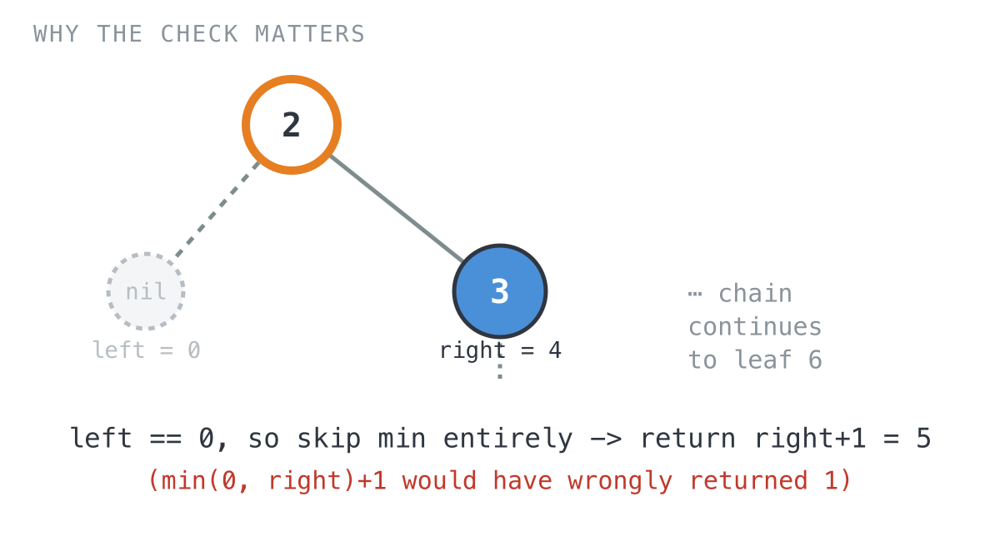

## 365 Days of LeetCode Challenge — Day 7/365

# Minimum Depth of Binary Tree

🔗 https://leetcode.com/problems/minimum-depth-of-binary-tree/ · Difficulty: Easy

### The problem

Given a binary tree, find its minimum depth: the number of nodes on the shortest
path from the root down to the nearest leaf, where a leaf is a node with no
children at all.

### The intuition

This looks like the mirror image of Maximum Depth of Binary Tree: swap `max` for
`min` and call it a day, right? That's the trap. Minimum depth means the shortest
path down to a genuine leaf, not the shallowest point anywhere in the tree, and a
leaf specifically has no children, not just a missing one.

That distinction matters because a node with only one child is not a leaf, even
though one of its subtrees is empty. I got tripped up by this myself the first time
I looked at it, which is basically why it's worth writing down. If the code naively
took `min(minDepth(root.Left), minDepth(root.Right)) + 1` at every node, a missing
left child would report depth `0`, and `min(0, right) + 1` would collapse to `1`,
claiming the tree bottoms out one step below a node that isn't actually a leaf.
That's wrong. You have to keep walking down the side that does exist until you
reach a real leaf.

So the fix is: a `0` coming back from a nil child means "no subtree here," and it
must never be allowed to win a `min` comparison against a real subtree.
- If both children exist, it's a genuine branching point. Take the smaller subtree
  depth and add one.
- If only one child exists, that's the only path down. Follow it and add one,
  regardless of how it compares to a sibling that doesn't exist.
- The base case (`root == nil`) returns `0`, which is exactly what lets a parent
  detect "no subtree" versus "a real, shallow subtree."

This one adjustment, refusing to let a missing child masquerade as a zero-length
path, is the entire difference between this problem and Maximum Depth.

### The solution



```go
func minDepth(root *TreeNode) int {
	// An empty subtree has no depth. This 0 sentinel also lets a parent
	// tell "no subtree here" apart from "a real subtree of depth 1".
	if root == nil {
		return 0
	}
	left := minDepth(root.Left)
	right := minDepth(root.Right)

	// Both children exist (neither depth came back as the nil-sentinel 0):
	// this is a real branching node, so the shortest path takes the
	// shallower side.
	if left != 0 && right != 0 {
		return minVal(left, right) + 1
	} else if left != 0 {
		// Only the left child exists; a 0 on the right means "no subtree",
		// not "a zero-length path", so it must never win the comparison.
		return left + 1
	}
	// Falls through when only the right child exists, or when both are
	// nil (a true leaf), in which case right is 0 and this yields 1.
	return right + 1
}

// minVal returns the smaller of a and b.
func minVal(a, b int) int {
	if a < b {
		return a
	}
	return b
}
```

Walking it through `[3,9,20,null,null,15,7]` (expected `2`):
- `9`, `15`, and `7` are leaves. Both children are nil, so `left != 0` fails and each
  one falls through to `return right + 1 = 1`.



- `minDepth(20)`: `left=1` (from `15`), `right=1` (from `7`), both non-zero, so
  `minVal(1, 1) + 1 = 2`.



- `minDepth(3)`: `left=1` (from `9`), `right=2` (from `20`), both non-zero, so
  `minVal(1, 2) + 1 = 2`, which matches the expected answer.



Here's why the `left != 0` / `right != 0` guard is the whole problem. Example 2,
`[2,null,3,null,4,null,5,null,6]`, has no left children at all: a straight
right-leaning chain down to leaf `6`, correct answer `5`. If the code ever computed
`minVal(left, right) + 1` at a node whose left child is nil, `left` would be `0`, and
`minVal(0, right) + 1` would collapse to `1` at the very first node. Wrong, since a
missing child is not a leaf. The guard keeps a `0` from a nil child out of the `min`
comparison entirely; the code just follows whichever single side actually exists.



Time comes out to O(n), since every node gets visited once. Space is O(h) for the
recursion stack, where h is the tree height: O(log n) if it's balanced, O(n) if it's
skewed.

Full code: `easy_problems/101_200/minimum_depth_of_binary_tree/` in the repo.

#DSA #LeetCode #100DaysOfCode #CodingInterview #BinaryTree #DFS #Golang

---

*Solution and code by Archit Agarwal. Write-up drafted with AI assistance from the code and problem statement.*
