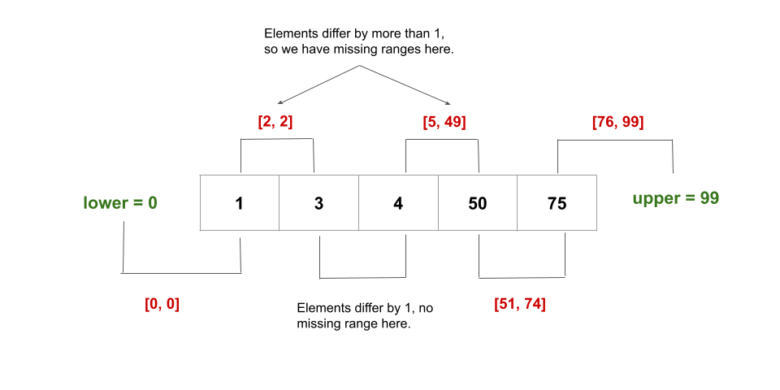

# Intuition

As the input array `nums` is sorted ascending and all the elements in it are within the given `[lower, upper]` bounds, we can simply check consecutive elements to see if they differ by one or not. If they don't, then we have found a missing range.

- When `nums[i + 1] - nums[i] <= 1`, we know that there are no missing elements between `nums[i + 1]` and `nums[i]`.
- When `nums[i + 1] - nums[i] > 1`, we know that the range of elements, `[nums[i] + 1, nums[i + 1] - 1]`, is missing.

## However, there are two edge cases

1. If we don't start with `lower` as the first element of the array, we will need to include `[lower, num[0] - 1]` as a missing range as well.
1. Similarly, if we don't end with `upper` as the last element of the array, we will need to include `[nums[n - 1] + 1, upper]` as a missing range as well where `n` is the length of `nums`.

Here's a visual representation of the missing ranges for an example:

## Algorithm

1. Create a variable `n` and initialize it to the size of `nums`.
1. Create a list `missingRanges` that will contain the solution to the problem.
1. If there are no elements in `nums`, we simply return the range `[lower, upper]`.
1. We check if the first element of the array is equal to lower or not. If `lower < nums[0]`, we have a missing range `[lower, nums[0] - 1]`. We add it to missingRanges.
1. We iterate over all the elements in `nums` using a loop that runs from `i = 0` to `n - 2` (till the second last element):
   - If the current element `nums[i]` and the next element `nums[i + 1]` differ by `1` or less, there are no missing numbers between these two numbers. Otherwise, if `nums[i + 1] - nums[i] > 1`, we have missing numbers from `nums[i] + 1 to nums[i + 1] - 1` (both inclusive). As a result, `[nums[i] + 1, nums[i + 1] - 1]` is added to missingRanges.
1. We check if the last element of the array is equal to `upper` or not. If`nums[n - 1] < upper`, we have a missing range `[nums[n - 1] + 1, upper]`. We again add it to `missingRanges`.
