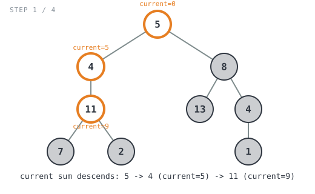
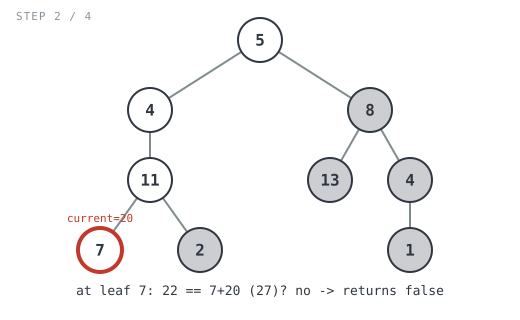
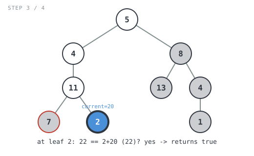

## 365 Days of LeetCode Challenge — Day 7/365

# Path Sum

🔗 https://leetcode.com/problems/path-sum/ · Difficulty: Easy

### The problem

Given the root of a binary tree and an integer `targetSum`, return `true` if the tree
has a **root-to-leaf** path whose values add up to `targetSum`. A leaf is a node with
no children.

### The intuition

The word doing all the work here is "root-to-leaf" — a match only counts if the path
runs the entire way from the root down to a childless node. That rules out checking
"does the running sum equal `targetSum` at this node?" everywhere; a match at an
internal node (one that still has children) doesn't count, so the comparison has to
happen exactly once, at the leaf.

The natural approach is to carry the running total *down* the tree as an extra
argument, adding each node's value in as you descend, and only compare against
`targetSum` once you reach a node with nowhere left to go.

The one subtlety: a node with only a left child (no right child) is **not** a leaf,
even though `root.Right == nil`. It still has somewhere to go, so it needs to recurse
into that one real child rather than getting scored on the spot. The branching in the
code is explicit about this — "does this node have any child to descend into" is
checked before the leaf comparison ever runs.

### The solution


```go
func hasPathSum(root *TreeNode, targetSum int) bool {
	return sum(root, targetSum, 0)
}

func sum(root *TreeNode, target, current int) bool {
	if root == nil {
		return false
	} else if root.Left != nil && root.Right != nil {
		return sum(root.Left, target, current+root.Val) || sum(root.Right, target, current+root.Val)
	} else if root.Left != nil {
		return sum(root.Left, target, current+root.Val)
	} else if root.Right != nil {
		return sum(root.Right, target, current+root.Val)
	}
	return target == root.Val+current
}
```

Walking it through `root = [5,4,8,11,null,13,4,7,2,null,null,null,1]`, `targetSum = 22`:

```
            5
          /   \
         4     8
        /     / \
      11     13  4
      / \          \
     7   2          1
```

- `sum(5, 22, 0)` — `5` has two children, so it recurses left into `4` (`current=5`)
  and, only if that comes back `false`, would try right into `8`.
- `sum(4, 22, 5)` — `4` has only a left child, so it descends into `11`
  (`current=9`).
- `sum(11, 22, 9)` — `11` has two children, so it tries both `7` and `2`, each
  arriving with `current=20`.



- `sum(7, 22, 20)` — `7` is a leaf. `22 == 7+20` (`27`)? No → `false`.



- `sum(2, 22, 20)` — `2` is a leaf. `22 == 2+20` (`22`)? Yes → `true`.



`true` now bubbles back up through `11` → `4` → `5`. Because Go's `||` short-circuits,
`sum(8, 22, 5)` — the entire right subtree (`13`, `4`, `1`) — is never evaluated.
`hasPathSum` returns `true`. ✓


**Complexity:** O(n) time — every node is visited at most once (fewer, whenever `||`
short-circuits). O(h) space for the recursion stack, where h is the tree's height.

Full code: `easy_problems/101_200/path_sum/` in the repo.
