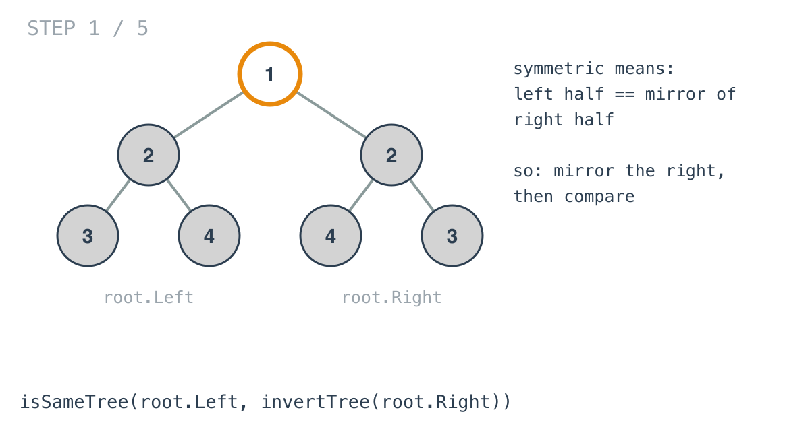
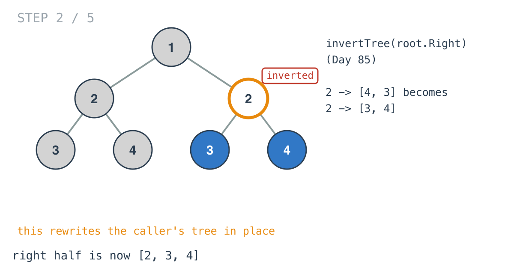
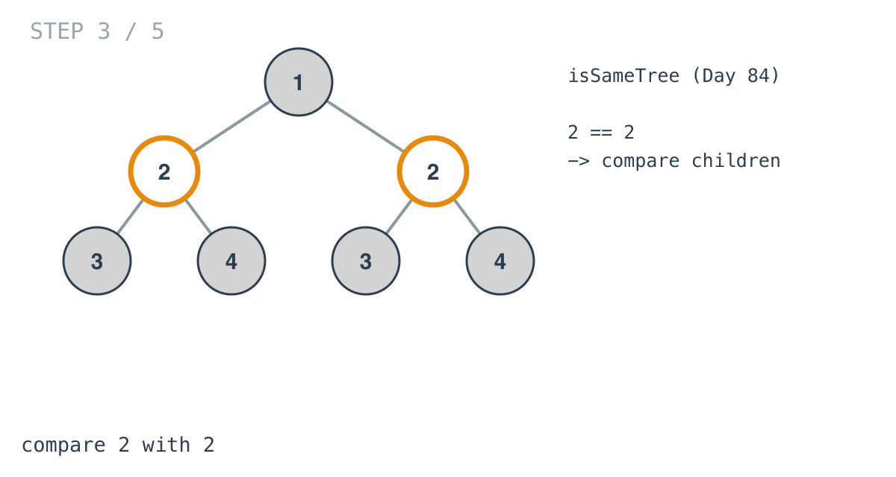
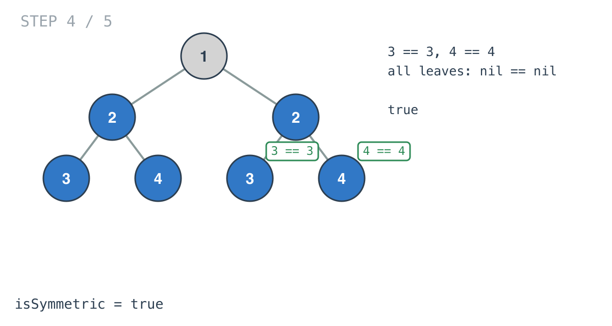
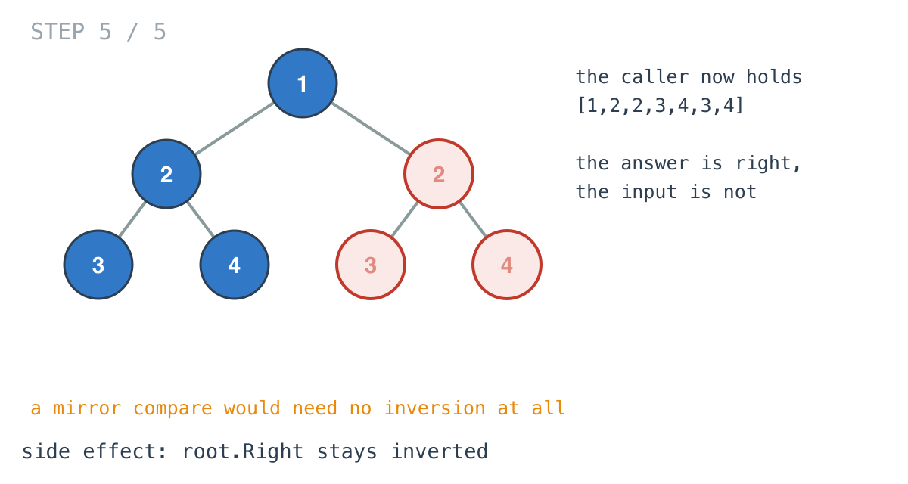

## Solution walkthrough

`isSymmetric` in `main.go` is one line on top of two helpers carried over from earlier
problems: `invertTree` from Invert Binary Tree and `isSameTree` from Same Tree.

We'll trace Example 1, `[1,2,2,3,4,4,3]`, which is symmetric.

1. **An empty tree is symmetric.** `if root == nil { return true }`. The constraints say
   there's at least one node, so this never fires on LeetCode's tests.

2. **Split at the root.** The root itself has no partner, so the question is only about
   its two subtrees: is `root.Left` the mirror of `root.Right`?

   

3. **Mirror the right half.** `invertTree(root.Right)` swaps children at every node of the
   right subtree. Its `2 -> [4, 3]` becomes `2 -> [3, 4]`.

   This happens in place. The tree the caller passed in has been changed.

   

4. **Compare in lockstep.** `isSameTree(root.Left, <inverted right>)` walks both subtrees
   together. The roots are `2` and `2`.

   

5. **Every pair matches.** `3` meets `3`, `4` meets `4`, and every leaf's nil children
   meet nils. The answer is true.

   

   For Example 2, `[1,2,2,null,3,null,3]`, inverting the right half gives
   `2 -> [3, null]`, while the left half is `2 -> [null, 3]`. The left children compare
   nil against `3`, and `isSameTree` returns false.

6. **The side effect stays behind.** When `isSymmetric` returns, `root.Right` is still
   inverted. The caller's tree is now `[1,2,2,3,4,3,4]`.

   

   Comparing the halves as mirrors avoids that entirely: check that the values match, that
   `a.Left` mirrors `b.Right`, and that `a.Right` mirrors `b.Left`. That's one pass and no
   writes.

**Complexity:** O(n) time: the inversion visits the right half, and the comparison visits
both halves. O(h) space for the recursion stack.
