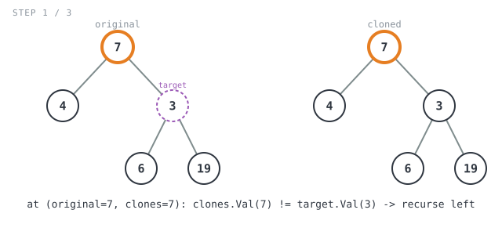
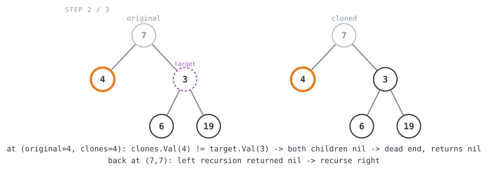

**365 Days of LeetCode Challenge — Day 27/365**
**Find a Corresponding Node of a Binary Tree in a Clone of That Tree** (Easy)
🔗 https://leetcode.com/problems/find-a-corresponding-node-of-a-binary-tree-in-a-clone-of-that-tree/

**Intuition:** `cloned` is a structurally identical copy of `original`, so you never need
to search it on its own. Walk both trees **in lockstep** — one recursive call, both
pointers step together — and compare values at each paired position. The instant they
match, the `cloned`-side pointer is standing exactly where `target` stands, so it's the
answer.


**Full solution:**
```go
// getTargetCopy walks original and clones in lockstep: every recursive call
// advances both pointers together, so wherever the traversal is standing in
// original, clones is standing at the structurally-matching node in the
// cloned tree. That's guaranteed because clones is an exact copy of
// original, which lets the search find target's counterpart purely by
// position/value instead of needing to compare node identities.
func getTargetCopy(original, clones, target *TreeNode) *TreeNode {
	// clones mirrors original node-for-node, so clones == nil alone is
	// enough to detect "ran out of tree" along this path; original doesn't
	// need its own nil check.
	if clones == nil {
		return nil
	}
	// Values are guaranteed unique, so a value match means clones is
	// standing exactly where target stands in original — return this
	// cloned-tree node as the answer.
	if clones.Val == target.Val {
		return clones
	}
	// Search the left subtrees of both trees together first.
	n := getTargetCopy(original.Left, clones.Left, target)
	if n != nil {
		return n
	}
	// Not found on the left; whatever the right subtree search finds (or
	// doesn't) is this call's result.
	return getTargetCopy(original.Right, clones.Right, target)
}
```

**Walkthrough** on `original = [7,4,3,null,null,6,19]`, `target = 3` (expected: the `3`
node from `cloned`):

- `getTargetCopy(7, 7, target)` → `7 != 3` → recurse left into `(4, 4)`



- `getTargetCopy(4, 4, target)` → `4 != 3`, both children nil on both sides → dead end,
  returns `nil`



- Back at `(7,7)`: left returned `nil` → recurse right into `(3, 3)` → `3 == 3` → match!
  return `clones` (the cloned-tree `3` node) ✓


O(n) time, O(h) space (tree height).
