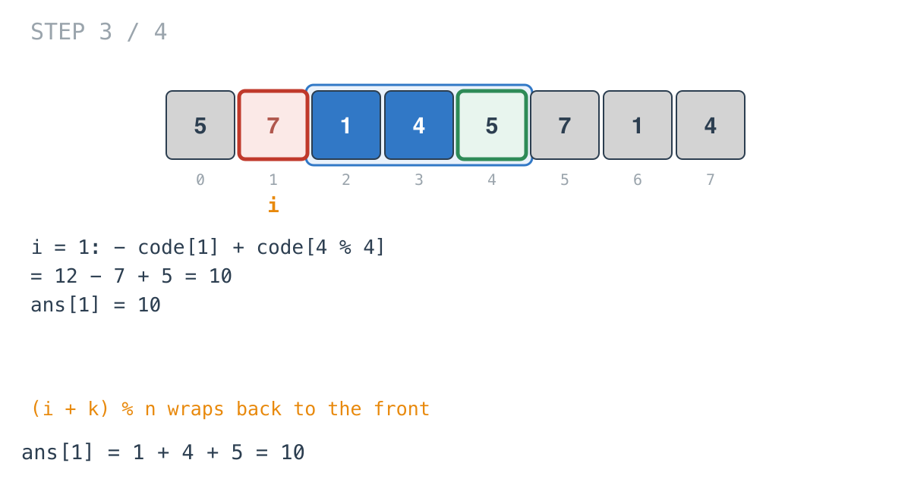
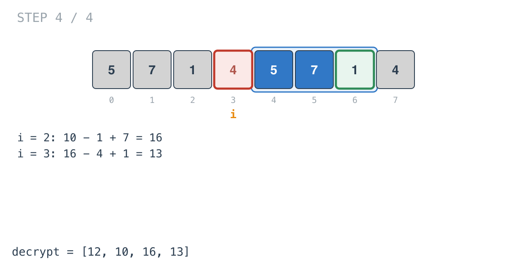

## Solution walkthrough

`decrypt(code []int, k int) []int` in `defuse_the_bomb.go` handles `k > 0` and `k < 0`
with mirrored sliding windows, and leaves `k == 0` to the zeroed output slice.

We'll trace Example 1: `code = [5,7,1,4]`, `k = 3`, expected `[12,10,16,13]`. The
diagrams draw the array twice so a window that wraps past the end can be shown in one
piece; index `j` in the drawing is `code[j % 4]`.

1. **A fresh output slice.** `ans := make([]int, n)`. The problem replaces every number
   simultaneously, so the sums must be computed from the original `code`, not from values
   already replaced. `make` also zero-fills, which is the whole answer for `k == 0`.

2. **Prime with the first `k` numbers.** `sum += code[i%n]` for `i` in `0..k-1`:
   `5 + 7 + 1 = 13`. This window includes position 0, which the answer for position 0
   must not.

   ![Step 1: primed with code[0..2]](images/walkthrough-1.png)

3. **Update, then record.** `sum = sum - code[i] + code[(i+k)%n]`. At `i = 0` that
   removes 5 and adds `code[3] = 4`: 12, the sum of the three numbers after position 0.
   `ans[0] = 12`.

   ![Step 2: ans[0] = 12](images/walkthrough-2.png)

4. **Wrap around.** At `i = 1`, `(1+3)%4 = 0`, so the entering number is `code[0] = 5`.
   `12 - 7 + 5 = 10`. The modulo is what turns the end of the array into the start.

   

5. **Finish.** `i = 2` gives `10 - 1 + 7 = 16`, `i = 3` gives `16 - 4 + 1 = 13`. Output
   `[12, 10, 16, 13]`.

   

6. **Negative `k` is the mirror.** `k *= -1`, prime with the last `k` numbers, and walk
   `i` from `n-1` down, doing `sum = sum - code[i] + code[((i-k)+n)%n]`. The `+n` keeps the
   index non-negative, because Go's `%` returns a negative result for a negative left
   operand. On Example 3 this produces `[12, 5, 6, 13]`.

**Complexity:** O(n) time, O(n) space for the output.
