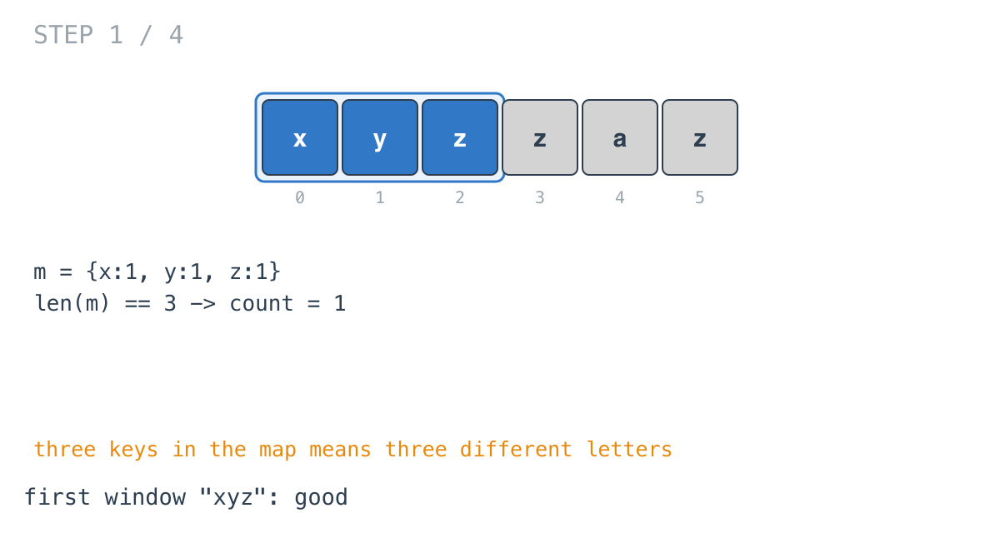
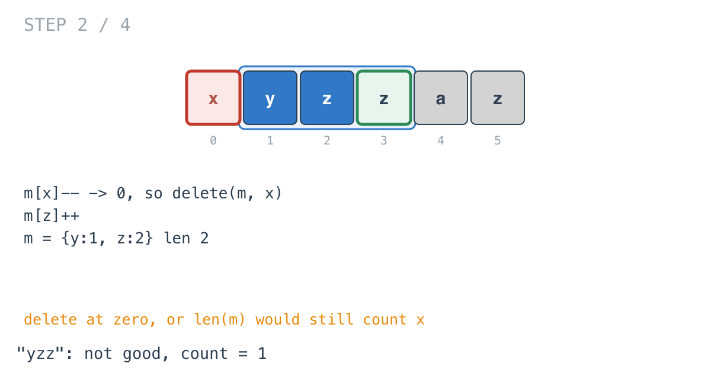
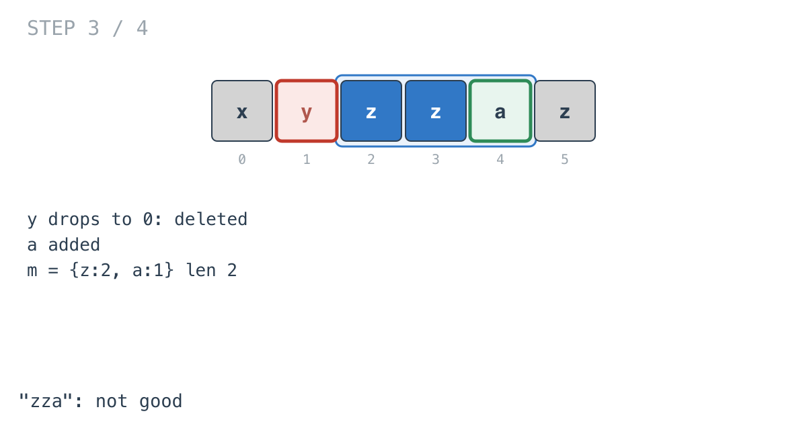
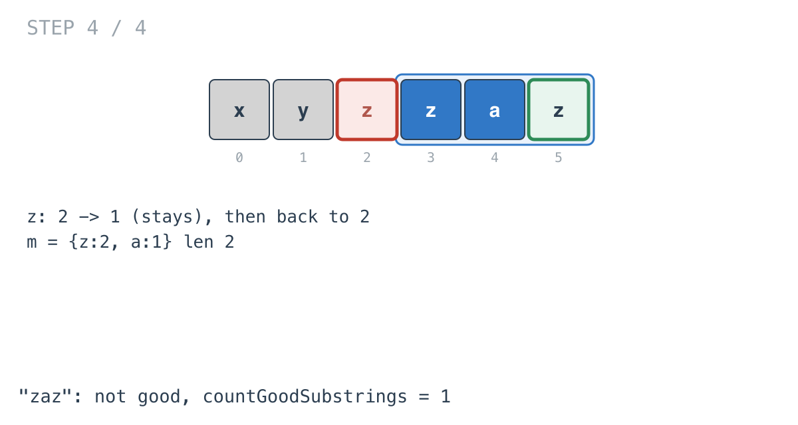

## Solution walkthrough

`countGoodSubstrings(s string) int` in
`substrings_of_size_three_with_distinct_characters.go` slides a window of three letters
along `s`, keeping a map of letter counts.

We'll trace Example 1: `s = "xyzzaz"`, expected `1`.

1. **Short strings have no windows.** `if n < 3 { return 0 }`.

2. **Build the first window in full.** `m[s[0]]++`, `m[s[1]]++`, `m[s[2]]++`, then
   `if len(m) == 3 { count++ }`. For `"xyz"` there are three keys, so `count = 1`.

   

3. **Remove the oldest letter, and delete it at zero.**

   ```go
   m[s[i-3]]--
   if m[s[i-3]] == 0 {
       delete(m, s[i-3])
   }
   ```

   At `i = 3`, `x` leaves. Its count hits 0 and the key is removed. Without the `delete`,
   `x` would stay in the map with count 0 and `len(m)` would still be 3.

4. **Add the new letter and check.** `m[s[i]]++`, then `len(m) == 3`. The new letter is
   `z`, already present, so the map is `{y:1, z:2}`: two keys, not good.

   

5. **Keep sliding.** `y` leaves (deleted), `a` enters: `{z:2, a:1}`, two keys.

   

6. **A letter can leave and re-enter in one step.** At `i = 5`, `z` leaves (count 2 to 1,
   not deleted) and `z` enters again (back to 2). Still two keys. The final count is 1.

   

**Complexity:** O(n) time, O(1) space since the map holds at most three keys.
