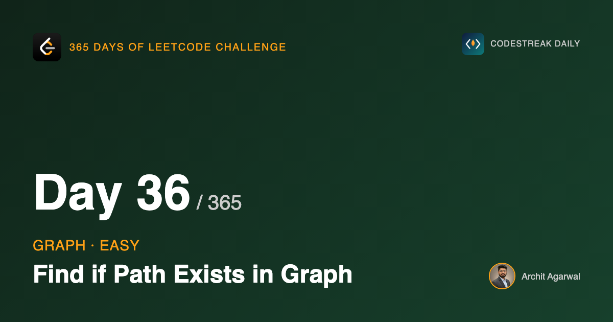

## 365 Days of LeetCode Challenge — Day 36/365

**[1971. Find if Path Exists in Graph](https://leetcode.com/problems/find-if-path-exists-in-graph/)** (Easy)

Given an undirected graph as a list of edges, is `destination` reachable from `source`?

New topic today. The linked list arc ended on Reorder List, and the thread that carries over is the same one that ran through it: a structure is defined by what points at what, and changing the pointers changes the structure.

## The input is not a graph

This is the part that gets skipped when people say a graph problem "is just BFS".

You are handed `edges`, a flat list of pairs. Ask that list "what are node 3's neighbours?" and you have to scan all of it. Do that once per node during a traversal and an O(V + E) algorithm quietly becomes O(V x E).

So the first half of the problem is building an adjacency list: a map from each node to the nodes it touches, built in one pass, after which every neighbour lookup is immediate.

The traversal is the easy half. Choosing the representation is the half that is actually a decision.

## Undirected means recording the edge twice

```go
val[edges[i][1]] = true   // u knows about v
val[edges[i][0]] = true   // and v knows about u
```

An undirected edge has to go into the list under both endpoints.

Record it once and you have built a directed graph without meaning to. The traversal then refuses to walk an edge "backwards", and you get a false answer on inputs where the path exists but happens to arrive from the other side. It is the most common bug in this problem and it passes plenty of test cases before it fails one.

## Then it is a traversal


Example 2 has two components, and a walk from 0 can only reach the one it started in. `visited[5]` stays false.

## Mark on the way in

```go
if !visited[key] {
	queue.Enqueue(key)
	visited[key] = true
}
```

A node is marked visited when it is **enqueued**, not when it is dequeued.

Mark on dequeue and a node with five neighbours can be pushed five times before it is ever processed, and each copy repeats the work. Marking on enqueue guarantees every node enters the queue at most once.

## BFS or DFS does not matter here, and will

The question is reachability, not distance, so either traversal answers it correctly. A recursive DFS would be shorter than this BFS and just as right.

That stops being true the moment a problem asks for a *shortest* path, because BFS reaches every node by a shortest route and DFS does not. Day 40 is where the difference starts paying rent.

## One thing this could do better

The loop drains the whole queue and checks the destination at the end. It could check on each dequeue and return early.

For a false answer that changes nothing, since the component has to be explored either way. For a true answer on a large component it can stop much sooner. Worth knowing; not worth much on an Easy.

## Complexity

- **Time: O(V + E)**. One pass to build the list, one traversal.
- **Space: O(V + E)**. The adjacency list dominates.

Full code and the step-by-step walkthrough:
[find_if_path_exists_in_graph](https://github.com/architagr/leetcode_solutions/blob/main/easy_problems/1901_2000/find_if_path_exists_in_graph/SOLUTION.md)

#DSA #LeetCode #Golang #Graphs #BFS #CodingInterview #Algorithms

---

*Solution and code by Archit Agarwal. Write-up drafted with AI assistance from the code and problem statement.*
