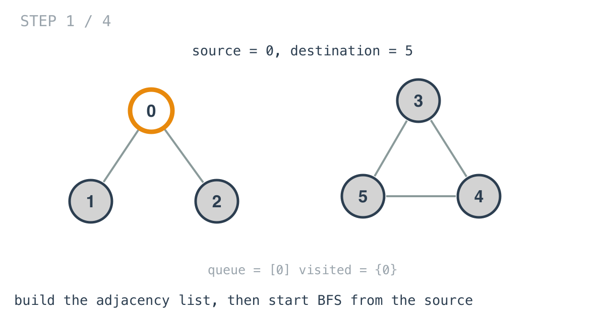
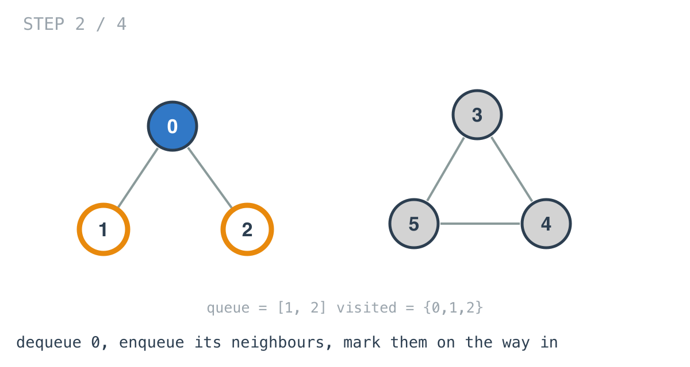
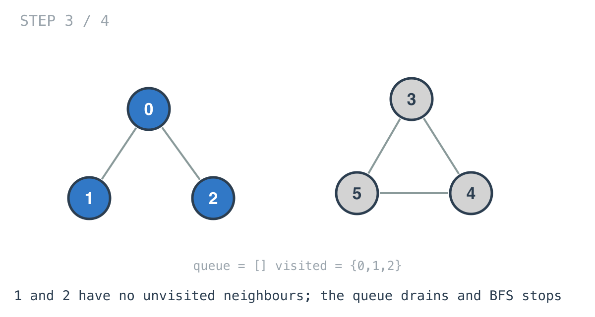
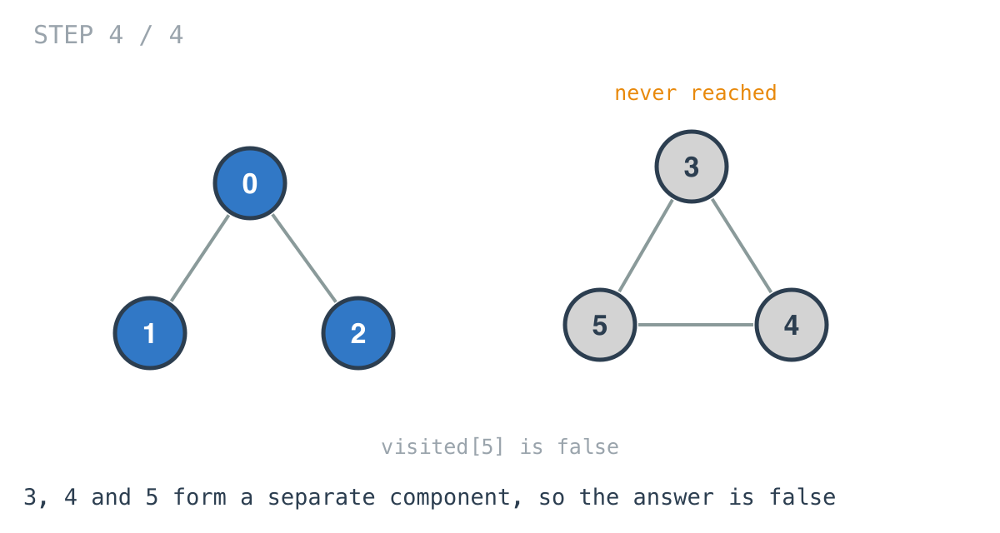

# Find if Path Exists in Graph — solution walkthrough

From `find_if_path_exists_in_graph.go`:

```go
func validPath(n int, edges [][]int, source int, destination int) bool {
	visited := make([]bool, n)
	queue := NewQueue()
	at := make(map[int]map[int]bool)
	for i := 0; i < len(edges); i++ {
		val, ok := at[edges[i][0]]
		if !ok {
			val = make(map[int]bool)
		}
		val[edges[i][1]] = true
		at[edges[i][0]] = val

		val, ok = at[edges[i][1]]
		if !ok {
			val = make(map[int]bool)
		}
		val[edges[i][0]] = true
		at[edges[i][1]] = val
	}
	queue.Enqueue(source)
	visited[source] = true
	for !queue.IsEmpty() {
		x := queue.Dequeue().Data
		val := at[x]
		for key := range val {
			if !visited[key] {
				queue.Enqueue(key)
				visited[key] = true
			}
		}
	}
	return visited[destination]
}
```

Two halves: build a usable representation, then walk it.

## Half one: the adjacency list

`edges` arrives as a flat list of pairs. Asking it "what touches node 3?" means scanning the whole list, so the loop turns it into `at`, a map from node to its set of neighbours.

Each edge is recorded **twice**, once under each endpoint, because the graph is undirected. Record it once and you have built a directed graph by accident, and the traversal will refuse to walk an edge backwards.

The inner value is a `map[int]bool` rather than a slice. For this problem, where the constraints promise no duplicate edges, a slice would do the same job with less allocation. A set matters when duplicates are possible and you want neighbours deduplicated for free.

## Half two: BFS



The source goes in, and is marked before the loop starts.



Each iteration takes one node off the queue and pushes its unvisited neighbours.

Note where the marking happens:

```go
if !visited[key] {
	queue.Enqueue(key)
	visited[key] = true
}
```

A node is marked **as it is enqueued**, not when it is later dequeued. That is what keeps each node in the queue at most once. Mark on dequeue instead and a node with five neighbours can be pushed five times before it is ever processed, and every one of those duplicates does the work again.



The queue drains once the component is exhausted.



In example 2 the graph has two components, and the BFS from 0 can only ever reach the one it started in. `visited[5]` is still false, so the answer is false.

## The one thing this could do better

The loop runs until the queue is empty, then checks the destination at the end. It could check `x == destination` on each dequeue and return `true` immediately.

For a false answer that changes nothing, since the whole component has to be explored either way. For a true answer on a large component it can stop much earlier. The version here is a little wasteful and much easier to read, which is a fair trade for an Easy, and worth knowing about when the graph is big.

## Why the queue is hand-rolled

The file defines its own `Queue` over a linked list of `Node` values. Go's standard library has no queue type, and the usual idiom is a slice with `q = q[1:]` to pop, which is what days 39 and 40 use.

Both are fine. The slice version is shorter; the linked-list version does not retain the backing array of everything already popped, which only matters for very long queues.

## Complexity

- **Time: O(V + E).** One pass over the edges to build the adjacency list, then a traversal touching each node once and each edge from both ends.
- **Space: O(V + E).** The adjacency list dominates. The visited array and the queue are both O(V).

## Test

`main_test.go` covers both worked examples: the triangle `[[0,1],[1,2],[2,0]]` where 2 is reachable from 0, and the six-node graph split into two components where it is not. The second case is the one that fails if edges are only recorded in one direction.
