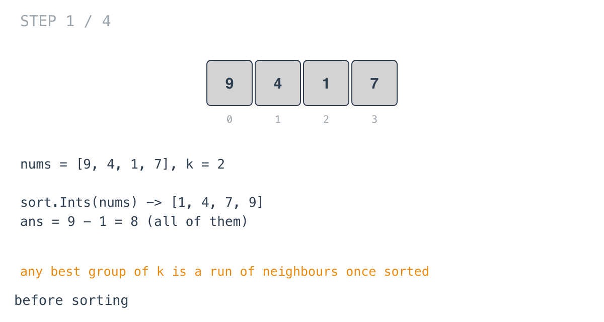

## Solution walkthrough

`minimumDifference(nums []int, k int) int` in
`minimum_difference_between_highest_and_lowest_of_k_scores.go` sorts the scores and checks
every window of `k` neighbours.

We'll trace Example 2: `nums = [9,4,1,7]`, `k = 2`, expected `2`.

1. **Sort.** `sort.Ints(nums)` gives `[1, 4, 7, 9]`. Once sorted, the best group of `k`
   is always some run of neighbours: a scattered group can be swapped for the run starting
   at its lowest score without increasing the difference.

2. **Start from the widest possible gap.** `ans := nums[n-1] - nums[0]`, here `9 - 1 = 8`.
   No window can be wider.

   

3. **Offset.** `k--` makes `k = 1`, so `nums[i-k]` is the first element of the window
   ending at `i`.

4. **Each window's difference is its two ends.** In sorted order, a window's minimum is
   its first element and its maximum is its last, so the loop does
   `l := nums[i] - nums[i-k]`. At `i = 1` that's `4 - 1 = 3`, and `ans` becomes 3.

   ![Step 2: window [1, 4]](images/walkthrough-2.png)

5. **Slide.** `7 - 4 = 3`, no change.

   ![Step 3: window [4, 7]](images/walkthrough-3.png)

6. **The best window.** `9 - 7 = 2`. `ans = 2`, which is the answer.

   ![Step 4: window [7, 9]](images/walkthrough-4.png)

   With `k = 1` (Example 1), `k--` gives 0, every difference is `nums[i] - nums[i] = 0`,
   and the answer is 0 with no special case.

**Complexity:** O(n log n) for the sort, O(n) for the pass. `sort.Ints` sorts the input
slice in place.
