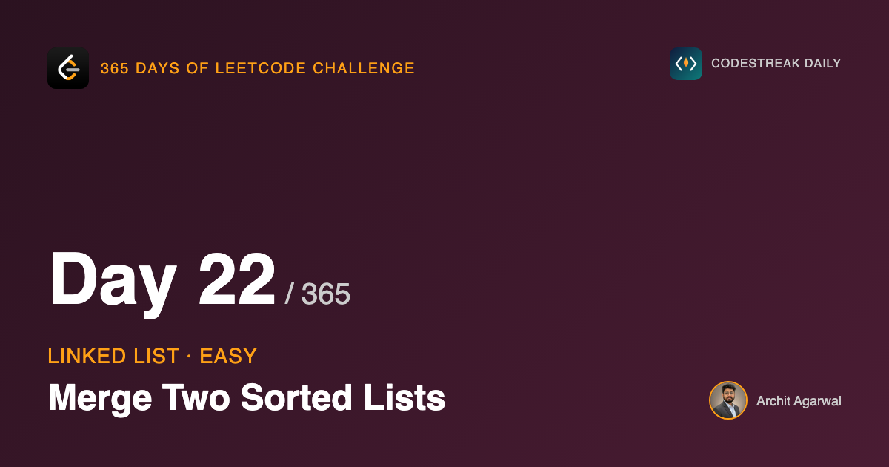
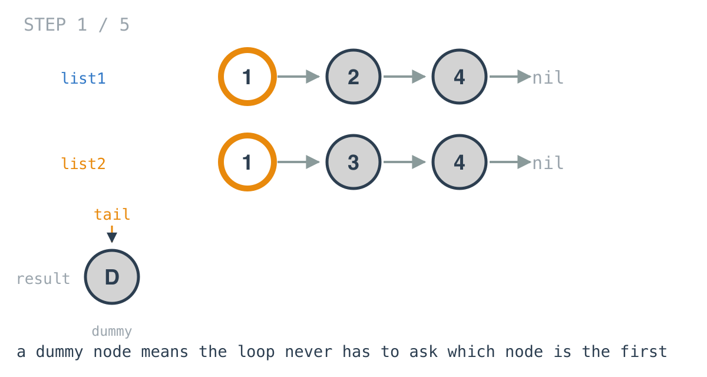
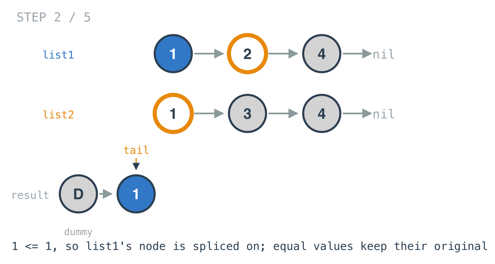
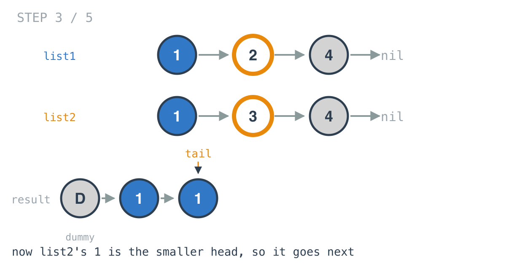
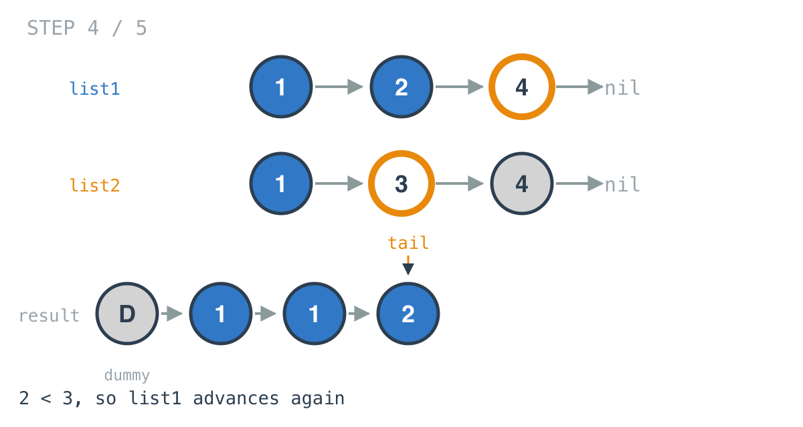
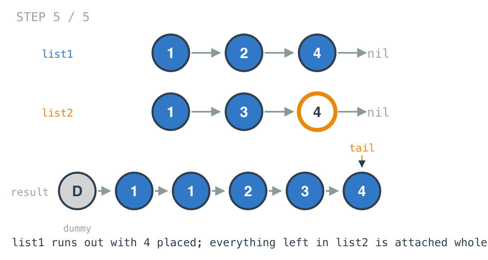

*365 Days of LeetCode Challenge — Day 22/365*

**[21. Merge Two Sorted Lists](https://leetcode.com/problems/merge-two-sorted-lists/)** (Easy)

Two sorted lists go in, one sorted list comes out. The problem statement is specific about how: the result "should be made by splicing together the nodes of the first two lists". That word is doing real work, and I will come back to it.

## The algorithm is not the interesting part

At any moment, the smallest node not yet placed is the head of one list or the head of the other.

It cannot be anywhere else. Both lists are sorted, so nothing sitting behind a head is smaller than that head. Two candidates, always, no matter how long the lists are.

So: compare the two heads, take the smaller, advance that list, repeat. If you have seen merge sort this is its combining step, and if you have not, you have now seen the part of merge sort that does the actual work.

## The interesting part is the first node

Here is where a clean idea gets ugly in code.

To attach a node to the result you need a previous node to attach it to. At the start there is no result yet, so there is no previous node, so the first element cannot be handled the same way as the others.

The version most people write first deals with this by choosing the head before the loop starts:

```go
if list2.Val <= list1.Val {
	// ... set up head from list2
} else {
	// ... set up head from list1
}
for list1 != nil && list2 != nil {
	// ... the same comparison again
}
```

It works. It is also the same comparison written twice, which means it is two places to get `<=` versus `<` wrong, and two places to update if the comparison ever changes.

## The dummy node

```go
dummy := &ListNode{}
tail := dummy
```

Allocate one throwaway node. Never read its value, never return it. Point `tail` at it.

Now `tail` refers to something real from the very first iteration. The loop can attach to `tail.Next` immediately, and the question "is this the first node?" never comes up, because from the loop's point of view it never is. At the end, the real head is `dummy.Next`, and the dummy is discarded.

This is the technique worth taking away from the problem, and it has nothing to do with merging. Any time you build a linked list front to back, a dummy head removes the special case for the first element. You will reach for it again.

## The whole function

```go
func MergeTwoLists(list1 *ListNode, list2 *ListNode) *ListNode {
	dummy := &ListNode{}
	tail := dummy

	for list1 != nil && list2 != nil {
		if list1.Val <= list2.Val {
			tail.Next = list1
			list1 = list1.Next
		} else {
			tail.Next = list2
			list2 = list2.Next
		}
		tail = tail.Next
	}

	if list1 != nil {
		tail.Next = list1
	} else {
		tail.Next = list2
	}

	return dummy.Next
}
```

## Watching it run

`list1 = [1,2,4]`, `list2 = [1,3,4]`.





`1 <= 1` is true, so list1's node is taken. Which of the two ties wins is a real decision and I will come back to it.







list1 empties out and the loop ends with list2 still holding a node.

## Attaching the rest in one move

```go
if list1 != nil {
	tail.Next = list1
} else {
	tail.Next = list2
}
```

The leftover list is attached whole. One pointer assignment, no traversal.

That is correct because two things are true simultaneously at this point. The leftover list is sorted, because it always was and nothing reordered it. And every node in it is at least as large as everything already placed, because the only way its head survived to the end of the loop was by losing every comparison it entered.

The obvious alternative keeps the loop going until both lists are empty, moving one node at a time. Same answer, n more assignments, and it obscures the fact that the tail needed no work at all.

## Three guards that were not needed

An earlier version of this function opened with:

```go
if list1 == nil && list2 == nil { return nil }
if list1 == nil { return list2 }
if list2 == nil { return list1 }
```

Every one of these is already handled by the code below it.

Both `nil`: the loop never runs, the `else` branch assigns `tail.Next = nil`, and `dummy.Next` is `nil`. Exactly one `nil`: the loop never runs, the other list is attached whole, and that is the answer.

This is worth flagging because defensive guards that restate what the general path already does are not free. They are three more branches to read, three more places where a future edit can disagree with the main logic, and they hide the fact that the loop already handles the edges. Deleting code that does nothing is a real improvement.

## `<=` versus `<`

```go
if list1.Val <= list2.Val {
```

On a tie this takes from `list1` rather than `list2`.

The result is correctly sorted either way. No test that checks "is the output sorted" will ever fail because of this character.

What changes is stability: with `<=`, equal values keep their original relative order, list1's ahead of list2's. When this merge is the combining step of a merge sort, that is the difference between a stable sort and an unstable one, and stability is usually the reason someone chose merge sort in the first place.

## Splicing, not copying

Back to that word in the problem statement.

You can solve this by reading the values out and building fresh nodes around them. Same output, and it costs O(n) extra space for nodes that already existed.

Relinking the nodes you were given costs two pointers. It is the same move as day 19: change what points where, and the structure changes without anything being allocated. Three days into this arc it is starting to look less like a trick and more like the only thing linked lists do.

## Complexity

- **Time: O(n + m).** Every node is inspected at most once, and the remainder is attached without being walked.
- **Space: O(1).** One dummy node and two pointers, whatever the input size.

Full code and the step-by-step walkthrough:
[merge_two_sorted_lists](https://github.com/architagr/leetcode_solutions/blob/main/easy_problems/1_100/merge_two_sorted_lists/SOLUTION.md)

---

*Solution and code by Archit Agarwal. Write-up drafted with AI assistance from the code and problem statement.*
