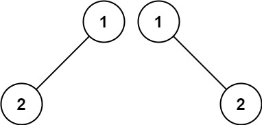
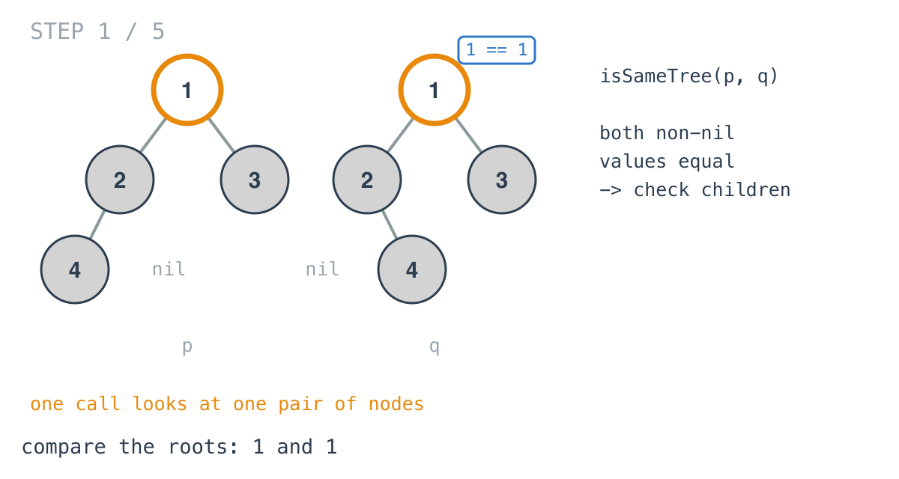
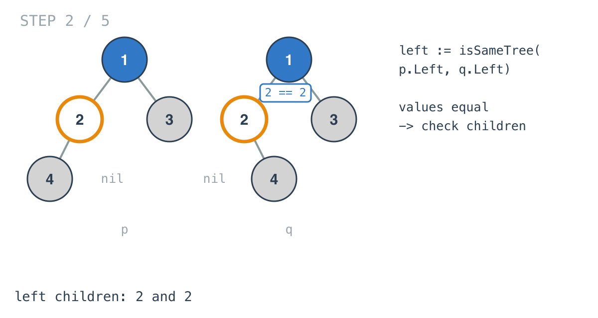
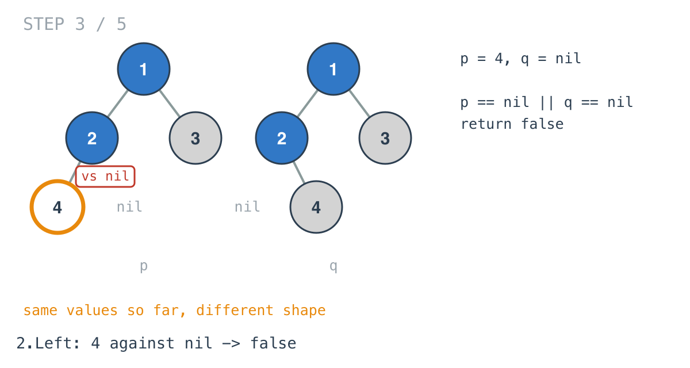
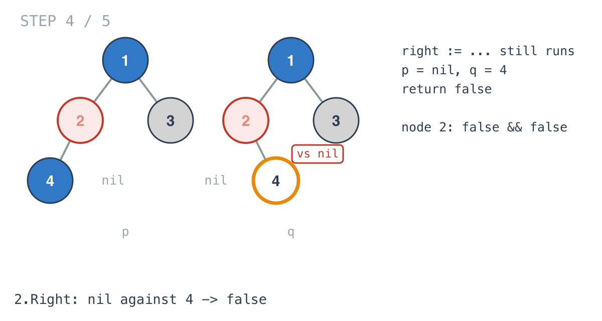
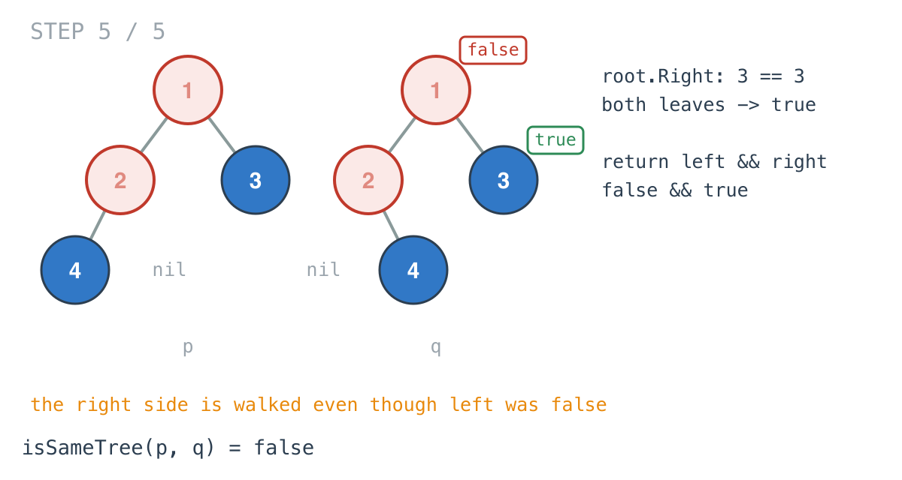

## Solution walkthrough

`isSameTree(p, q *TreeNode) bool` in `main.go` compares one pair of nodes per call and
recurses into both pairs of children.

The examples are small, so we'll trace a pair that shows the interesting case more
clearly: `p = [1,2,3,4]` and `q = [1,2,3,null,4]`. The values are identical, and the only
difference is that `4` hangs off the left of `2` in `p` and off the right of `2` in `q`.

1. **Both nil first.** `if p == nil && q == nil { return true }`. Two empty subtrees
   match. This check has to come first because the next one would also fire for it.

2. **Exactly one nil.** `else if p == nil || q == nil { return false }`. Having ruled out
   both-nil, this `||` can only mean one side has a node and the other doesn't.

3. **Values.** `if p.Val != q.Val { return false }`. At the root, `1` and `1` agree, so
   we move on to the children.

   

4. **Recurse left.** `left := isSameTree(p.Left, q.Left)` compares `2` with `2`, which
   also agree and recurse further.

   

5. **The shape difference shows up as a nil.** Under `2`, the left pair is `p`'s `4`
   against `q`'s nil. Step 2's `||` fires and this call returns false.

   

6. **The right side still runs.** The code stores the left result and then calls
   `right := isSameTree(p.Right, q.Right)` regardless. Under `2`, that's nil against
   `q`'s `4`, also false, so node `2` returns `false && false`.

   

7. **Back at the root.** The root's right pair, `3` and `3`, is compared too, and it
   returns true. The root returns `left && right`, which is `false && true`, so the answer
   is false.

   

   Because the two recursive calls are made before the `&&`, nothing is skipped. Inlining
   them as `return isSameTree(p.Left, q.Left) && isSameTree(p.Right, q.Right)` would stop
   at the first false, since Go's `&&` doesn't evaluate its right side when the left is
   false.

**Complexity:** O(n) time as written, one call per position the trees share. O(h) space
for the recursion stack, where h is the smaller tree's height along the path being walked.
