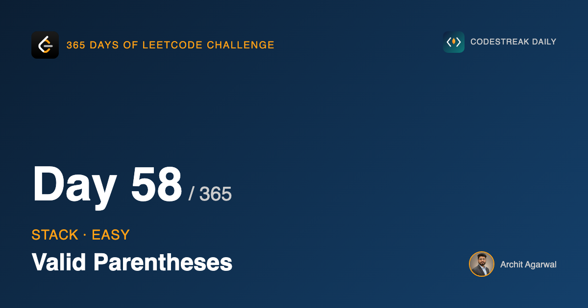
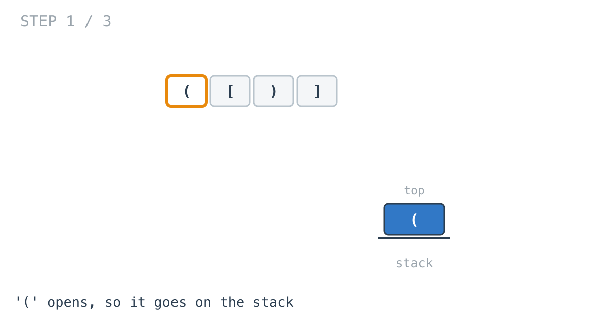
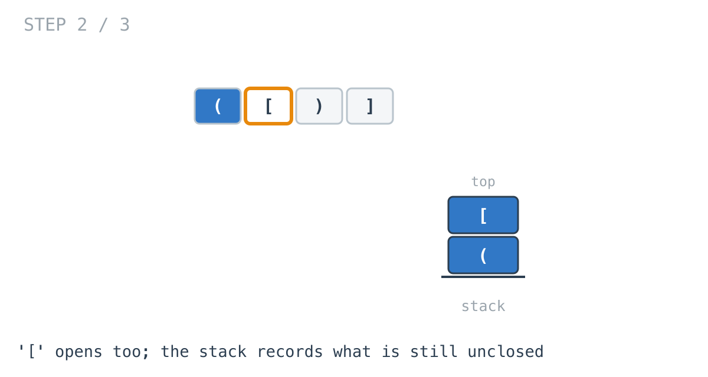
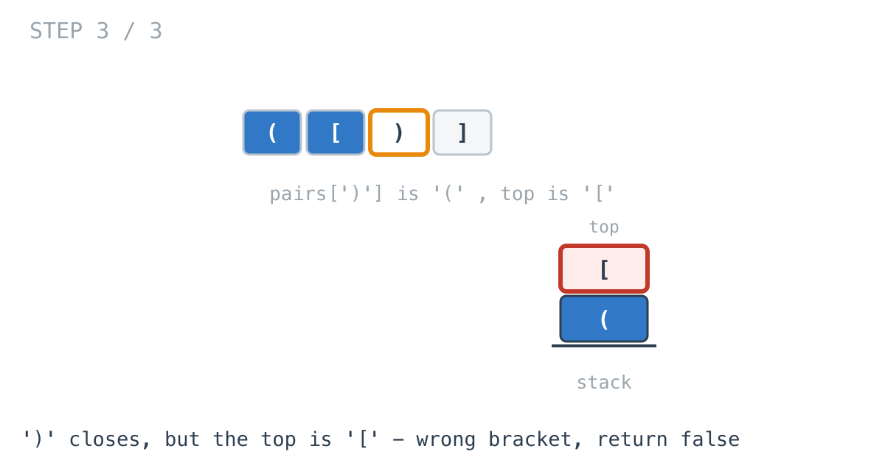

*365 Days of LeetCode Challenge — Day 58/365*

**[20. Valid Parentheses](https://leetcode.com/problems/valid-parentheses/)** (Easy)

Given a string containing only `()[]{}`, decide whether every bracket is closed by the right kind, in the right order.

Stacks start today. The graph arc ended on Course Schedule, and if you want a thread between them: Kahn's algorithm used a queue because the question was "what is ready first". Today's question is "what is *most recent*", and that single word is the difference between the two structures.

## Start with the solutions that do not work

I want to spend real time here, because this problem is usually taught by stating the answer, and the answer is much more convincing once you have watched two reasonable ideas fail.

**Idea one: count them.** Count the openers, count the closers, check they match.

That accepts `)(`. Two brackets, one of each, perfectly balanced by count — and completely invalid, because the closer arrives before anything is open.

**Idea two: track a depth.** Start at zero, add one for an opener, subtract one for a closer. Invalid if it ever goes negative, or if it does not end at zero.

This is a real improvement. It rejects `)(` immediately, because the first character drives the depth to -1. It handles nesting. It looks right.

It accepts `([)]`.

Trace it: `(` takes depth to 1, `[` to 2, `)` back to 1, `]` to 0. Never negative, ends at zero, and the string is nonsense.

## The reason both fail is the same

A counter records **how many** brackets are open. It never records **which**.

And "which" is the entire problem. `([)]` is invalid for a reason that has nothing to do with quantity: at the moment `)` arrives, the innermost unclosed bracket is `[`, and a round bracket cannot close a square one.

Once that is clear, what you need becomes obvious. Not a number — a record of the brackets opened and not yet closed, in the order they were opened.

## And only one of them can ever match

Here is the second observation, and it is what picks the data structure.

When a closer arrives, you do not need to search that record. Only one entry can possibly match: the most recent one.

In `([`, a `)` is wrong. Not because `(` is unmatched — it is sitting right there, waiting. It is wrong because `[` was opened later and has to close first. Brackets nest, and nesting means the last thing opened is the first thing that must close.

Most recent in, first out. That is the definition of a stack, and arriving at it by noticing a property of the problem is worth much more than remembering that bracket problems use stacks.

## The function

```go
func IsValid(A string) bool {
	pairs := map[byte]byte{')': '(', ']': '[', '}': '{'}
	stack := make([]byte, 0, len(A))

	for i := 0; i < len(A); i++ {
		open, isCloser := pairs[A[i]]
		if !isCloser {
			stack = append(stack, A[i])
			continue
		}
		if len(stack) == 0 || stack[len(stack)-1] != open {
			return false
		}
		stack = stack[:len(stack)-1]
	}

	return len(stack) == 0
}
```

## Keying the map by the closer

```go
pairs := map[byte]byte{')': '(', ']': '[', '}': '{'}
```

Almost everyone writes this the other way round the first time — `'(' : ')'` — because that is the direction we read brackets in.

Keying by the closing bracket is what makes the loop short:

```go
open, isCloser := pairs[A[i]]
```

Go's two-value map read returns the value and whether the key was present, so that one line answers both of the questions the loop needs. Is this character a closer? And if it is, what has to be on top of the stack?

Keyed by the opener, you need a separate test for membership before you can branch at all, and then a second lookup to find the expected partner. Same logic, more lines, one more place to be inconsistent.

## Walking it



An opener has no decision attached. It goes on the stack, because it is now something that must eventually be closed.



Two brackets open, and the stack holds them in order. This is the state a depth counter throws away.



And here is `([)]` failing, at the moment it should: `)` needs `(` on top and finds `[`.

## Two failures, one condition

```go
if len(stack) == 0 || stack[len(stack)-1] != open {
	return false
}
```

A closer can be wrong in two distinct ways, and both are in that line.

`len(stack) == 0` is a closer with nothing open at all. The string `)` or `())`.

`stack[len(stack)-1] != open` is a closer meeting the wrong bracket. `([)]`.

The order of the two tests is load-bearing. Go evaluates `||` left to right and short-circuits, so the emptiness check must come first — otherwise the index expression runs on an empty slice and panics on exactly the input the first test exists to catch. This is the same short-circuit ordering that mattered in day 37's grid guard, and it will keep coming up.

Neither failure can be rescued by later characters, so the function returns immediately rather than reading the rest of the string. That is not really a performance argument at this size. It is that the invariant is being checked continuously, rather than reconstructed at the end.

## The last line is not a formality

```go
return len(stack) == 0
```

It is tempting to read the loop finishing as success. It is not.

Getting to the end proves that every closer that appeared found its partner. It proves nothing about openers that never met a closer at all. Feed it `(((` and the closer branch never executes once, the loop completes without complaint, and the string is obviously invalid.

The stack being empty is the other half of the claim: nothing was opened and left open.

## One small thing about the allocation

```go
stack := make([]byte, 0, len(A))
```

Every character can push at most one entry, so the stack can never be longer than the string. Allocating that capacity up front means `append` never has to grow and copy.

It over-allocates on a string that is mostly closers, and it makes no difference to correctness. I think it is worth it when the bound is this obvious and this tight.

## Complexity

- **Time: O(n).** One pass, and each character does a map lookup and at most one push or pop, all constant.
- **Space: O(n).** The stack. The worst case is a string of all openers, where nothing is ever popped.

Full code and the step-by-step walkthrough:
[valid_parentheses](https://github.com/architagr/leetcode_solutions/blob/main/easy_problems/1_100/valid_parentheses/SOLUTION.md)

---

*Solution and code by Archit Agarwal. Write-up drafted with AI assistance from the code and problem statement.*
