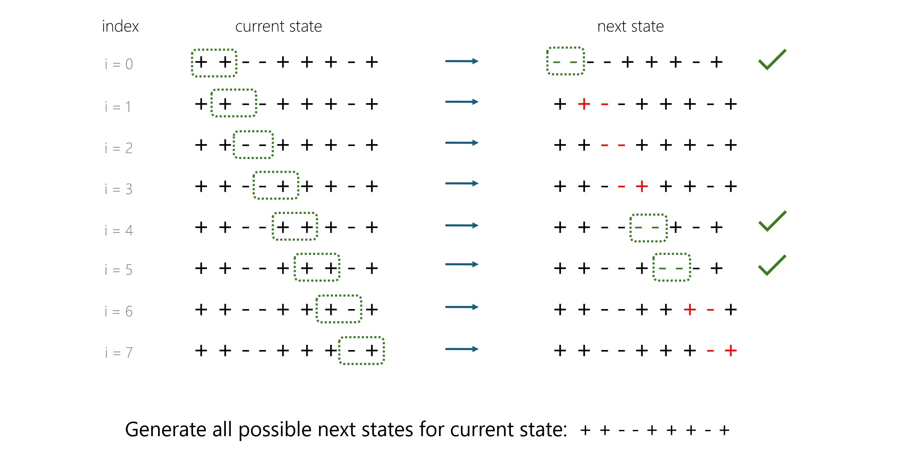

# Intuition

> **Note:** This problem evaluates your understanding and handiness in working with string data structures and performing operations like sub-string and concatenation.

Given the `currentState` string consisting of `'+'` and `'-'`, we must return all possible next states after making one move.
In one move we can only change one `'++'` to `'--'`. All other combinations `'--'`, `'+-'`, or `'-+'` can't be changed.

The naive approach would be to find all `'++'` in the `currentState` string and change them to `'--'` one at a time.
For this, we can iterate over the whole `currentState` string from the `0`th index to the end and check every two adjacent characters. If both characters are `'+'`, they can be replaced with `'-'` and stored in the `nextPossibleStates` array.

## Algorithm

1. Create an empty array `nextPossibleStates` to store all possible next states after making one move.

1. Start a loop from `index = 0` up to `currentState.size() - 1`. For each `index`:

   - If the character at `index` and `index + 1` are both `'+'`:
     - Create a new string nextState by replacing the two adjacent `'+'` characters with `'--'`.
     - Use string concatenation to construct `nextState` from the substring before the first `'+'`, `"--"`, and the substring after the second `'+'` till the end.
     - Store the generated `nextState` in the `nextPossibleStates` array.

1. After the loop, return the `nextPossibleStates` array containing all the possible next states.

## Complexity Analysis

Let `n` be the length of the `currentState` string.

- Time complexity: $\ O(n^2)$
  - We iterate over all $\ n−1 $ indices of the `currentState` string, and for each index, we may create the next state string, which takes $\ O(n)$ time. Thus, for all indices, this approach will take $\ O(n^2)$ time.
- Space complexity: $\ O(1)$
  - We declare a few variables, which use constant space. We also declare the output array `nextPossibleStates`, but because this is only used for storing the output, it does not count towards the space complexity. Therefore, the space complexity is $\ O(1)$.

> **Note:** We generally don't consider input and output space usages during space complexity analysis.
