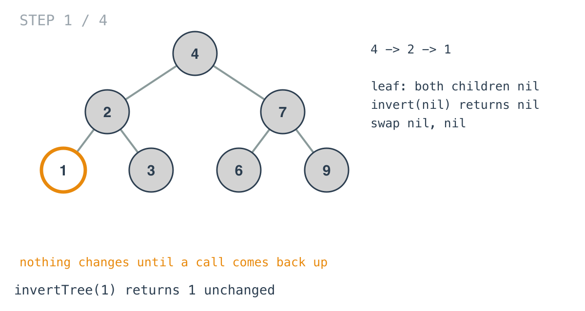
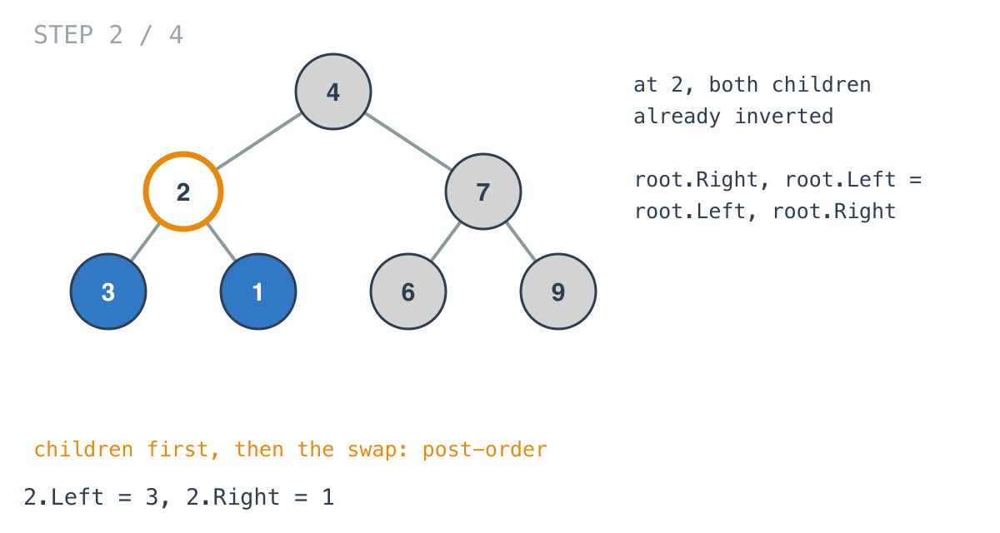
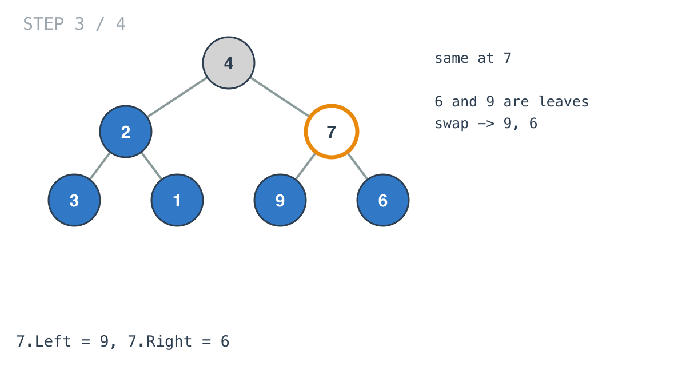
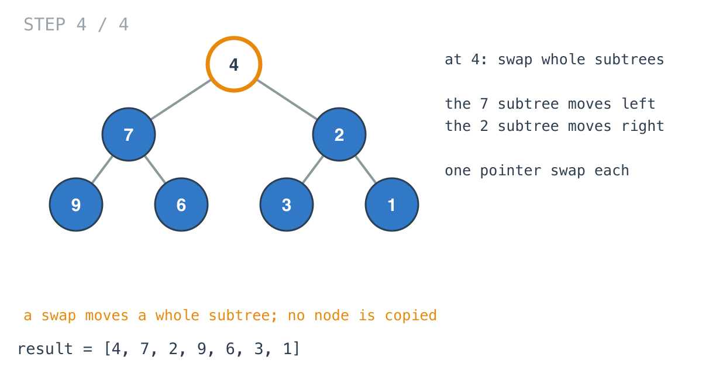

## Solution walkthrough

`invertTree(root *TreeNode) *TreeNode` in `main.go` is a post-order recursion: both
subtrees are inverted first, then the node swaps them.


We'll trace Example 1, `[4,2,7,1,3,6,9]`, which should become `[4,7,2,9,6,3,1]`.

1. **The base case returns nil.** `if root == nil { return root }`. An empty subtree is
   its own mirror. It also covers Example 3, where the whole tree is empty.

2. **Recurse before swapping.**

   ```go
   root.Left = invertTree(root.Left)
   root.Right = invertTree(root.Right)
   ```

   The call goes `4`, then `2`, then `1`. Node `1` is a leaf, so both its recursive calls
   return nil and its swap exchanges two nils. It comes back unchanged.

   The assignments look redundant, since `invertTree` returns the same node it was given.
   They're harmless, and they keep the shape consistent with other "return the new
   subtree" recursions where the returned node can be different.

   

3. **Swap on the way back up.**

   ```go
   root.Right, root.Left = root.Left, root.Right
   ```

   Go's tuple assignment evaluates the right-hand side first, so no temporary is needed.
   At `2`, both children are finished, and the swap puts `3` on the left and `1` on the
   right.

   

4. **The same happens on the other side.** Node `7`'s leaves come back unchanged, and `7`
   swaps them to `9, 6`.

   

5. **The root swaps whole subtrees.** At `4`, both children are fully mirrored subtrees.
   One swap moves the `7` subtree to the left and the `2` subtree to the right, each
   carrying its own already-swapped children. The function returns `4`, and the tree is
   `[4,7,2,9,6,3,1]`.

   

**Complexity:** O(n) time, one visit and one swap per node. O(h) space for the recursion
stack, where h is the height. The tree is modified in place; nothing is allocated.
