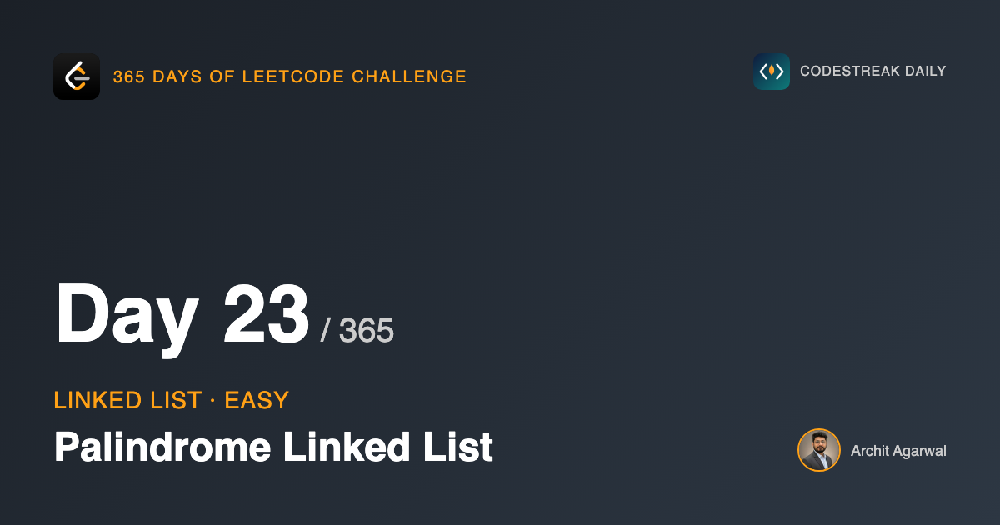

## 365 Days of LeetCode Challenge — Day 23/365

**[234. Palindrome Linked List](https://leetcode.com/problems/palindrome-linked-list/)** (Easy)

Does the list read the same forwards and backwards?

This is the day the last four add up to something, so it is worth saying what is coming: the entire solution is day 19 and day 20 run back to back.

## Why the array answer does not port

On an array this is nothing. An index at each end, walk them toward each other, compare.

A singly linked list has no index and no pointer backwards. A node knows what comes after it and has no idea what came before. The array algorithm depends entirely on moving right to left, so it cannot run here at all.

## The answer that avoids the problem

Copy every value into a slice, run the array algorithm on that. Correct, O(n) time, O(n) space.

The follow-up on the problem page asks for O(1) space, and that is where this gets interesting.

## The answer this week has been building toward

If the difficulty is that you cannot walk the second half backwards, reverse the second half. Then walking it *forwards* walks the original *backwards*.

Three steps, two of which are already written:

1. Find the middle, with day 20's fast/slow walk.
2. Reverse everything after it, with day 19's in-place reversal.
3. Walk both halves inward, comparing.

There is no new technique here. The only new thing is seeing that the problem decomposes into two you have already solved, which is a more valuable skill than either of them on its own.

```go
func IsPalindrome(head *ListNode) bool {
	if head == nil || head.Next == nil {
		return true
	}

	slow, fast := head, head
	for fast.Next != nil && fast.Next.Next != nil {
		slow = slow.Next
		fast = fast.Next.Next
	}

	second := reverse(slow.Next)

	left, right := head, second
	ok := true
	for right != nil {
		if left.Val != right.Val {
			ok = false
			break
		}
		left = left.Next
		right = right.Next
	}

	slow.Next = reverse(second)
	return ok
}
```

## The loop condition is not day 20's

```go
for fast.Next != nil && fast.Next.Next != nil {
```

Day 20 tested `fast` and `fast.Next` and landed on the first node of the second half. This tests one node earlier and lands on the *last node of the first half*.

That is the variant day 20's write-up flagged as the one to remember, and this is why: the node you need is the one whose `Next` gets cut and later repaired. Use day 20's exact condition and `slow` sits one node too far along.

## Watching it run

`[1,2,2,1]`.


`slow` stops on the first 2.


The back half now runs the other way. Walking forward from `second` visits the original list back to front, which is the entire idea, and it cost one line.


Both pairs match and `right` runs out.

## Why the loop is driven by the second half

```go
for right != nil {
```

On an odd-length list the halves are different sizes. The middle node belongs to the first half and has no partner.

Because `right` is the one that runs out, that middle node is never compared, which is exactly right: a palindrome's middle element only ever has itself to match. There is no parity check anywhere in this function and none is needed.

Drive the loop with `left` instead and it walks off the end of `right` on every odd-length input.

## Putting the list back


```go
slow.Next = reverse(second)
```

Without this line the function returns the right answer and hands the caller back a list whose second half points the wrong way.

Nothing in the name `IsPalindrome` suggests it modifies its argument. A function that quietly does is a bug waiting for a second caller, and I think an interviewer asking this is at least as interested in whether you notice that as in whether you find the reversal trick.

Note also that the answer is held in `ok` and returned after the repair. An early `return true` inside the loop would skip the restore on exactly the inputs where it matters.

## Complexity

- **Time: O(n)**. Four passes over half a list each: find, reverse, compare, restore.
- **Space: O(1)**. Five pointers and a bool.

## Builds on

- [Day 19: Reverse Linked List](https://github.com/architagr/leetcode_solutions/blob/main/easy_problems/201_300/reverse_linked_list/) — the in-place reversal, used here on half the list
- [Day 20: Middle of the Linked List](https://github.com/architagr/leetcode_solutions/blob/main/easy_problems/801_900/middle_of_the_linked_list/) — the fast/slow walk that finds where to split

Full code and the step-by-step walkthrough:
[palindrome_linked_list](https://github.com/architagr/leetcode_solutions/blob/main/easy_problems/201_300/palindrome_linked_list/SOLUTION.md)

#DSA #LeetCode #Golang #LinkedList #TwoPointers #CodingInterview #Algorithms

---

*Solution and code by Archit Agarwal. Write-up drafted with AI assistance from the code and problem statement.*
