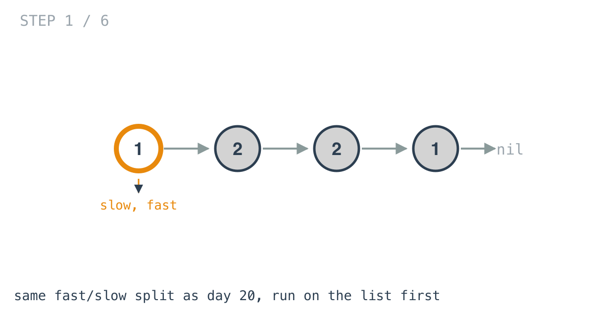
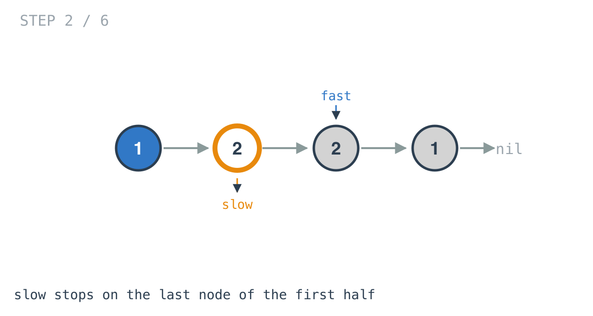
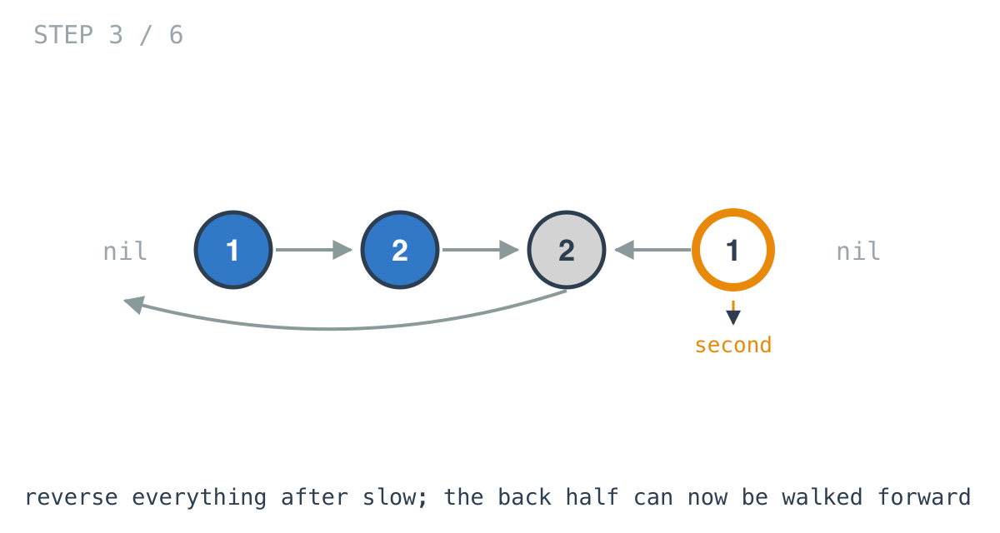
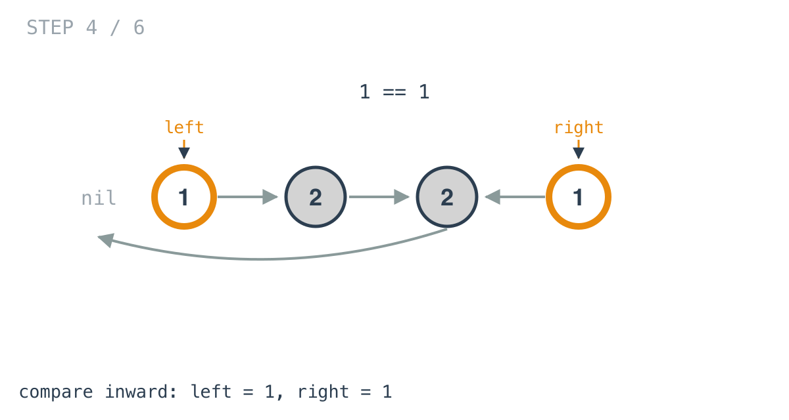
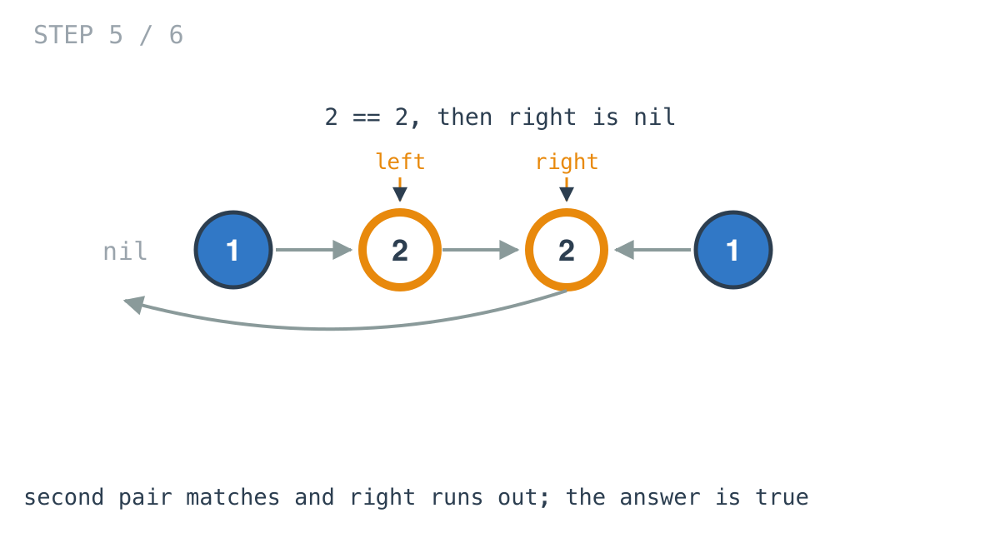
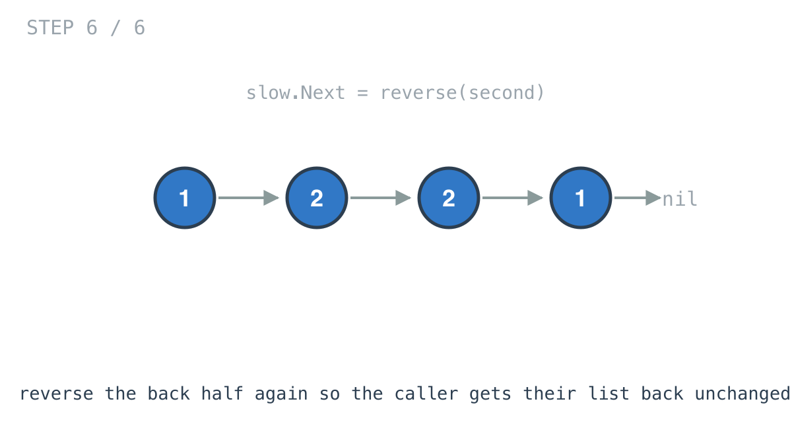

# Palindrome Linked List — solution walkthrough

The function, from `palindrome_linked_list.go`:

```go
func IsPalindrome(head *ListNode) bool {
	if head == nil || head.Next == nil {
		return true
	}

	slow, fast := head, head
	for fast.Next != nil && fast.Next.Next != nil {
		slow = slow.Next
		fast = fast.Next.Next
	}

	second := reverse(slow.Next)

	left, right := head, second
	ok := true
	for right != nil {
		if left.Val != right.Val {
			ok = false
			break
		}
		left = left.Next
		right = right.Next
	}

	slow.Next = reverse(second)
	return ok
}
```

Four phases: split, reverse, compare, restore. Two of them are problems from earlier this week.

## Phase 0: the trivial cases

```go
if head == nil || head.Next == nil {
	return true
}
```

An empty list and a one-node list read the same in both directions. This also guarantees the walk below has at least two nodes to work with.

## Phase 1: find the split point

```go
for fast.Next != nil && fast.Next.Next != nil {
```

This is day 20's walk, but note the condition: it tests `fast.Next` and `fast.Next.Next` rather than `fast` and `fast.Next`. That is the variant day 20's write-up flagged, the one that stops a node earlier.

It matters here. Day 20 wanted the *first node of the second half*. This wants the *last node of the first half*, because that is the node whose `Next` gets reversed and later restored. Use day 20's exact condition and `slow` lands one node too far.





On `[1,2,2,1]`, `slow` stops on the first `2`, the last node of the first half.

## Phase 2: reverse the back half

```go
second := reverse(slow.Next)
```

`reverse` is day 19's function, copied in unchanged: walk forward, point each node at its predecessor, return the node that ends up first.



The back half now runs in the opposite direction, so walking it forward from `second` visits the original list's nodes back to front. That is the whole idea of the solution, and it took one line.

Note what `slow.Next` still points at: the node that used to be the head of the second half and is now its tail. That stale-looking pointer is not a bug, it is the handle the restore step uses.

## Phase 3: compare inward

```go
left, right := head, second
for right != nil {
	if left.Val != right.Val {
		ok = false
		break
	}
	left = left.Next
	right = right.Next
}
```





The loop is driven by `right`, the reversed second half, and that choice is load-bearing.

On an odd-length list the halves are not the same size: the middle node belongs to the first half and has no partner in the second. Because `right` runs out first, that middle node is simply never compared, which is correct, since a palindrome's middle element has only itself to match. There is no parity check anywhere in this function, and none is needed.

Driving the loop with `left` instead would walk off the end of `right` on every odd-length input.

## Phase 4: put the list back

```go
slow.Next = reverse(second)
```



Reversing the second half again returns it to its original direction, and reattaching it to `slow` makes the caller's list exactly what it was.

Without this line the function answers the question correctly and leaves the caller holding a list whose back half points the wrong way. Nothing in the signature suggests `IsPalindrome` modifies its argument, and a function that quietly does is a bug waiting for a second caller.

Note that the result is captured in `ok` and returned after the restore, rather than returned from inside the comparison loop. An early `return true` would skip the repair on exactly the inputs that need it most.

## Complexity

- **Time: O(n).** Four passes over half the list each: find, reverse, compare, restore. Linear.
- **Space: O(1).** `slow`, `fast`, `second`, `left`, `right`, `ok`. Nothing allocated, nothing proportional to input.

The slice-copy version is also O(n) time, and O(n) space. This is the version the follow-up asks for.

## Test

`main_test.go` covers the two worked examples, `[1,2,2,1]` returning true and `[1,2]` returning false. The even-length true case is the one that exercises the split landing correctly; a `slow` that stopped one node late fails it.
