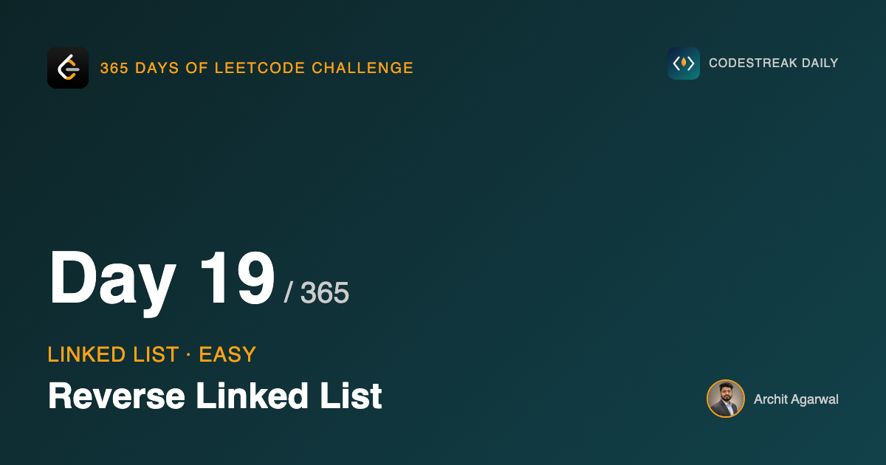

## 365 Days of LeetCode Challenge — Day 19/365

**[206. Reverse Linked List](https://leetcode.com/problems/reverse-linked-list/)** (Easy)

A new topic starts today. For eighteen days this series has been binary trees, and the last one before this, Day 10, flattening a tree into a linked list, was already doing the thing today's problem is entirely about. It rewrote `Next` pointers until a tree was shaped like a line. Today the structure is already a line, and rewriting the same pointers puts it in the other order.

## The idea

A linked list is not a sequence of values. It is a pile of nodes, each holding a value and a pointer, and the order lives entirely in the pointers. Nothing about the first node says "I am first". It is first because nothing points at it.

So reversing a list moves no data. Every node stays exactly where it is. You walk the list once, turn each arrow around, and the new order is a consequence of that.

## Why the loop needs three variables

The version that looks right is two lines:

```go
head.Next = prev
head = head.Next
```

It does not work, and why it does not work is the actual problem. The first line destroys the link the second line needs. Once `head.Next` points at `prev`, the node you meant to visit next has nothing referring to it any more.

So you save it first:

```go
next := head.Next
head.Next = prev
prev = head
head = next
```

Three variables, four lines, and the order matters more than anything else here. `next` exists for one reason: to hold the rest of the list across the line that breaks the link to it.

## The code

```go
func ReverseList(head *ListNode) *ListNode {
	var prev *ListNode = nil
	for head != nil {
		next := head.Next
		head.Next = prev
		prev = head
		head = next
	}
	return prev
}
```

`prev` starting at `nil` is doing quiet work. It is not a placeholder waiting to be overwritten. It is the correct final `Next` for the current head, because that node ends up last, and the last node points at `nil`. Starting there is what removes the special case.

## Watching it run

The list is `1 -> 2 -> 3`.


`prev` is `nil`, `head` is node 1, nothing has changed yet.


`next := head.Next` saves node 2. This line exists purely to make the next one safe.


`head.Next = prev` is the reversal. Node 1 now points at `nil`. At this instant the list is cut in two, and the only thing referring to node 2 is that local variable.


Two more iterations of the same four lines.


`head` is `nil`, the loop ends, and `prev` is sitting on the original tail, which is the new head. Return `prev`, not `head`. Returning `head` is the most common way to get this wrong, and it fails silently: you just get an empty list back.

Look at where the nodes are in that last picture. Exactly where they started. Only the arrows moved.

## The order of those four lines is forced

Each line depends on something the next one overwrites:

- `next := head.Next` has to precede `head.Next = prev`, or the rest of the list is unreachable.
- `prev = head` has to precede `head = next`, or `prev` ends up on the wrong node.

There is no other arrangement of these four statements that reverses the list. That is unusual for a four-line loop, and it is why this question survives as a filter despite being marked Easy.

## Empty and single-element lists

Both work with no special case. For `nil` the loop body never runs and `prev` is still `nil`. For one node the body runs once, points it at `nil`, and returns it. When the edge cases fall out of the loop rather than needing an `if` in front of it, that is usually a sign the loop is built right.

## Complexity

- **Time: O(n)**. One visit per node, constant work each.
- **Space: O(1)**. Three pointers, whatever the length. Nothing allocated.

The O(1) is the question. Copying the values into a slice, reversing it and rebuilding the list is also O(n) time and far easier to write, but it is O(n) space. An interviewer asking 206 is asking whether you can skip the copy.

## Builds on

- [Day 10: Flatten Binary Tree to Linked List](https://github.com/architagr/leetcode_solutions/blob/main/medium_problems/101_200/flatten_binary_tree_to_linked_list/) — the same move: rewriting `Next` pointers to change a structure's shape without moving a single node

Full code and the step-by-step walkthrough:
[reverse_linked_list](https://github.com/architagr/leetcode_solutions/blob/main/easy_problems/201_300/reverse_linked_list/SOLUTION.md)

#DSA #LeetCode #Golang #LinkedList #CodingInterview #SoftwareEngineering #Algorithms

---

*Solution and code by Archit Agarwal. Write-up drafted with AI assistance from the code and problem statement.*
