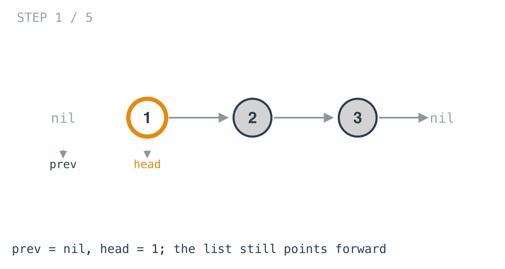
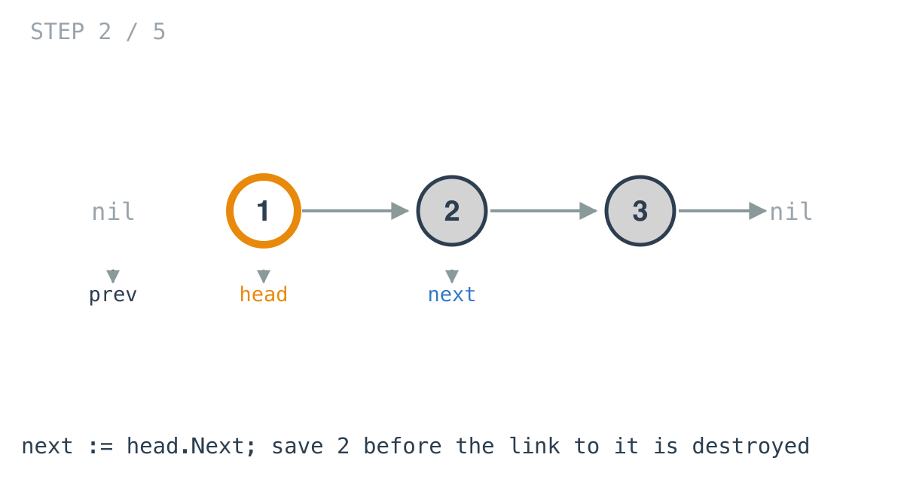
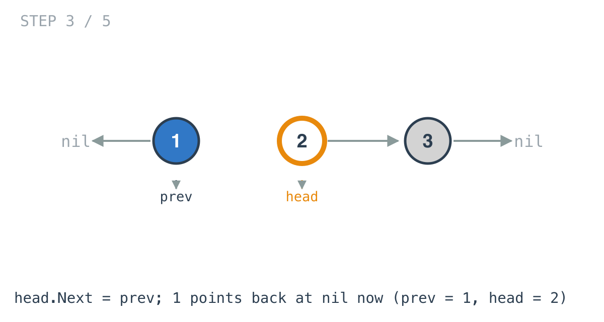
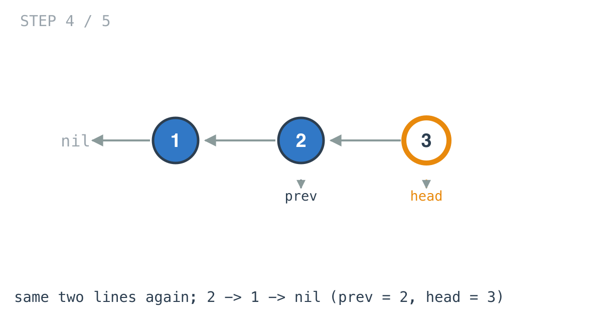
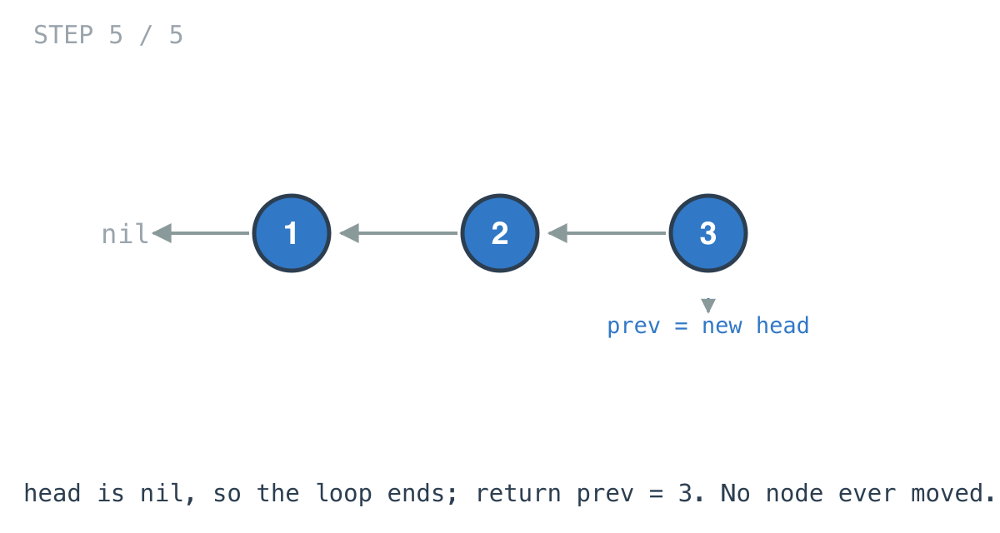

# Reverse Linked List — solution walkthrough

The full function, from `reverse_linked_list.go`:

```go
func ReverseList(head *ListNode) *ListNode {
	var prev *ListNode = nil
	for head != nil {
		next := head.Next
		head.Next = prev
		prev = head
		head = next
	}
	return prev
}
```

Nine lines, and four of them are the loop body. Those four are the problem.

## The two pointers the loop carries

`prev` starts at `nil`. That is not a placeholder value waiting to be replaced. It is the correct final `Next` for the node that is currently first, because that node is going to end up last, and the last node in a list points at `nil`. Starting `prev` at `nil` is what makes the old head terminate the reversed list, with no special case to handle it.

`head` is the reused parameter, walking forward through the original order. It is worth being clear that it stops meaning "the head of the list" on the first iteration. After that it means "the node I am currently turning around".

## The loop body, line by line

The example list is `1 -> 2 -> 3`.

### Before the loop

`prev` is `nil` and `head` is node 1. Nothing has changed yet.



### `next := head.Next`

This is the line that exists purely to make the next line safe.



`next` now holds node 2. It is a local, redeclared every iteration, and it is never read except on the last line of the body. Its whole job is to survive the assignment that comes next.

### `head.Next = prev`

The actual reversal. Node 1's pointer, which was aimed at node 2, is now aimed at `nil`.



At this instant the list is cut in two. Node 1 is a complete one-element reversed list. Nodes 2 and 3 are still in their original order, and the only thing referring to node 2 is the local `next`. Drop that local and the rest of the list is garbage.

### `prev = head` and `head = next`

The two lines that step forward. `prev` becomes the node just finished, so the next iteration points its node back at this one. `head` becomes the saved `next`.

Two iterations later:



### The loop ends

When `head` is `nil` there is nothing left to turn around. `prev` is sitting on the last node processed, which is the original tail, which is the new head.



`return prev`, not `head`, which is `nil` by now. Returning `head` here is the single most common way to get this wrong, and the failure is silent: the tests just see an empty list.

## Why the order of those four lines is fixed

Each line depends on a value the following line overwrites, so the body only works read top to bottom:

- `next := head.Next` must come before `head.Next = prev`, or the rest of the list is lost.
- `prev = head` must come before `head = next`, or `prev` is assigned the wrong node.

There is no arrangement of these four statements other than this one that reverses the list. That is unusual for a four-line loop, and it is why the problem is a good filter despite being marked Easy.

## Walking off the end

`for head != nil` is the whole termination argument. `head` advances to `next` every iteration, and `next` came from a `Next` pointer read *before* it was modified, so the walk follows the original order exactly once. The list is finite, the original order has an end, so the loop ends.

## Complexity

- **Time: O(n)**. One iteration per node, constant work inside.
- **Space: O(1)**. `prev`, `next` and the reused `head`. Nothing allocated, nothing that grows with the input.

## Test

`reverse_linked_list_test.go` covers `1 -> 2 -> 4` reversing to `[4, 2, 1]`, and the empty list returning an empty result. The second case is the one that catches a missing `nil` guard, and it passes here because the loop body simply never runs.
