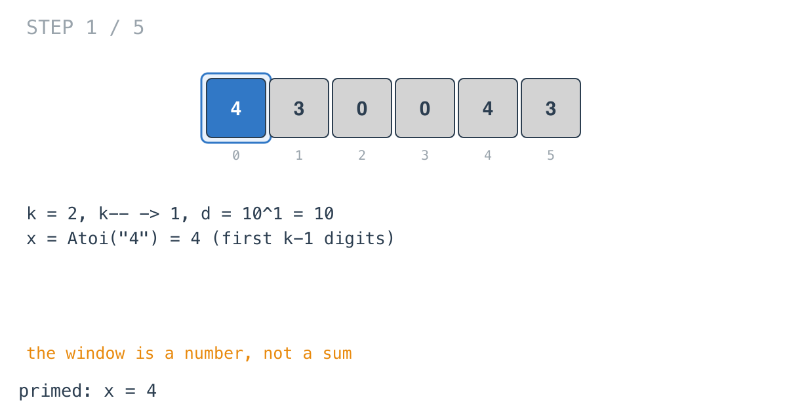
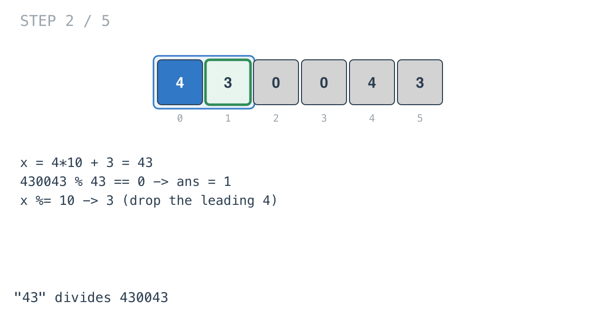
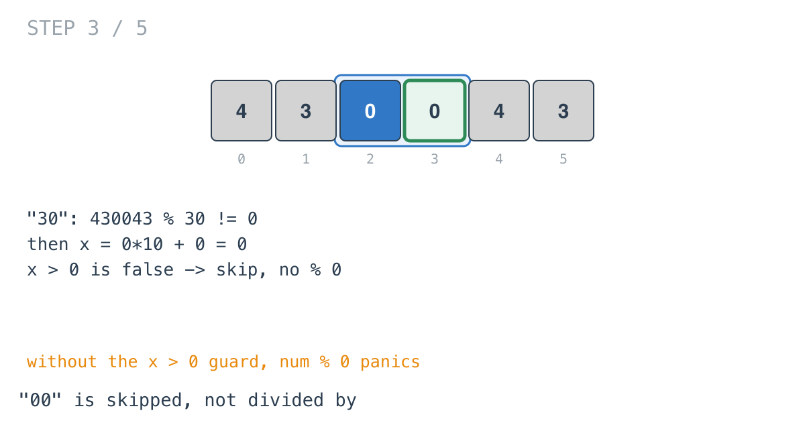
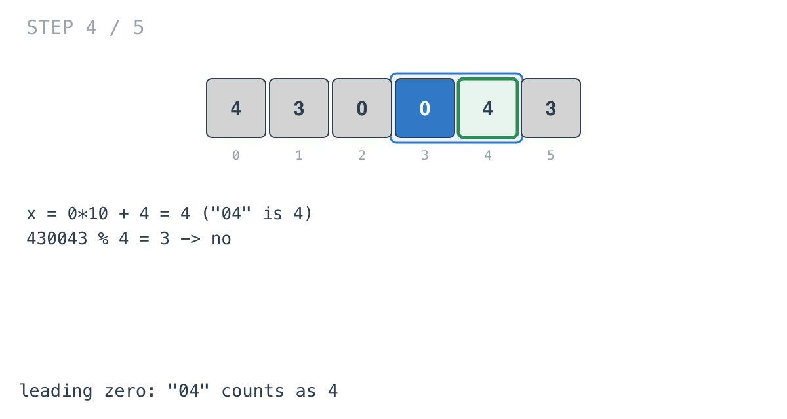
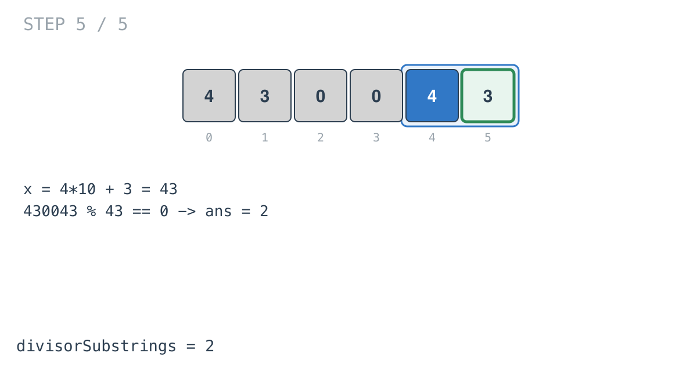

## Solution walkthrough

`divisorSubstrings(num int, k int) int` in `find_the_k_beauty_of_a_number.go` slides a
window of `k` digits across `num` and keeps the window's value as an integer.

We'll trace Example 2: `num = 430043`, `k = 2`, expected `2`.

1. **Offset and place value.** `k--` makes `k = 1`. The first loop multiplies `d` up to
   `10^k = 10`. Taking `x % d` later will keep the last `k` digits of a `k+1`-digit
   window, which is how the oldest digit gets dropped.

2. **Prime one short.** `x, _ = strconv.Atoi(numsStr[:k])` parses the first `k` digits:
   `x = 4`. This is the only string parse in the function.

   

3. **Append a digit, test, drop a digit.**

   ```go
   a := int(numsStr[k] - '0')
   x = (x * 10) + a
   if x > 0 && num%x == 0 {
       ans++
   }
   x %= d
   ```

   Appending `3` gives 43, and `430043 = 43 * 10001`, so `ans = 1`. Then `x %= 10`
   leaves 3.

   

4. **Zero is skipped, not divided by.** `"30"` doesn't divide 430043, and `x %= 10`
   leaves 0. Appending `0` gives 0 for the window `"00"`. `x > 0` is false, so the
   `num%x` on the right of `&&` never runs. Without that guard this would panic with a
   division by zero.

   

5. **Leading zeros come out right.** Appending `4` to 0 gives 4, which is the value of
   `"04"`. `430043 % 4 = 3`, so it isn't counted.

   

6. **The last window.** `4*10 + 3 = 43` divides again. `ans = 2`.

   

The loop reuses `k` as its index (`for ; k < len(numsStr); k++`), which works but means
`k` stops meaning "window size" partway through the function.

**Complexity:** O(d) time for d digits, O(d) space for the string.
