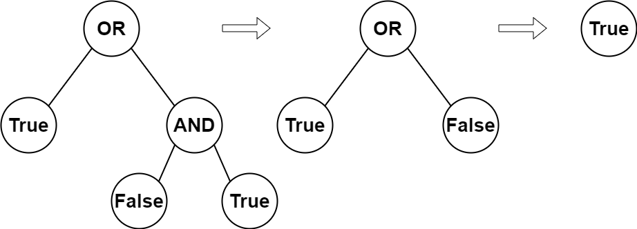
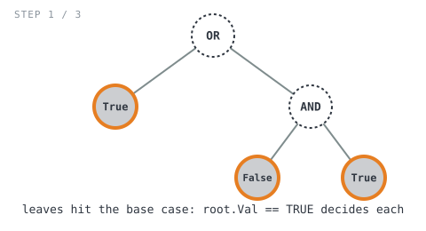
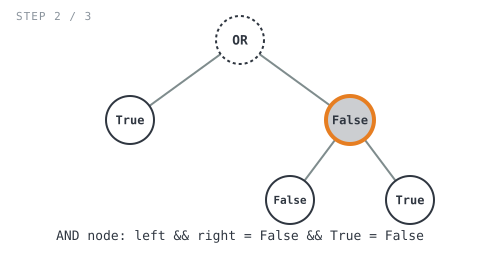
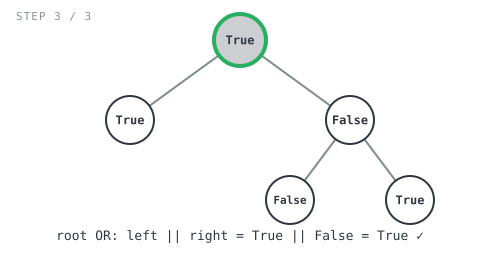

## 365 Days of LeetCode Challenge — Day 28/365

# Evaluate Boolean Binary Tree

🔗 https://leetcode.com/problems/evaluate-boolean-binary-tree/ · Difficulty: Easy

### The problem

You're given the root of a **full binary tree** (every node has 0 or 2 children) that
encodes a boolean expression:
- **Leaf nodes** hold `0` (`False`) or `1` (`True`).
- **Non-leaf nodes** hold `2` (`OR`) or `3` (`AND`), and their evaluation is the result
  of applying that operator to their two children's evaluations.

Return the boolean result of evaluating the whole tree.

### The intuition

The tree itself *is* the expression. Every leaf is a literal, and every internal node
is an operator waiting on its two operands — and because the tree is guaranteed **full**,
there's never an ambiguous case: a node is either a pure value with no children, or an
operator with exactly two children to combine.

That maps directly onto a **post-order recursion**: to know a node's own boolean value,
you first need the boolean values of both its children, then you combine them with the
node's operator. Leaves are the base case — their value *is* the answer, nothing to wait
on — while internal nodes recurse into `Left` and `Right` first, and only combine
afterward. That's exactly why the children's evaluations have to bubble back up the call
stack before their parent can produce its own result.

The only other piece is translating the encoded integers into meaning: `2` is `OR`, `3`
is `AND`, and for a leaf, `1` means `True` (anything else, i.e. `0`, means `False`).

### The solution



```go
const (
	FALSE = 0
	TRUE  = 1
	OR    = 2
	AND   = 3
)

func evaluateTree(root *TreeNode) bool {
	if root.Left == nil && root.Right == nil {
		return root.Val == TRUE
	}

	left := evaluateTree(root.Left)
	right := evaluateTree(root.Right)
	if root.Val == OR {
		return left || right
	}
	return left && right
}
```

Walking it through `root = [2,1,3,null,null,0,1]` (root is `OR`, its left child is leaf
`1`, its right child is `AND` whose own children are leaves `0` and `1`; expected
`true`):

- The three leaves hit the base case immediately: root's left child (`1`) returns
  `True`; `AND`'s left child (`0`) returns `False`; `AND`'s right child (`1`) returns
  `True`.



- Back at the `AND` node: `left = False`, `right = True`, and since `root.Val` isn't
  `OR` it falls to `left && right` → `False && True = False`.



- Back at the `root` (`OR`) node: `left = True` (its own left child), `right = False`
  (the just-resolved `AND` subtree). `root.Val == OR`, so `left || right` →
  `True || False = True`. ✓



**Complexity:** O(n) time — every node visited and evaluated exactly once. O(h) space
for the recursion stack, where h is the tree's height (O(log n) balanced, O(n) skewed).

Full code: `easy_problems/2301_2400/evaluate_boolean_binary_tree/` in the repo.
