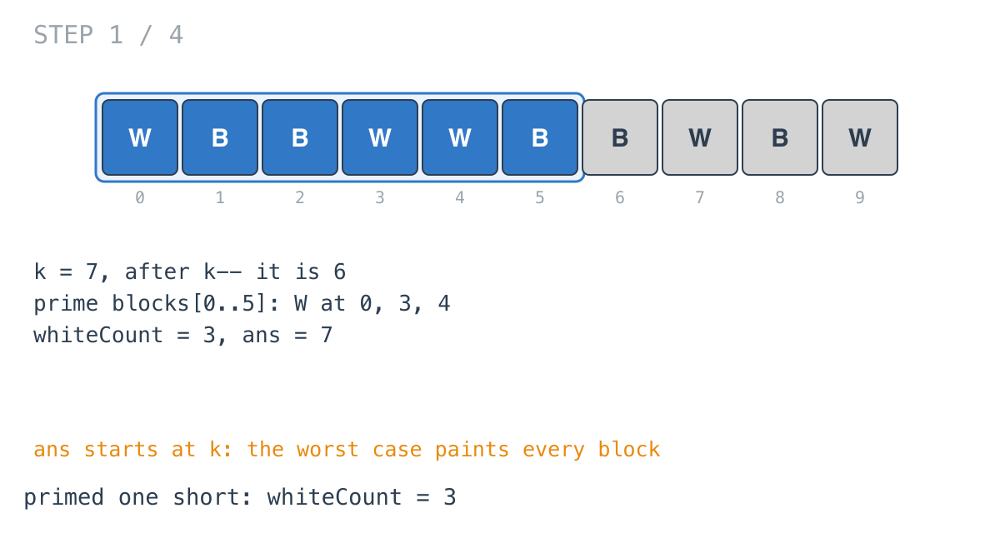

## Solution walkthrough

`minimumRecolors(blocks string, k int) int` in
`minimum_recolors_to_get_k_consecutive_black_blocks.go` slides a window of length `k` and
tracks how many white blocks it holds.

We'll trace Example 1: `blocks = "WBBWWBBWBW"`, `k = 7`, expected `3`.

1. **Start from the worst case.** `ans := k`: painting every block in a window of all
   whites. Then `k--`, making `k = 6` an offset: `blocks[i-k]` is the oldest block of the
   window ending at `i`.

2. **Prime one short.** The first loop counts whites in `blocks[0..5]`: positions 0, 3
   and 4, so `whiteCount = 3`.

   

3. **Add, check, remove.** At `i = 6` the block is `B`, so the full window `[0..6]` has 3
   whites and `ans` becomes 3. Then the oldest block, `blocks[0] = W`, leaves:
   `whiteCount = 2`.

   ![Step 2: window [0..6] has 3 whites](images/walkthrough-2.png)

4. **Slide.** `blocks[7]` is `W`, back to 3; `ans` stays 3. `blocks[1]` is `B`, so
   nothing changes when it leaves.

   ![Step 3: window [1..7]](images/walkthrough-3.png)

5. **The rest.** `[2..8]` also has 3 whites. `[3..9]` has 4. The minimum stays 3, which
   matches the example: repaint blocks 0, 3 and 4.

   ![Step 4: window [3..9] has 4 whites](images/walkthrough-4.png)

**Complexity:** O(n) time, O(1) space.
