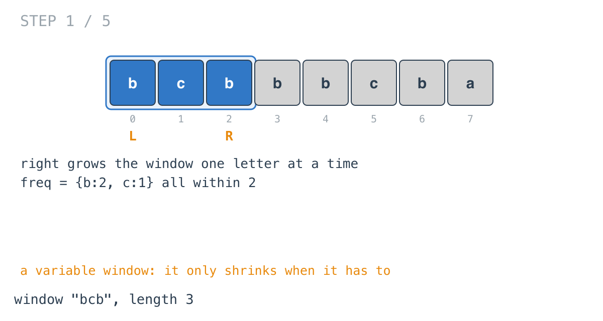
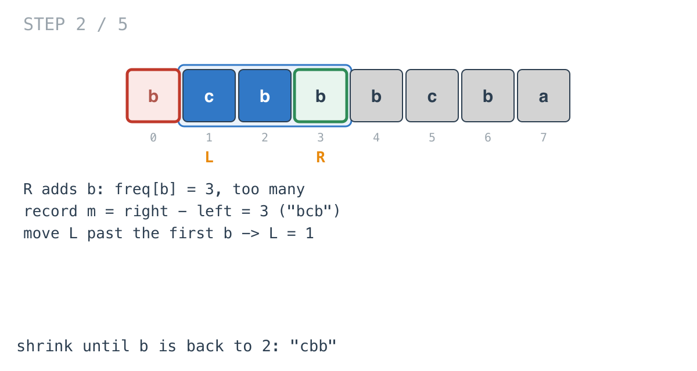
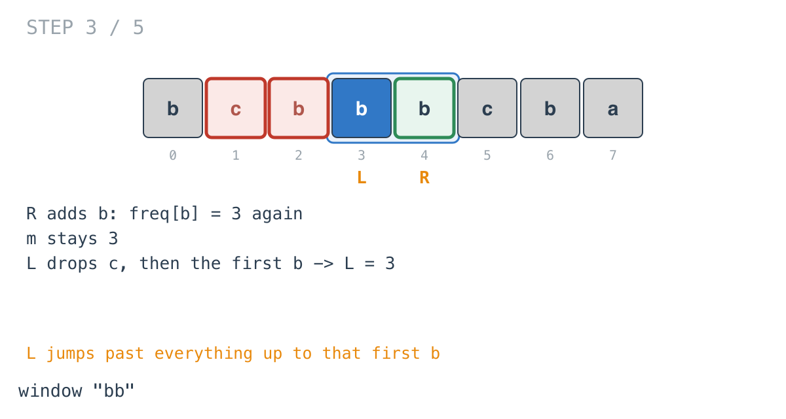
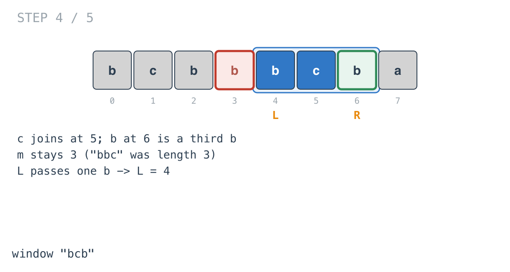
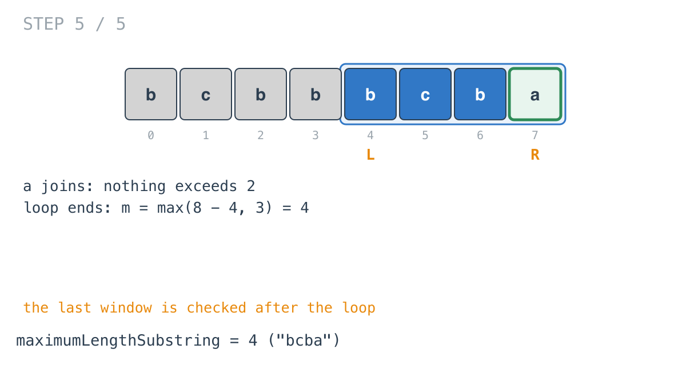

## Solution walkthrough

`maximumLengthSubstring(s string) int` in
`maximum_length_substring_with_two_occurrences.go` grows a window with `right`, shrinks
it with `left` whenever a letter hits three copies, and tracks the longest valid length.

We'll trace Example 1: `s = "bcbbbcba"`, expected `4`.

1. **Grow.** `frequencyMap[s[right]]++` for each new letter. `b`, `c`, `b` fit: the
   window `"bcb"` has `b` twice.

   

2. **A third copy: record, then shrink.** At `right = 3`, `b` reaches 3. The window
   without it, `s[left:right]`, is the longest this run got, so
   `m = max(right-left, m) = 3`. Then:

   ```go
   for ; left <= right; left++ {
       frequencyMap[s[left]]--
       if s[right] == s[left] {
           left++
           break
       }
   }
   ```

   The first letter dropped is `b` itself, which matches, so `b` goes back to 2 and `left`
   moves to 1. Window `"cbb"`.

   

3. **Shrinking can drop several letters.** At `right = 4`, `b` hits 3 again. `m` stays 3.
   The loop drops `c` (no match, keep going), then `b` (match), and `left` lands on 3.
   Window `"bb"`.

   

4. **Again.** `c` joins at 5, and the `b` at 6 is a third one. `right - left = 3`, so `m`
   stays 3. One `b` leaves: window `"bcb"`, `left = 4`.

   

5. **The last window.** `a` joins with no violation. The loop ends with `right = 8`, and
   the final `m = max(right-left, m)` catches the window that never hit a violation:
   `8 - 4 = 4`, the substring `"bcba"`.

   

**Complexity:** O(n) time: `left` and `right` each move forward at most `n` times. O(1)
space for a map of at most 26 letters.
