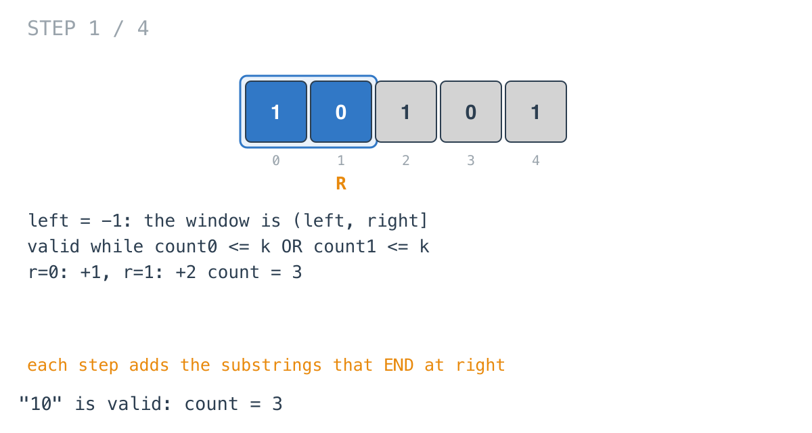
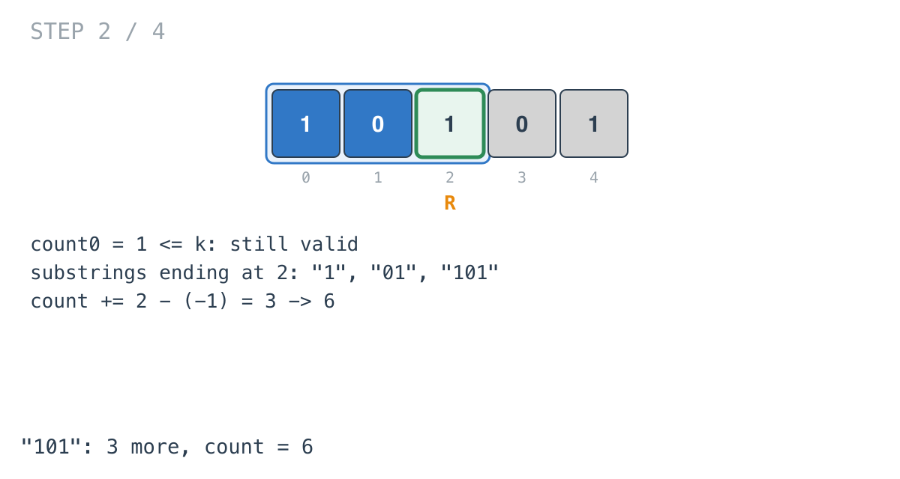
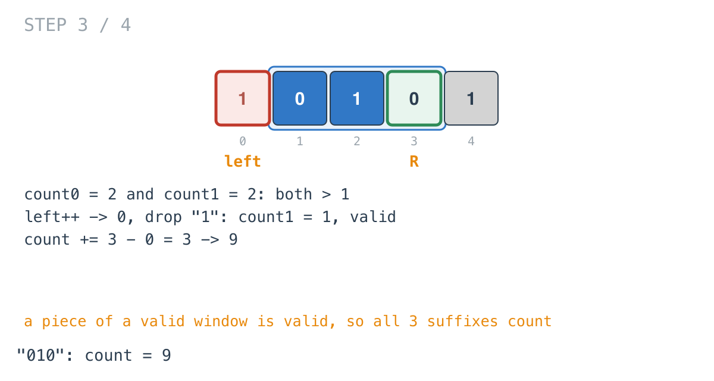
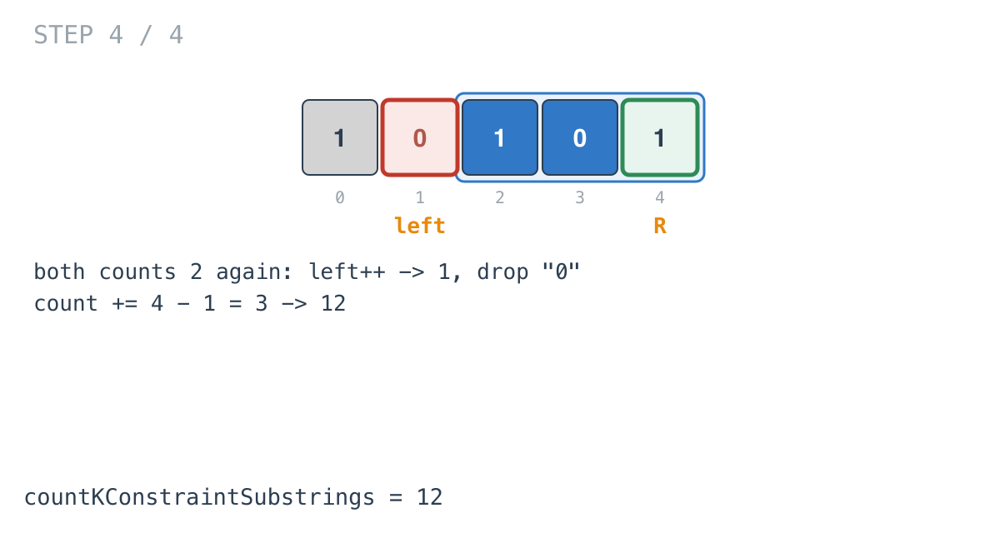

## Solution walkthrough

`countKConstraintSubstrings(s string, k int) int` in
`count_substrings_that_satisfy_k_constraint_i.go` keeps the longest valid window ending at
each position and adds its length to the count.

We'll trace Example 1: `s = "10101"`, `k = 1`, expected `12`.

1. **An exclusive left edge.** `left := -1`. The window is `s[left+1..right]`, and its
   length is `right - left` without any `+1`.

2. **Grow, count by end position.** For each `right`, the new character bumps `count0` or
   `count1`. At `right = 0` the window `"1"` is valid: `count += 0 - (-1) = 1`. At
   `right = 1`, `"10"` has one of each, still valid: `+2`, total 3.

   

3. **Every suffix of a valid window is valid.** At `right = 2`, `"101"` has one 0, which is
   within `k`, so it's valid. The substrings ending at index 2 are `"1"`, `"01"` and
   `"101"`, all inside that window, so all valid: `count += 3`, total 6.

   

4. **Shrink only when both counts break.**

   ```go
   for left <= right && count0 > k && count1 > k {
       left++
       ...
   }
   ```

   At `right = 3`, `"1010"` has two 0s and two 1s: both above `k`. `left` moves to 0 and
   drops `s[0] = '1'`, leaving `"010"` with one 1. Valid again. `count += 3 - 0 = 3`,
   total 9.

   

5. **Once more.** At `right = 4`, `"0101"` breaks both counts. `left` moves to 1 and drops
   a `0`: `"101"`. `count += 4 - 1 = 3`, total 12, matching the example.

   

**Complexity:** O(n) time, O(1) space.
