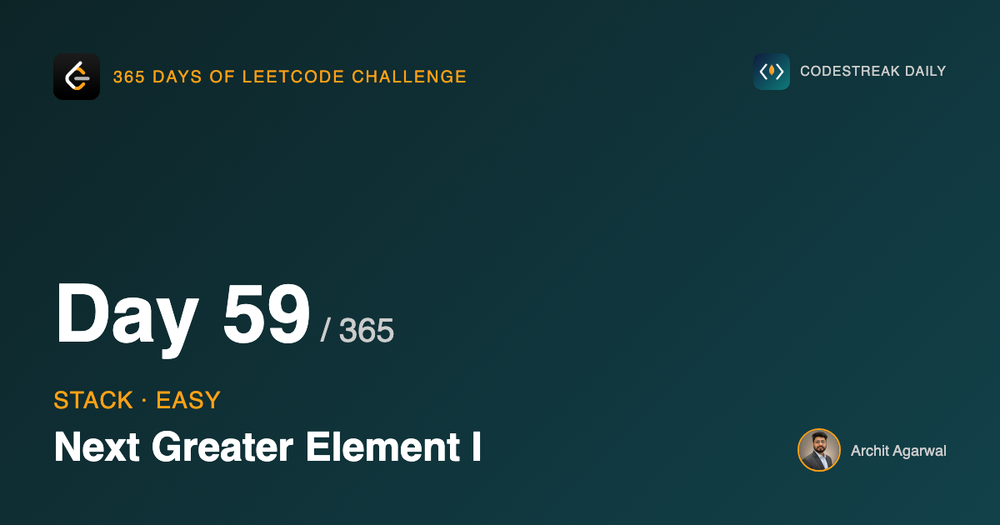
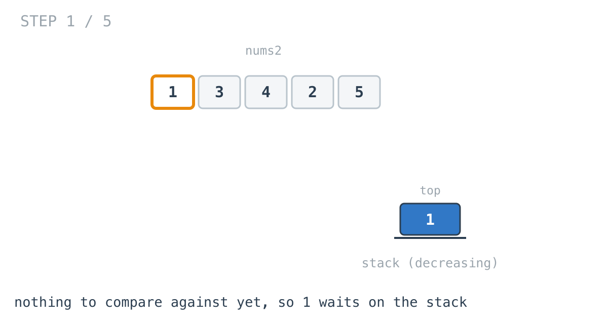
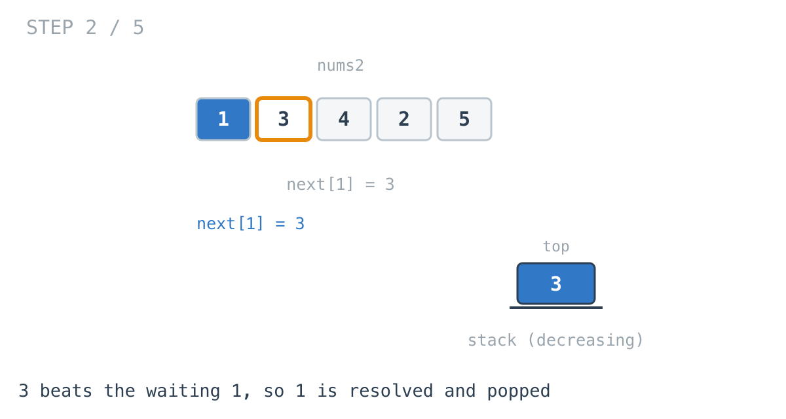
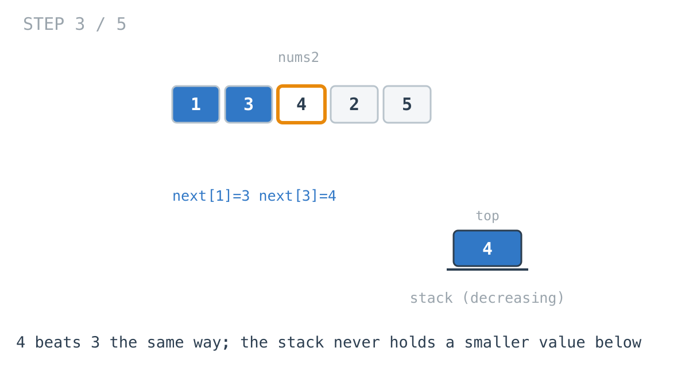
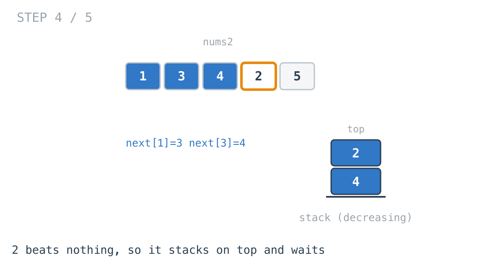
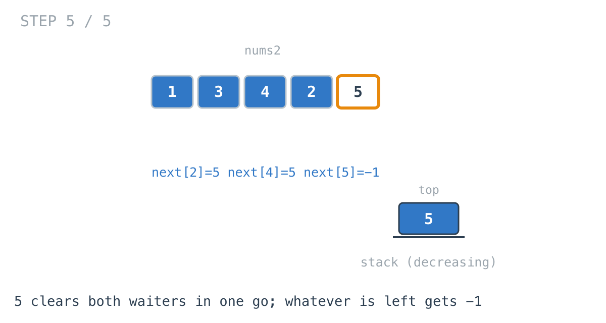

## 365 Days of LeetCode Challenge — Day 59/365

**[496. Next Greater Element I](https://leetcode.com/problems/next-greater-element-i/)** (Easy)

For each value in `nums1`, find the first value to its right in `nums2` that is larger.

## The brute force, and exactly what it wastes

For each element, scan rightwards until something bigger turns up. O(n²), and correct.

What it wastes is specific: the scans repeat each other. Scan right from index 3 across a long descending run, then scan right from index 4 across almost the same run. You are re-reading values you have already established are too small.

## Turn the question round

Instead of "what is to the right of me", ask, for each value as you arrive at it:

**which earlier values does this one answer?**

That flips the work. A value arriving resolves every earlier value smaller than it that is still unanswered — and a resolved value is never looked at again.

## What has to be remembered

The values seen so far that have not yet found anything bigger.

That set has a property worth stating, because it is where the name comes from: it is always **decreasing from bottom to top**. If an earlier value were smaller than a later one, the later one would have resolved it on arrival, so it could not still be waiting.

A stack that maintains an ordering invariant like that is a monotonic stack.

```go
for _, v := range nums2 {
	for len(stack) > 0 && stack[len(stack)-1] < v {
		next[stack[len(stack)-1]] = v
		stack = stack[:len(stack)-1]
	}
	stack = append(stack, v)
}
```









2 beats nothing, so it stacks on top of 4 and the stack is `[4, 2]` — decreasing, as promised.



5 clears both waiters in one iteration.

## Why the inner loop is not a hidden O(n²)

That last step is the one that answers the obvious objection. The inner loop ran twice in a single outer iteration — so is this quadratic after all?

No, and the argument is short. Every value is pushed exactly once, and popped at most once, because a popped value is never pushed again. So across the entire run the inner loop executes at most `n` times in total, no matter how unevenly those iterations are distributed.

The brute force **re-reads** values it has already rejected. This one **consumes** them.

## The leftovers

Anything still on the stack when `nums2` runs out never met a larger value, so it gets `-1`.

## One assumption to check before reusing this

The answers are stored in a map keyed by **value**, because `nums1` is a subset of `nums2` in a different order and positions do not line up.

That is safe only because the problem guarantees every value is unique. Without it, two equal values share a map entry and collide. It is the first thing to verify before lifting this shape into another problem.

## Complexity

- **Time: O(n + m)**. Each value pushed and popped at most once, then one pass over `nums1`.
- **Space: O(n)** for the stack and map.

## Builds on

- [Day 58: Valid Parentheses](https://github.com/architagr/leetcode_solutions/blob/main/easy_problems/1_100/valid_parentheses/) — the same "the top of the stack is the only thing that can be resolved right now" reasoning, applied to values instead of brackets

Full code and the step-by-step walkthrough:
[next_greater_element_i](https://github.com/architagr/leetcode_solutions/blob/main/easy_problems/401_500/next_greater_element_i/SOLUTION.md)

#DSA #LeetCode #Golang #Stack #MonotonicStack #CodingInterview #Algorithms

---

*Solution and code by Archit Agarwal. Write-up drafted with AI assistance from the code and problem statement.*
