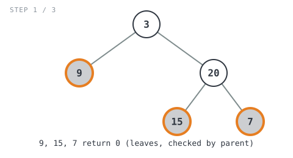
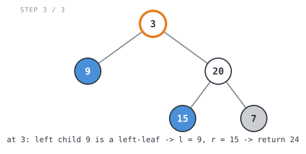

**365 Days of LeetCode Challenge — Day 4/365**
**Sum of Left Leaves** (Easy)
🔗 https://leetcode.com/problems/sum-of-left-leaves/

**Intuition:** Only a parent knows if its child is a "left" leaf — a node can't tell
this about itself. So check `root.Left` for leaf-ness from `root`'s call, not from
inside the child's own base case.


**Full solution:**
```go
func sumOfLeftLeaves(root *TreeNode) int {
	if root == nil {
		return 0
	}

	l := sumOfLeftLeaves(root.Left)
	r := sumOfLeftLeaves(root.Right)
	// Only a parent can tell whether its child is a "left" leaf, since a
	// node has no idea which side of its own parent it's on. So this check
	// happens here, from root's perspective, looking at root.Left.
	if root.Left != nil && root.Left.Left == nil && root.Left.Right == nil {
		l += root.Left.Val
	}
	return l + r
}
```

**Walkthrough** on `[3,9,20,null,null,15,7]` (expected `24`):
- `9` (leaf, `3`'s left child) → counts
- `15` (leaf, `20`'s left child) → counts
- `7` (leaf, `20`'s **right** child) → doesn't count



- `sumOfLeftLeaves(20)` → detects `15` → returns `15`


- `sumOfLeftLeaves(3)` → detects `9` → `9 + 15 = 24` ✓



O(n) time, O(h) space (tree height).
