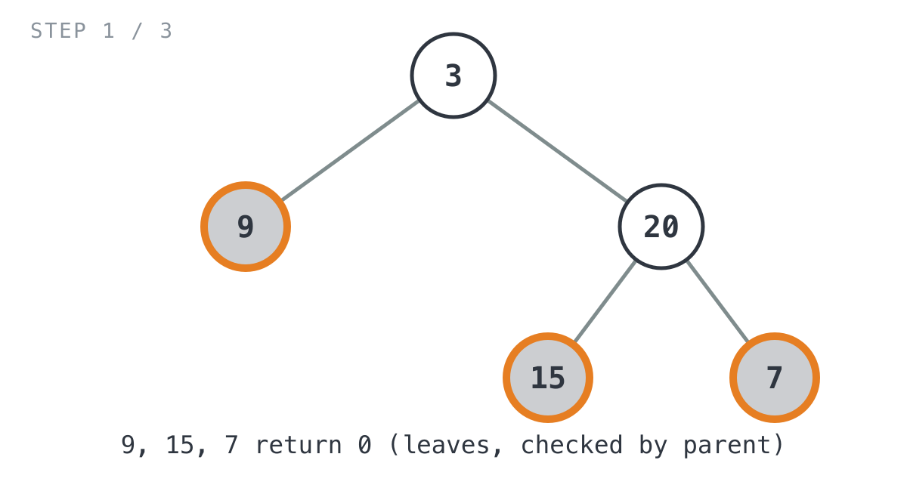
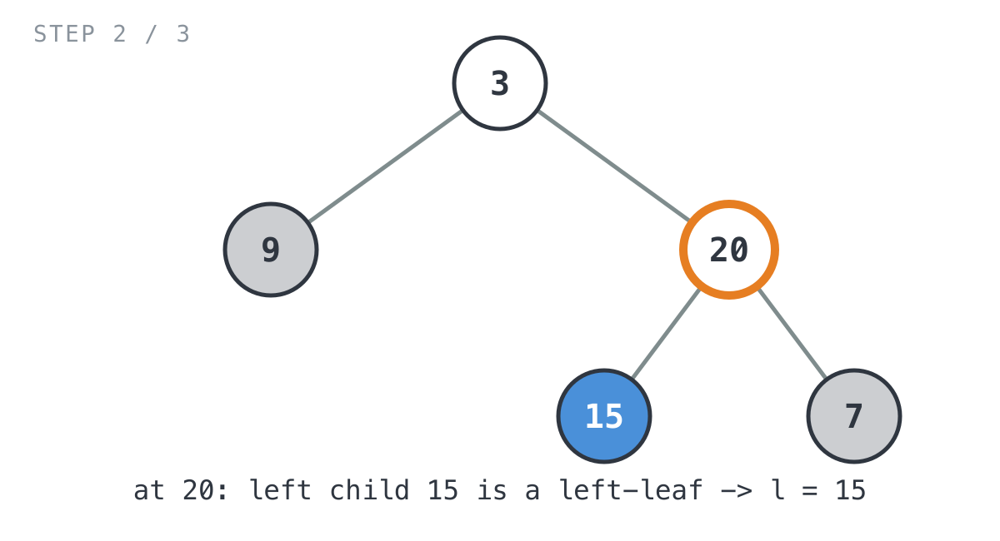
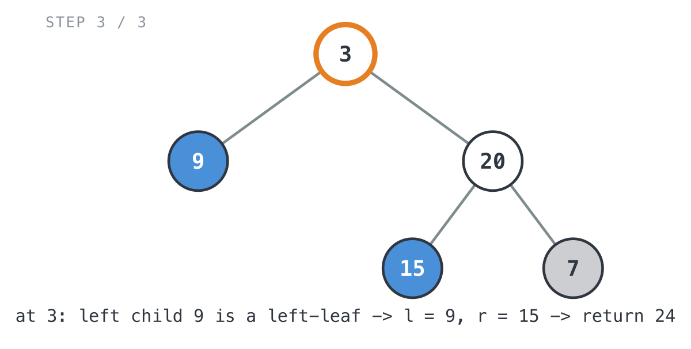

## 365 Days of LeetCode Challenge — Day 4/365

# Sum of Left Leaves

🔗 https://leetcode.com/problems/sum-of-left-leaves/ · Difficulty: Easy

### The problem

Given the root of a binary tree, add up every left leaf: every leaf node that happens
to be its parent's left child.

### The intuition

Finding leaves is the easy part. Figuring out which side of the parent a leaf sits on
is the annoying part, and that's the whole problem, since only left leaves count. A
node has no way to know that about itself. It doesn't carry a pointer back up, so it
can't say "I'm my parent's left child" on its own. Only the parent can tell you that.

So the recursion has to ask the question from the other direction. Instead of each
node checking "am I a left leaf," the parent checks "is my left child a leaf." Once
that clicks, everything else is a plain tree recursion: sum whatever the left and
right subtrees already found, add in the current node's left child value if it
qualifies, and return the total.

### The solution


```go
func sumOfLeftLeaves(root *TreeNode) int {
	if root == nil {
		return 0
	}

	l := sumOfLeftLeaves(root.Left)
	r := sumOfLeftLeaves(root.Right)
	// Only a parent can tell whether its child is a "left" leaf, since a
	// node has no idea which side of its own parent it's on. So this check
	// happens here, from root's perspective, looking at root.Left.
	if root.Left != nil && root.Left.Left == nil && root.Left.Right == nil {
		l += root.Left.Val
	}
	return l + r
}
```

Tracing it on `[3,9,20,null,null,15,7]` (expected `24`), the part I like is that `7`
is a leaf too, it just never gets a vote:
- `9` is a leaf and `3`'s left child → counts.
- `15` is a leaf and `20`'s left child → counts.
- `7` is a leaf but `20`'s *right* child → doesn't count.



- `sumOfLeftLeaves(20)` detects `15` as a left leaf → returns `15`.



- `sumOfLeftLeaves(3)` detects `9` as a left leaf → `9 + 15 = 24`. ✓



Time is O(n), every node gets visited once. Space is O(h) for the recursion stack,
where h is the tree height, so it's cheap unless the tree is a long skinny chain.

Full code: `easy_problems/401_500/sum_of_left_leaves/` in the repo.

#DSA #LeetCode #100DaysOfCode #BinaryTree #Recursion #Golang #CodingInterview #Programming

---

*Solution and code by Archit Agarwal. Write-up drafted with AI assistance from the code and problem statement.*
