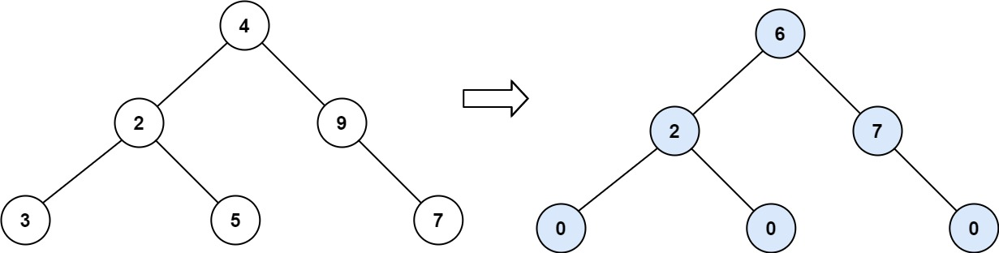
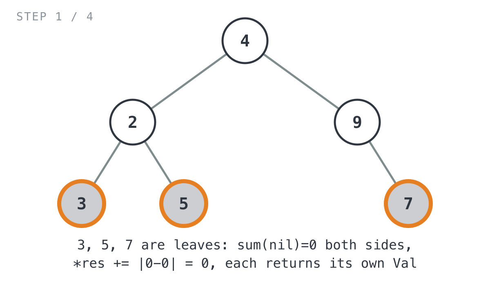
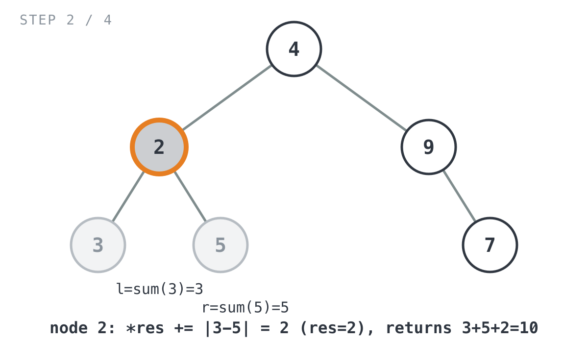
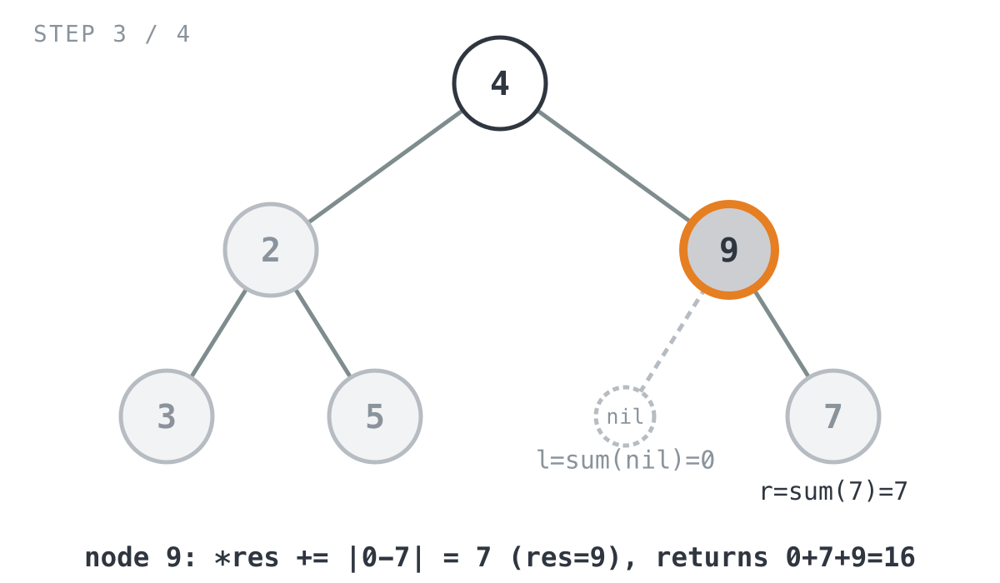
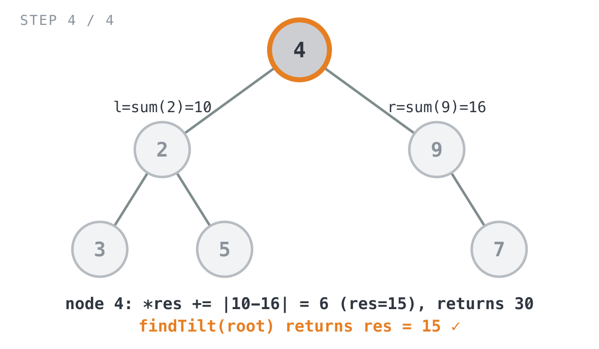

## 365 Days of LeetCode Challenge — Day 22/365

# Binary Tree Tilt

🔗 https://leetcode.com/problems/binary-tree-tilt/ · Difficulty: Easy

### The problem

Given the root of a binary tree, add up every node's **tilt**: the absolute
difference between the sum of everything in its left subtree and the sum of
everything in its right subtree. A missing child just counts as `0`.

### The intuition

Working out one node's tilt takes the sum of *every* value under its left child and
*every* value under its right child, not just the two direct children. Sum each
subtree from scratch every time you need it and the same numbers, sitting lower in
the tree, get added up again and again as you climb back toward the root.

The way around that is to compute each subtree's sum exactly once, on the way back
up, and hand it to whoever asked for it. That's a **postorder** traversal: visit
left, visit right, then do the actual work at this node. You can't do that work any
earlier, because this node's tilt depends on both children's totals already being
settled.

What I like about this one is that a single recursive call ends up doing two
unrelated-feeling jobs. It adds this node's tilt into a running total through a
shared pointer, and separately it returns this subtree's sum so the parent can use
it. One number goes sideways into an accumulator, the other travels up the call
stack. Once you see the split it looks obvious, but it wasn't obvious to me on the
first read.

### The solution



```go
func findTilt(root *TreeNode) int {
	if root == nil {
		return 0
	}
	// res is shared across every recursive call via pointer, so each node
	// can add its own tilt directly into one running total instead of
	// returning a (subtreeSum, tiltSum) pair that would need merging.
	res := 0
	sum(root, &res)
	return res
}

// sum does double duty: it accumulates every node's tilt into *res as a
// side effect, and it returns the sum of the subtree rooted at node so the
// caller (the parent) can use it when computing its own tilt.
func sum(node *TreeNode, res *int) int {
	if node == nil {
		return 0
	}
	// Postorder: both children must be fully resolved before this node's
	// tilt (which depends on both subtree sums) can be computed.
	l := sum(node.Left, res)
	r := sum(node.Right, res)
	// This node's tilt is the absolute difference between its left and
	// right subtree sums; add it straight into the shared accumulator.
	*res += absDiff(l, r)
	// Hand the parent this whole subtree's total as a single number.
	return l + r + node.Val
}

func absDiff(a, b int) int {
	diff := a - b
	if diff < 0 {
		diff = -diff
	}
	return diff
}
```

Tracing it through `root = [4,2,9,3,5,null,7]` (expected `15`):

- `sum(2)` recurses into leaves `3` and `5`: `l=0, r=0` for each, `*res += |0-0| = 0`,
  each returns its own value.

  

- Back in `sum(2)`: `l=3, r=5`. `*res += |3-5| = 2` (running total `2`). Returns
  `3 + 5 + 2 = 10`.

  

- `sum(9)`: no left child so `l=0`; `sum(7)` (a leaf) gives `r=7`.
  `*res += |0-7| = 7` (running total `9`). Returns `0 + 7 + 9 = 16`.

  

- Back in `sum(4)` (the root): `l=10, r=16`. `*res += |10-16| = 6` (running total
  `15`). Returns `10 + 16 + 4 = 30`. `findTilt` returns `res = 15`. ✓

  

**Complexity:** O(n) time, since every node is visited exactly once and each one
does O(1) work. O(h) space for the recursion stack, where h is the tree's height:
O(log n) if it's balanced, O(n) if it's basically a straight line.

Full code and the step-by-step walkthrough:
[binary_tree_tilt](https://github.com/architagr/leetcode_solutions/blob/main/easy_problems/501_600/binary_tree_tilt/SOLUTION.md)

#DSA #LeetCode #100DaysOfCode #BinaryTree #Recursion #Golang #CodingInterview

---

*Solution and code by Archit Agarwal. Write-up drafted with AI assistance from the code and problem statement.*
