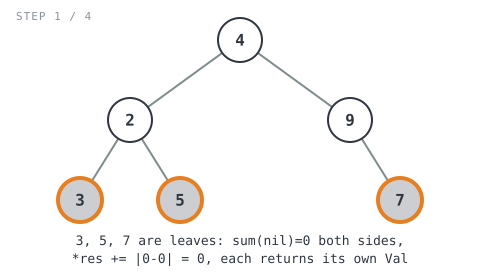
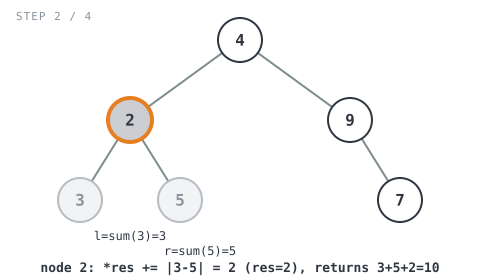
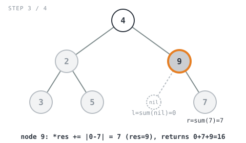
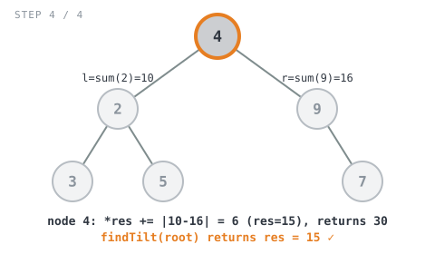

## Solution walkthrough

The implementation is `findTilt(root *TreeNode) int` in `main.go`, backed by a helper
`sum(node *TreeNode, res *int) int` and a small `absDiff(a, b int) int` utility.

We'll trace it on Example 2 above, `root = [4,2,9,3,5,null,7]` (expected `15`).

1. **Entry point.** `findTilt` handles the trivial empty-tree case
   (`if root == nil { return 0 }`), then declares `res := 0` — a single running total
   shared across the whole recursion — and kicks off `sum(root, &res)`. Passing `&res`
   (a pointer) rather than returning a value from each call is what lets every
   recursive call accumulate into the *same* total instead of each call managing its
   own partial tilt sum that would then need to be summed back up separately.

2. **Base case.** Inside `sum`, `if node == nil { return 0 }` — an empty subtree
   contributes nothing to either the tilt total or the subtree-sum return value.

3. **Recurse into both children first.** `l := sum(node.Left, res)` and
   `r := sum(node.Right, res)` — this is the postorder step: both subtree sums (and
   any tilt they contain) must be fully known before this node can compute its own
   tilt or its own contribution to its parent's subtree sum.

   

4. **Accumulate this node's tilt.** `*res += absDiff(l, r)` — the absolute difference
   between the left subtree's total and the right subtree's total is exactly this
   node's tilt, added straight into the shared accumulator.

5. **Return this subtree's total.** `return l + r + node.Val` — so the parent's call
   can treat this whole subtree as a single number when it computes *its* `l` or `r`.

Walking the recursion bottom-up:

- `sum(2)` recurses into `sum(3)` and `sum(5)`, both leaves: `l=0, r=0` for each,
  `*res += |0-0| = 0`, and each returns its own value (`3` and `5`).
- Back in `sum(2)`: `l=3, r=5`. `*res += |3-5| = 2` (running total `2`). Returns
  `3 + 5 + 2 = 10`.

  

- `sum(9)` recurses into `sum(9.Left)` — `nil`, so `l=0` — and `sum(7)`, a leaf
  returning `7`, so `r=7`. `*res += |0-7| = 7` (running total `9`). Returns
  `0 + 7 + 9 = 16`.

  

- Back in `sum(4)` (the root): `l=10` (from the `2` call), `r=16` (from the `9` call).
  `*res += |10-16| = 6` (running total `15`). Returns `10 + 16 + 4 = 30`.

  

- `findTilt` returns `res = 15`. ✓
