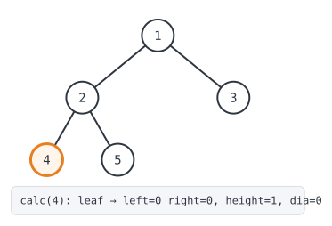
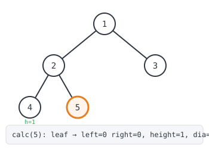
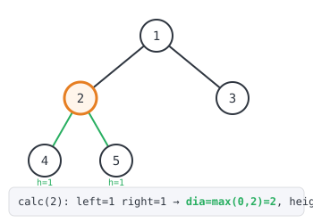
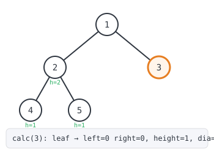
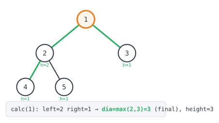

## 365 Days of LeetCode Challenge — Day 12/365

### Diameter of Binary Tree

[LeetCode 543 — Diameter of Binary Tree](https://leetcode.com/problems/diameter-of-binary-tree/) · Difficulty: **Easy**

Given the `root` of a binary tree, return the length of the **diameter** of the
tree — the longest path between any two nodes, measured in edges. That path may
or may not pass through the root.


```
Input: root = [1,2,3,4,5]
Output: 3
Explanation: 3 is the length of the path [4,2,1,3] or [5,2,1,3].
```

---

### The intuition

The part that trips people up first: the longest path in the tree doesn't have to
pass through the root at all. It could be buried entirely inside a subtree, far
from the top. So a naive "just measure from the root" approach doesn't work.

Here's the insight that unlocks it: for **any** node in the tree, the longest path
that passes *through that specific node* is easy to compute — it's the height of
its left subtree plus the height of its right subtree. Walk down to the deepest
leaf on the left, up through the node, then down to the deepest leaf on the right.
That's the longest path with this node acting as the "peak."

So instead of asking "what's the longest path through the root," we ask the same
question at *every* node and keep whichever answer is biggest. The true diameter
of the tree is the maximum, over all nodes, of `height(left) + height(right)`.

The elegant part is that we don't need two separate passes — one to compute
heights and another to compute the diameter. A single post-order depth-first
traversal does both: as the recursion naturally computes the height of each
subtree (needed for the parent's calculation anyway), it can simultaneously check
whether that node's `left + right` beats the best diameter seen so far.

**Complexity:** `O(n)` time — every node is visited exactly once — and `O(h)`
space for the recursion stack, where `h` is the tree's height (worst case `O(n)`
for a completely skewed tree, `O(log n)` for a balanced one).

---

### The solution

```go
var dia = 0

func diameterOfBinaryTree(root *TreeNode) int {
	dia = 0
	calc(root)
	return dia
}

func calc(root *TreeNode) int {
	if root == nil {
		return 0
	}
	left := calc(root.Left)
	right := calc(root.Right)
	dia = maxVal(left+right, dia)
	return maxVal(left, right) + 1
}
func maxVal(a, b int) int {
	if a > b {
		return a
	}
	return b
}
```

`dia` is a package-level variable holding the best diameter found so far.
`diameterOfBinaryTree` resets it to `0` before each call (since it's not local to
the call, a stale value from a previous invocation would otherwise leak in), then
kicks off `calc(root)` purely for its side effects — the height it returns at the
top level is thrown away, because all we actually want is whatever `dia` ends up
holding.

`calc` is the workhorse. Its base case, `root == nil`, returns height `0` for an
empty subtree. Otherwise it recurses into `root.Left` and `root.Right` to get
their heights, then does two things with them:

1. `dia = maxVal(left+right, dia)` — checks whether the path through *this* node
   beats the best one found so far, and updates `dia` if so.
2. `return maxVal(left, right) + 1` — reports this node's own height back up to
   its parent, so the parent can repeat the same check one level higher.

`maxVal` is just a small `int` max helper.

### Walking through the example

Using `root = [1,2,3,4,5]` (node 2's children are 4 and 5), the post-order
traversal visits nodes in the order **4, 5, 2, 3, 1**:

**Step 1 — `calc(4)`:** a leaf. Both children return height `0`, `dia` stays
`0`, and node 4 reports `height = 1`.



**Step 2 — `calc(5)`:** also a leaf. Same result — `dia` stays `0`, height `1`.



**Step 3 — `calc(2)`:** both children are now known (`left=1`, `right=1`). The
path through node 2 has length `1+1=2`, beating `dia=0`, so `dia` updates to `2`.
Node 2 reports `height = max(1,1)+1 = 2`.



**Step 4 — `calc(3)`:** a leaf on the other side of the root. `dia` stays `2`,
height is `1`.



**Step 5 — `calc(1)`:** the root has `left=2` (from node 2) and `right=1` (from
node 3). The path through the root has length `2+1=3`, beating `dia=2`, so `dia`
becomes its final value: `3`. That's the path `4 → 2 → 1 → 3` (or
`5 → 2 → 1 → 3`) called out in the problem statement.



`diameterOfBinaryTree` returns `dia = 3` — the correct answer.

---

Full breakdown, code, and images for every day of this challenge live in this
repo. See you tomorrow for Day 13.
