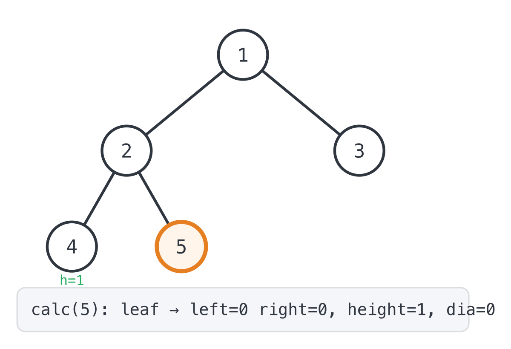
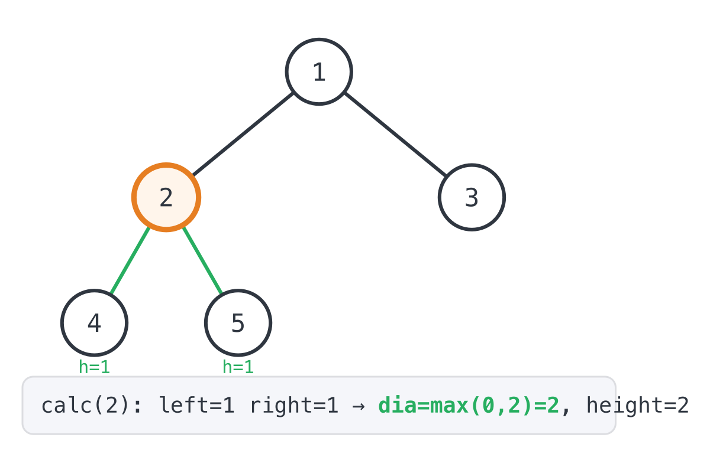
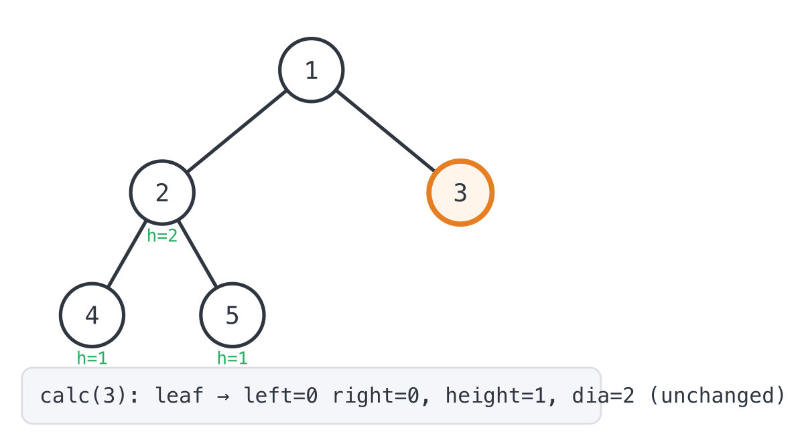

## 365 Days of LeetCode Challenge — Day 12/365

### Diameter of Binary Tree

[LeetCode 543 — Diameter of Binary Tree](https://leetcode.com/problems/diameter-of-binary-tree/) · Difficulty: **Easy**

Given the `root` of a binary tree, return the length of the **diameter** of the
tree — the longest path between any two nodes, measured in edges. That path may
or may not pass through the root.


```
Input: root = [1,2,3,4,5]
Output: 3
Explanation: 3 is the length of the path [4,2,1,3] or [5,2,1,3].
```

---

### The intuition

First thing that trips people up: the longest path doesn't have to touch the
root. It can live entirely inside some subtree, nowhere near the top, so
measuring "how far can I get starting from the root" just doesn't work here.

The fix is to stop thinking about the root specifically and ask a smaller
question at every node instead. If this node were the peak of the path, how
long would that path be? That's just the height of its left subtree plus the
height of its right subtree: walk down to the deepest leaf on one side, up
through the node, back down to the deepest leaf on the other side. Run that
check at every node in the tree and keep the biggest number you see. That
number is the diameter, no matter which node ends up being the actual peak.

What I like about this one is that the check is basically free. You already
have to compute subtree heights recursively, since a parent needs its
children's heights to compute its own. So a post-order traversal that returns
height can, on its way back up through each node, also compare left height
plus right height against a running max and update it when the current node
wins. One traversal does both jobs.

Time is `O(n)`, since every node gets visited once. Space is `O(h)` for the
call stack, where `h` is the tree's height: `O(log n)` if the tree is
balanced, `O(n)` if it's basically a straight line.

---

### The solution

```go
var dia = 0

func diameterOfBinaryTree(root *TreeNode) int {
	dia = 0
	calc(root)
	return dia
}

func calc(root *TreeNode) int {
	if root == nil {
		return 0
	}
	left := calc(root.Left)
	right := calc(root.Right)
	dia = maxVal(left+right, dia)
	return maxVal(left, right) + 1
}
func maxVal(a, b int) int {
	if a > b {
		return a
	}
	return b
}
```

`dia` sits at package level and holds the best diameter found so far.
`diameterOfBinaryTree` resets it to `0` at the start of every call, which
matters because it's not local: skip that reset and a second call in the same
process would start from whatever the last call left behind. Then it calls
`calc(root)` and throws away what comes back. That felt strange to me the
first time I wrote it, calling a function purely to ignore its return value,
but the whole point of `calc` here is the side effect. It updates `dia` as it
goes.

`calc` does the actual work. `root == nil` is the base case, returning height
`0` for an empty subtree. Otherwise it recurses into `root.Left` and
`root.Right` to collect both children's heights, then two things happen with
them. `dia = maxVal(left+right, dia)` checks whether the path through this
node beats whatever the current best is, and updates `dia` if it does. Then
`return maxVal(left, right) + 1` sends this node's own height up to its
parent, so the same comparison can happen one level higher.

`maxVal` is nothing fancy, just an int max helper.

### Walking through the example

Take `root = [1,2,3,4,5]` (node 2's children are 4 and 5). Post-order visits
nodes in this order: 4, 5, 2, 3, 1.

**Step 1: `calc(4)`.** A leaf, so both children return height `0`. `dia`
stays `0`, and node 4 reports `height = 1`.


**Step 2: `calc(5)`.** Also a leaf. Same result: `dia` stays `0`, height `1`.



**Step 3: `calc(2)`.** Both children are now known (`left=1`, `right=1`). The
path through node 2 has length `1+1=2`, which beats `dia=0`, so `dia` updates
to `2`. Node 2 reports `height = max(1,1)+1 = 2`.



**Step 4: `calc(3)`.** A leaf on the other side of the root. `dia` stays `2`,
height is `1`.



**Step 5: `calc(1)`.** The root has `left=2` (from node 2) and `right=1`
(from node 3). The path through the root has length `2+1=3`, which beats
`dia=2`, so `dia` lands on its final value: `3`. That's the path
`4 → 2 → 1 → 3` (or `5 → 2 → 1 → 3`) from the problem statement.


`diameterOfBinaryTree` returns `dia = 3`, the correct answer.

---

Full breakdown, code, and images for every day of this challenge live in this
repo. See you tomorrow for Day 13.

#DSA #LeetCode #100DaysOfCode #CodingInterview #Programming #BinaryTree #Recursion #Golang

---

*Solution and code by Archit Agarwal. Write-up drafted with AI assistance from the code and problem statement.*
