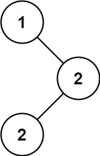
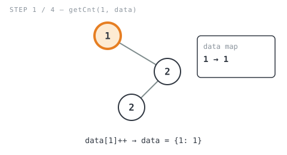
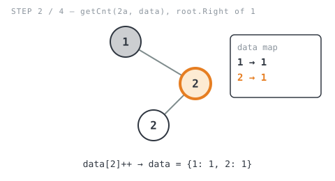
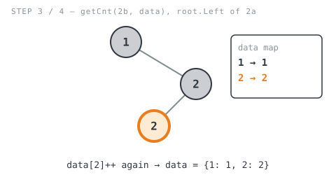

**365 Days of LeetCode Challenge — Day 10/365**
**Find Mode in Binary Search Tree** (Easy)
🔗 https://leetcode.com/problems/find-mode-in-binary-search-tree/

**Intuition:** The "BST" part is kind of beside the point here. The simplest approach
ignores the ordering completely, tallies how many times every value shows up in a
hashmap, then reads off whichever value (or values) hit the highest count. Ties get
handled for free, since the second pass just grabs everything matching the max.



**Full solution:**
```go
func findMode(root *TreeNode) []int {
	if root == nil {
		return []int{}
	}
	// Tally how many times every value occurs. This ignores the BST
	// ordering entirely and treats the tree like any binary tree.
	data := make(map[int]int)
	data = getCnt(root, data)

	res := make([]int, 0)
	cnt := 0
	// First pass: find the highest frequency present in the tree.
	for _, v := range data {
		if v > cnt {
			cnt = v
		}
	}

	// Second pass: collect every value whose frequency matches the max,
	// so ties (multiple modes) are all returned, not just one.
	for k, v := range data {
		if v == cnt {
			res = append(res, k)
		}
	}
	return res
}

// getCnt walks the whole tree and increments data[node.Val] for every
// node visited. Since data is a map (reference type), every recursive
// call mutates the same underlying map, so the return value only
// matters to the top-level caller.
func getCnt(root *TreeNode, data map[int]int) map[int]int {
	if root == nil {
		return nil
	}
	data[root.Val]++
	getCnt(root.Left, data)
	getCnt(root.Right, data)
	return data
}
```

**Walkthrough** on `[1,null,2,2]`: `1` sits at the root, its right child is `2`, and
that `2`'s left child is another `2`. Expected output is `[2]`.

- `getCnt(1, data)` → `data = {1: 1}`



- `getCnt(2a, data)` (right child of `1`) → `data = {1: 1, 2: 1}`



- `getCnt(2b, data)` (left child of `2a`) → `data = {1: 1, 2: 2}`



- `findMode` scans for the max (`cnt = 2`), then grabs every key that matches it →
  `[2]`

![Step 4: findMode scans for the max count, then collects every key matching it, producing [2]](images/walkthrough-4.svg)

O(n) time, O(n) space for the map, plus O(h) for the recursion stack.
