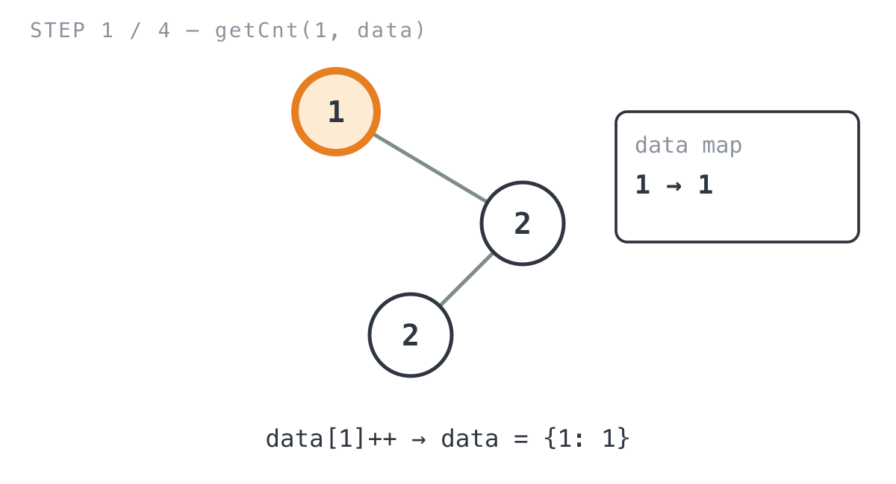
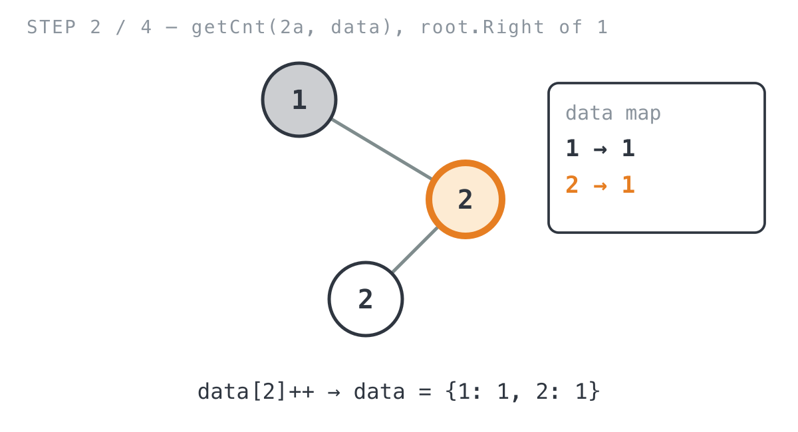
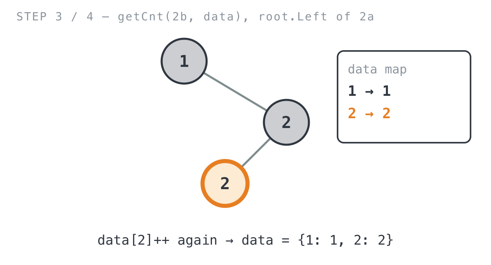

## 365 Days of LeetCode Challenge — Day 46/365

# Find Mode in Binary Search Tree

🔗 https://leetcode.com/problems/find-mode-in-binary-search-tree/ · Difficulty: Easy

### The problem

You're given the root of a binary search tree that's allowed to have duplicate values,
and you need to return the mode: whichever value (or values) show up most often. If
there's a tie, all of the tied values come back, in any order.

### The intuition

The "BST" in the name had me expecting to need the sorted order somehow, but the
plainest fix ignores it completely. A mode is just whichever value shows up most, and
the direct way to find that is to count every value's occurrences and read off whoever's
on top. That's a frequency-table problem. It doesn't care whether the tree is sorted at
all, and it would work the exact same way on any binary tree.

So I split it into two passes. First, walk the whole tree once and build a map from
value to how many times it showed up. Left and right order doesn't matter here; every
node just bumps its own counter. Second, once every count is known, scan the map for the
highest count, then scan it again to collect every value that hits that count. That
second scan is what makes ties work correctly: if two values are equally frequent, both
come back instead of whichever one the map happened to hand you first.

The BST property (`left <= node <= right`) does let you solve this in O(1) extra space,
with an in-order traversal that compares each value to the one right before it in sorted
order (that's what the problem's follow-up question is nudging you toward). I went with
the hashmap version instead. It costs O(n) extra space for the map, but there's a lot
less to get wrong, and for an easy problem that trade felt like the right one.

### The solution


```go
func findMode(root *TreeNode) []int {
	if root == nil {
		return []int{}
	}
	// Tally how many times every value occurs. This ignores the BST
	// ordering entirely and treats the tree like any binary tree.
	data := make(map[int]int)
	data = getCnt(root, data)

	res := make([]int, 0)
	cnt := 0
	// First pass: find the highest frequency present in the tree.
	for _, v := range data {
		if v > cnt {
			cnt = v
		}
	}

	// Second pass: collect every value whose frequency matches the max,
	// so ties (multiple modes) are all returned, not just one.
	for k, v := range data {
		if v == cnt {
			res = append(res, k)
		}
	}
	return res
}

// getCnt walks the whole tree and increments data[node.Val] for every
// node visited. Since data is a map (reference type), every recursive
// call mutates the same underlying map, so the return value only
// matters to the top-level caller.
func getCnt(root *TreeNode, data map[int]int) map[int]int {
	if root == nil {
		return nil
	}
	data[root.Val]++
	getCnt(root.Left, data)
	getCnt(root.Right, data)
	return data
}
```

Here's what happens on `root = [1,null,2,2]`: node `1` sits at the root with no left
child, its right child is a `2`, and that `2` has its own left child, another `2`.
Expected output is `[2]`.

**Phase 1: `getCnt` tallies every value**

- `getCnt(1, data)` fires first: `data[1]++` sets `data = {1: 1}`.



- `1.Left` is `nil`, so that branch returns immediately without touching anything.
  `getCnt(2a, data)`, the right child of `1`, bumps its own key: `data[2]++` gives
  `data = {1: 1, 2: 1}`.



- `getCnt(2b, data)`, the left child of `2a`, increments the same key again:
  `data = {1: 1, 2: 2}`. `2b` has no children, so recursion just unwinds from here.



**Phase 2: `findMode` finds the max, then collects the ties**

- First pass over `data`: the highest count seen is `cnt = 2`.
- Second pass over `data`: only key `2` matches, so `res = [2]`.

![Step 4: findMode scans for the max count, then collects every key matching it, producing [2]](images/walkthrough-4.png)

`return res` hands back `[2]`, which matches what the problem expects.

**Complexity:** O(n) time. `getCnt` visits every node once, and each scan over `data` in
`findMode` costs O(n) in the worst case too. Space is O(n) for the frequency map, plus
O(h) for the recursion stack, where h is the tree's height.

Full code and the step-by-step walkthrough:
[find_mode_in_binary_search_tree](https://github.com/architagr/leetcode_solutions/blob/main/easy_problems/501_600/find_mode_in_binary_search_tree/SOLUTION.md)

#DSA #LeetCode #100DaysOfCode #CodingInterview #Programming #BinarySearchTree #HashMap #Golang

---

*Solution and code by Archit Agarwal. Write-up drafted with AI assistance from the code and problem statement.*
