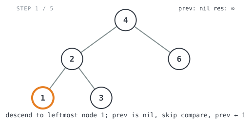
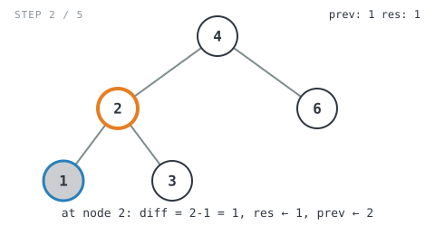

**365 Days of LeetCode Challenge — Day 11/365**
**Minimum Absolute Difference in BST** (Easy)
🔗 https://leetcode.com/problems/minimum-absolute-difference-in-bst/

**Intuition:** in-order traversal of a BST visits nodes in strictly increasing sorted
order, and in any sorted sequence the smallest gap between two values always sits
between neighbors. So instead of checking every pair (O(n²)), just compare each node
to the *previous* node hit during the traversal and keep the smallest gap you find.
Sorting for free, basically.


**Full solution:**
```go
func getMinimumDifference(root *TreeNode) int {
	res := math.MaxInt
	// prev is the previously-visited node in in-order sequence, i.e. the
	// current node's in-order predecessor. nil until the first node is visited.
	var prev *TreeNode
	// helper performs a standard in-order traversal (left, node, right), which
	// for a BST visits values in strictly increasing sorted order. That means
	// the minimum gap between ANY two nodes must occur between two in-order
	// adjacent nodes, so comparing each node only to its immediate
	// predecessor is enough — no need to compare every pair.
	var helper func(root *TreeNode)
	helper = func(root *TreeNode) {
		if root == nil {
			return
		}

		helper(root.Left)

		// Skip the comparison on the very first node visited (no predecessor
		// yet). Since traversal order is sorted, root.Val >= prev.Val always,
		// so no abs() is needed.
		if prev != nil {
			res = min(res, root.Val-prev.Val)
		}
		// This node becomes the predecessor for whichever node is visited next.
		prev = root

		helper(root.Right)
	}

	helper(root)

	return res
}
```

**Walkthrough** on `[4,2,6,1,3]` (in-order: `1, 2, 3, 4, 6`, expected `1`):

- Descend to leftmost node `1`. `prev` is nil so the compare is skipped, `prev = 1`



- At node `2`: `prev=1`, `diff=2-1=1`, `res=1`, `prev=2`



- At node `3`: `prev=2`, `diff=3-2=1`, `res=1`, `prev=3`


- Back at root `4`: `prev=3`, `diff=4-3=1`, `res=1`, `prev=4`


- At node `6`: `prev=4`, `diff=6-4=2`, `res` stays `1` ✓


O(n) time since every node is visited once, O(h) space for the recursion stack, where
h is the tree height.
