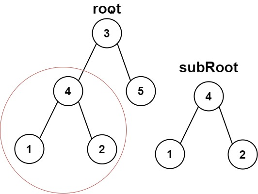
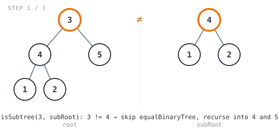
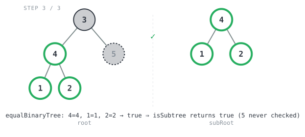

## 365 Days of LeetCode Challenge — Day 14/365

# Subtree of Another Tree

🔗 https://leetcode.com/problems/subtree-of-another-tree/ · Difficulty: Easy

### The problem

Given the roots of two binary trees `root` and `subRoot`, return `true` if there is a
subtree of `root` with the same structure and node values as `subRoot`, and `false`
otherwise. A subtree of a tree is a node together with all of its descendants — a tree
also counts as a subtree of itself.

### The intuition

This problem is really two smaller problems stacked on top of each other:

1. **"Are two trees identical?"** — same shape, same values everywhere. That's the
   classic Same Tree check.
2. **"Does `root` contain a node where, if you rooted a tree right there, it would be
   identical to `subRoot`?"** — that's just problem 1, tried at every possible anchor
   point in `root`.

So the approach walks every node of `root` and asks, at each one: "if I treat this node
as the root of its own little tree, is that tree identical to `subRoot`?" As soon as one
node answers yes, the whole thing is a match.

A cheap pruning trick makes this practical: don't bother running the full structural
comparison unless the current node's value already matches `subRoot`'s value — two
trees can't be identical if their roots don't match, so checking values first avoids a
lot of wasted work.

### The solution



```go
func isSubtree(root *TreeNode, subRoot *TreeNode) bool {
	if subRoot == nil {
		return true
	}
	if root == nil {
		return subRoot == nil
	}

	if root.Val == subRoot.Val && equalBinaryTree(root, subRoot) {
		return true
	}
	return isSubtree(root.Left, subRoot) || isSubtree(root.Right, subRoot)
}

func equalBinaryTree(root *TreeNode, subRoot *TreeNode) bool {
	if root == nil {
		return subRoot == nil
	}
	if subRoot == nil {
		return root == nil
	}
	if root.Val != subRoot.Val {
		return false
	}
	return equalBinaryTree(root.Left, subRoot.Left) && equalBinaryTree(root.Right, subRoot.Right)
}
```

Walking it through `root = [3,4,5,1,2]`, `subRoot = [4,1,2]` (expected `true`):

- `isSubtree(root=3, subRoot=4)`: values differ (`3 != 4`), so skip the equality check
  and recurse into both children instead.



- Recursing left, `isSubtree(root=4, subRoot=4)`: values match this time, so
  `equalBinaryTree` actually runs.


- `equalBinaryTree` walks both trees in lockstep: `4=4`, then `1=1` and `2=2` down each
  side — every pair matches, so it returns `true`. `isSubtree` returns `true`
  immediately, and because `||` short-circuits, node `5` is never even examined.



**Complexity:** O(m·n) time in the worst case (`m` = nodes in `root`, `n` = nodes in
`subRoot`) — up to `m` candidate anchors, each costing up to `n` work in
`equalBinaryTree`. O(h1 + h2) space for the two recursion stacks.

Full code: `easy_problems/501_600/subtree_of_another_tree/` in the repo.
