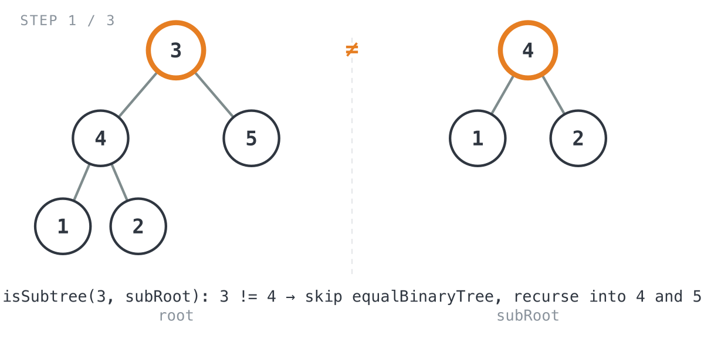
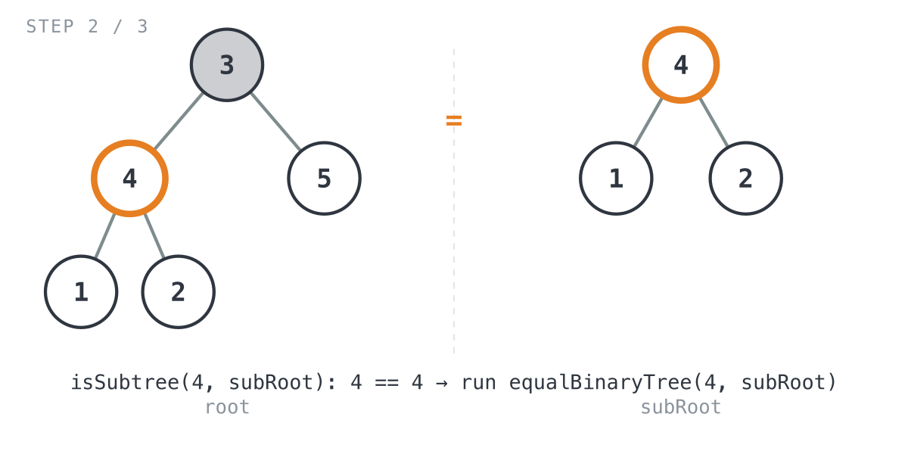
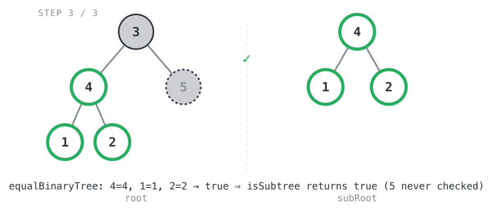

## 365 Days of LeetCode Challenge — Day 68/365

# Subtree of Another Tree

🔗 https://leetcode.com/problems/subtree-of-another-tree/ · Difficulty: Easy

### The problem

Given the roots of two binary trees `root` and `subRoot`, return `true` if `root` has a
subtree with the same structure and values as `subRoot`, and `false` if it doesn't. A
subtree is a node plus everything hanging below it, and a tree counts as a subtree of
itself too.

### The intuition

This one is really two problems stacked on top of each other. First: are two trees
identical, same shape and same values at every position? That's the classic Same Tree
check. Second: does `root` contain some node where, if you rooted a tree right there, it
would match `subRoot` exactly? That second question is just the first one, tried at
every possible anchor point in `root`.

So the approach walks every node of `root` and asks the same question each time: if I
treat this node as the root of its own little tree, does it match `subRoot`? The first
node that says yes ends the search.

The part I actually like here is the pruning trick. Check the value before running the
full structural comparison. Two trees obviously can't be identical if their roots don't
even agree, so that one comparison saves a lot of wasted recursion once the trees stop
being tiny.

### The solution


```go
func isSubtree(root *TreeNode, subRoot *TreeNode) bool {
	if subRoot == nil {
		return true
	}
	if root == nil {
		return subRoot == nil
	}

	if root.Val == subRoot.Val && equalBinaryTree(root, subRoot) {
		return true
	}
	return isSubtree(root.Left, subRoot) || isSubtree(root.Right, subRoot)
}

func equalBinaryTree(root *TreeNode, subRoot *TreeNode) bool {
	if root == nil {
		return subRoot == nil
	}
	if subRoot == nil {
		return root == nil
	}
	if root.Val != subRoot.Val {
		return false
	}
	return equalBinaryTree(root.Left, subRoot.Left) && equalBinaryTree(root.Right, subRoot.Right)
}
```

Here's the trace on `root = [3,4,5,1,2]`, `subRoot = [4,1,2]` (expected `true`):

`isSubtree(root=3, subRoot=4)` hits a value mismatch right away: `3 != 4`. So it skips
`equalBinaryTree` entirely and just recurses into both children.



Recursing left lands on `isSubtree(root=4, subRoot=4)`. Values match this time, so
`equalBinaryTree` finally gets to run.



`equalBinaryTree` walks both trees in lockstep: `4` matches `4`, then `1` matches `1`
and `2` matches `2` on each side. Every pair lines up, so it returns `true`, and
`isSubtree` returns `true` right away. Because `||` short-circuits, node `5` never even
gets checked. The left branch already settled it.



Worst case this runs in O(m·n) time, where `m` is the node count of `root` and `n` is
the node count of `subRoot`: up to `m` candidate anchors, each one costing up to `n`
work inside `equalBinaryTree`. Space is O(h1 + h2) for the two recursion stacks.

Full code and the step-by-step walkthrough:
[subtree_of_another_tree](https://github.com/architagr/leetcode_solutions/blob/main/easy_problems/501_600/subtree_of_another_tree/SOLUTION.md)

#LeetCode #100DaysOfCode #Algorithms #CodingInterview #BinaryTree #Recursion #Golang

---

*Solution and code by Archit Agarwal. Write-up drafted with AI assistance from the code and problem statement.*
