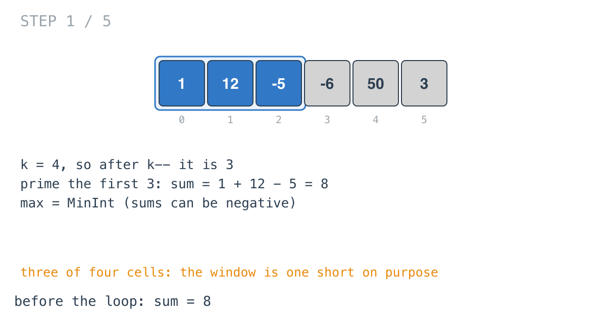
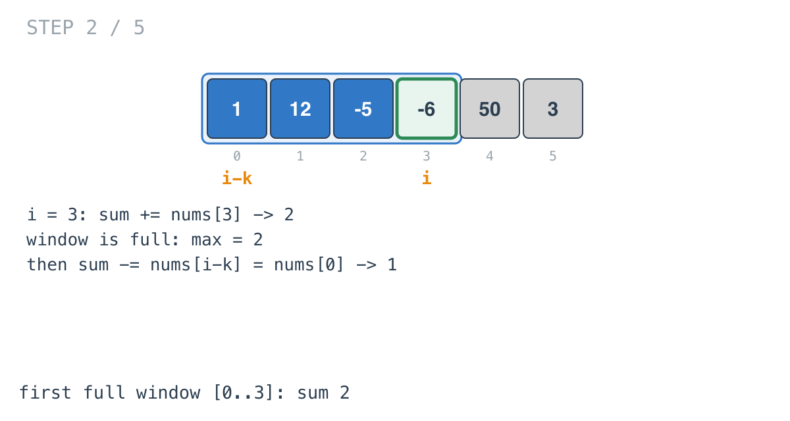
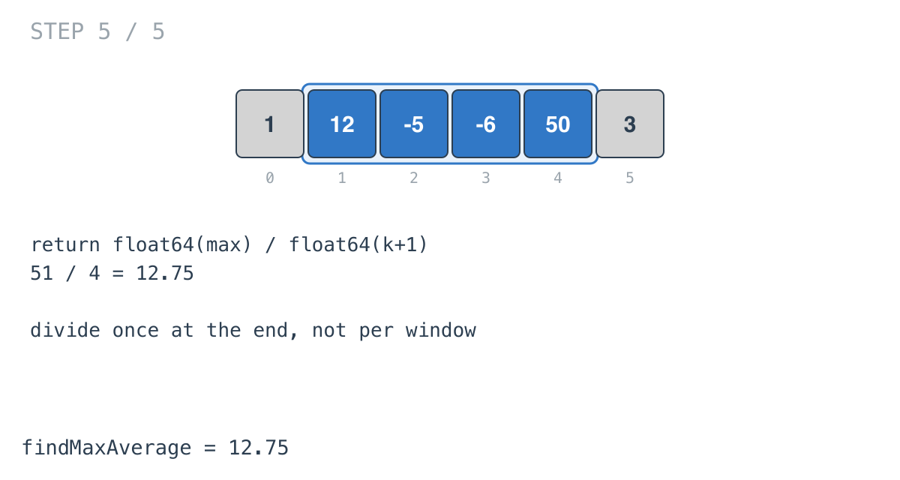

## Solution walkthrough

`findMaxAverage(nums []int, k int) float64` in `maximum_average_subarray_i.go` keeps a
running sum over a window of `k` elements and records the largest sum it sees.

We'll trace Example 1: `nums = [1,12,-5,-6,50,3]`, `k = 4`, expected `12.75`.

1. **Shift `k` down by one.** `k--` turns `k` into 3. From here on it's used as an
   offset: `nums[i-k]` is the oldest element of the window ending at `i`. The original
   length comes back as `k+1` in the final division.

2. **Prime the window one short.** The first loop adds `nums[0..2]`: `1 + 12 - 5 = 8`.
   That's three of the four elements. `max` starts at `math.MinInt`, since every sum could
   be negative.

   

3. **Add, check, remove.** The main loop runs `i` from 3. It adds `nums[3] = -6`, making
   the first full window `[0..3]` with sum 2, and records `max = 2`. Then it subtracts
   `nums[i-k] = nums[0] = 1`, leaving 1: the window is one short again, ready for the next
   element.

   

4. **The window slides.** At `i = 4`, adding 50 gives the window `[1..4]` with sum 51,
   the new `max`. Subtracting `nums[1] = 12` leaves 39. Each step is one addition and one
   subtraction, however large `k` is.

   ![Step 3: window [1..4], sum 51](images/walkthrough-3.png)

5. **The last window.** At `i = 5`, adding 3 gives `[2..5]` with sum 42. It doesn't beat
   51. The loop still subtracts `nums[2]` afterwards, which is wasted work on the final
   iteration but harmless.

   ![Step 4: window [2..5], sum 42](images/walkthrough-4.png)

6. **Divide once.** `return float64(max) / float64(k+1)`: `51 / 4 = 12.75`. Comparing
   sums rather than averages is valid because every window has the same length, so the
   biggest sum is the biggest average.

   

**Complexity:** O(n) time, O(1) extra space.
